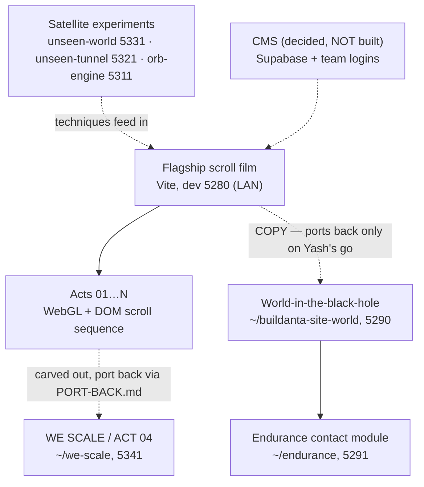

# Buildanta Solutions site (family) — living map

> Truth file (vault rule W3). `dashboard.html` is generated from this — never edit it by hand.
> Regenerate: `node ~/.claude/skills/build-standards/tools/gen-dashboard.mjs "~/claude code/buildanta-site"`

_Updated: 2026-08-11_

## Map

- **The family pattern:** heavy act work happens in carved-out repos with their own verify suites, then ports back deliberately — never edited live in the flagship.
- Content today is a **hand-edited `world.json`**; the CMS (Supabase, team logins, whole site, build-time + live preview) is decided but unbuilt.
- **Traps live in `CLAUDE.md`** — design freeze (UX4), no beat retiming without asking, page-scoped ids, world stays in the copy.

## Progress

- ✅ Perf + colour audit, all 4 stages shipped 8 Aug — GPU 8.84 → 3.93 Mpx; the 287ms stall was 19 shaders compiling mid-scroll, fixed
- ✅ WE SCALE (ACT 04) carved out and rebuilt — 33/33 headless checks
- ✅ World-inside-the-black-hole working in the copy — Projects sits at the black hole and falls into the world
- ✅ Endurance contact module built — Contact = fly into the ship; 12 MCQs settled
- ✅ CMS decided — 9 decisions on 11 Aug (Supabase + team logins + whole site + both preview modes)
- ⏳ Port the world + Endurance into the real site — **waits on Yash's explicit go**
- ⏳ Build the CMS (auto-fit on upload; card geometry from `image_size`, not the file)
- ⏳ WE SCALE port-back per PORT-BACK.md
- 🔴 Pre-existing portal bug — Yash's open item, not being chased silently
- 🔴 Endurance: form-send method + phone/WhatsApp number owed by Yash

## Decisions

### D-001 — The approved design is frozen (vault UX4)
- **Date:** 2026-08-10
- **Decision:** Once Yash approves a design it is FROZEN; rebuilds/migrations are not licence to redraw it; ambiguous scope resolves toward preserving.
- **Why:** A "leveled-up" rebuild silently redrew approved UI once; that class of loss is now banned by rule.
- **Alternatives:** Trust each session's judgment — rejected, that's how it happened.
- **Decided by:** Yash
- **Source:** Vault rule UX4 (2026-08-10)

### D-002 — Projects lives AT the black hole and falls you into the world
- **Date:** 2026-08 (approx)
- **Decision:** The Projects entry sits beside Contact at the black hole; entering it drops the visitor into the explorable world.
- **Why:** One gravity-well moment carries both destinations — the site's signature move stays singular.
- **Alternatives:** Separate Projects page/nav — rejected as ordinary.
- **Decided by:** Yash
- **Source:** Seeded 2026-08-11 from the world build

### D-003 — Contact = fly INTO the Endurance ship
- **Date:** 2026-08 (approx)
- **Decision:** The contact experience is the Interstellar-style ship beside the black hole; flying in reveals the form.
- **Why:** Contact should be a scene, not a form field — consistent with the film language of the site.
- **Alternatives:** Standard contact section — rejected.
- **Decided by:** Yash (12 MCQs)
- **Source:** Seeded 2026-08-11 from the Endurance module build

### D-004 — CMS: Supabase + team logins + whole site + both previews
- **Date:** 2026-08-11
- **Decision:** The CMS covers the WHOLE site (not just the world), runs on Supabase with team logins, and supports build-time AND live preview; uploads auto-fit because card geometry comes from `image_size`, not the file.
- **Why:** The team must edit content without Claude in the loop, and previews must match both publish paths.
- **Alternatives:** World-only CMS; file-based editing — rejected in the 9-decision MCQ round.
- **Decided by:** Yash (9 MCQs)
- **Source:** CMS decision round, 11 Aug 2026

### D-005 — Acts get carved out, worked in isolation, and ported back
- **Date:** 2026-08 (approx)
- **Decision:** Heavy act rework happens in a dedicated repo (e.g. we-scale) with its own verify suite and a written PORT-BACK.md path.
- **Why:** Two agents once overwrote each other six times editing the flagship concurrently; isolation plus a deliberate port-back ended that.
- **Alternatives:** Work acts live in the flagship — rejected after the collision.
- **Decided by:** Yash + Claude (logged)
- **Source:** Seeded 2026-08-11 from the WE SCALE carve-out

### D-006 — Beat boundaries never move without asking
- **Date:** 2026-08 (approx)
- **Decision:** No retiming of any scroll act's beat boundaries without Yash's explicit yes.
- **Why:** An ACT 03 retime silently ate the WE SCALE act twice — and its own tests passed both times.
- **Alternatives:** Rely on tests to catch it — proven insufficient, twice.
- **Decided by:** Yash
- **Source:** Seeded 2026-08-11 from the ACT 03 incident
