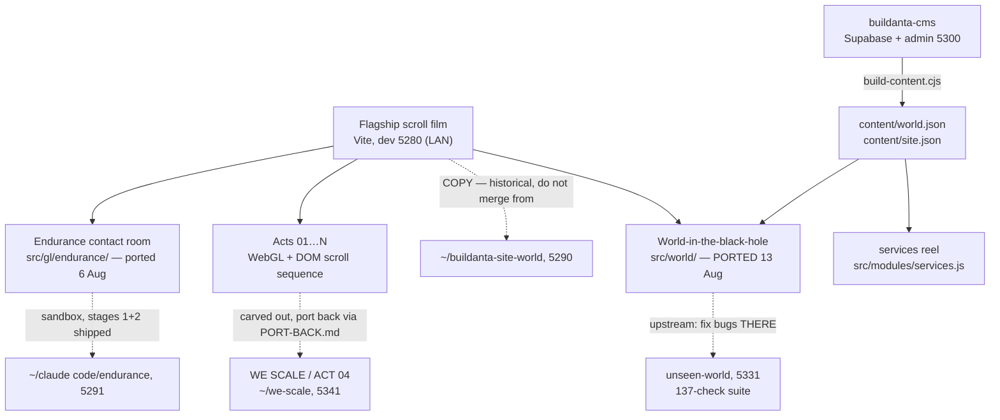

# Buildanta Solutions site (family) — living map

> Truth file (vault rule W3). `dashboard.html` is generated from this — never edit it by hand.
> Regenerate: `node ~/.claude/skills/build-standards/tools/gen-dashboard.mjs "~/claude code/buildanta-site"`

_Updated: 2026-08-14_

## Map

- **The family pattern:** heavy act work happens in carved-out repos with their own verify suites, then ports back deliberately — never edited live in the flagship.
- Content comes from **buildanta-cms**, not from files here. `content/` is generated — see *Changing the words* below.
- The world is **ported, not forked**: its source of truth is `~/claude code/unseen-world`. Fix bugs there first.
- **Traps live in `CLAUDE.md`** — design freeze (UX4), no beat retiming without asking, page-scoped ids, never hand-edit `content/`, never copy files in from the old 5290 copy.

## Changing the words

Nothing here is edited by hand. The loop is:

1. Edit in the admin — `cd ~/claude code/buildanta-cms/admin && npm run dev` → **localhost:5300**
   (Supabase must be up: `supabase start` in `buildanta-cms`. First account created becomes owner.)
2. Press **Publish** in the admin. That writes one immutable snapshot.
3. Build it into this site:
   `SUPABASE_SERVICE_KEY=$(supabase status -o json | jq -r .SERVICE_ROLE_KEY) \`
   `node tools/build-content.cjs --out "$HOME/claude code/buildanta-site" --art world/art`
   (run from `buildanta-cms`. The `--art world/art` is required — without it the media
   lands in `public/art/`, which nothing here reads.)
4. Commit `content/` and `public/world/art/`. Both are tracked on purpose.

If the CMS has never been published, the services reel falls back to the hardcoded
array in `src/modules/services.js` and the site looks exactly as it always did. The
world does not have a fallback: `content/world.json` is committed, so a fresh clone works.

## Progress

- ✅ Perf + colour audit, all 4 stages shipped 8 Aug — GPU 8.84 → 3.93 Mpx; the 287ms stall was 19 shaders compiling mid-scroll, fixed
- ✅ WE SCALE (ACT 04) carved out and rebuilt — 33/33 headless checks
- ✅ **World PORTED into this repo (13 Aug, `d5a032c`)** — 26/26 embedded checks; canvas count back to the pre-port baseline of 7
- ✅ Endurance contact module built — Contact = fly into the ship; 12 MCQs settled
- ✅ CMS BUILT and wired — 58 projects, 12 with real copy, 9 services + 5 headings; this site reads its output
- ✅ **Endurance contact module — already IN this repo** (`src/gl/endurance/`, ported 6 Aug across `c25506b`/`2df6082`/`9c4a069` with Yash's own MCQ rounds). The "waiting to be ported" note carried in this file was stale; verified 13 Aug by flying into the ship and reaching the room.
- 🔴 The contact form still composes a **mailto:** — Yash owes the real send method + the phone/WhatsApp number
- ⏳ 46 of the 58 projects still carry placeholder names and art
- ⏳ WE SCALE port-back per PORT-BACK.md
- 🔴 Pre-existing portal bug — Yash's open item, not being chased silently
- 🔴 Endurance: form-send method + phone/WhatsApp number owed by Yash

## Decisions

### D-001 — The approved design is frozen (vault UX4)
- **Date:** 2026-08-10
- **Decision:** Once Yash approves a design it is FROZEN; rebuilds/migrations are not licence to redraw it; ambiguous scope resolves toward preserving.
- **Why:** A "leveled-up" rebuild silently redrew approved UI once; that class of loss is now banned by rule.
- **Alternatives:** Trust each session's judgment — rejected, that's how it happened.
- **Decided by:** Yash
- **Source:** Vault rule UX4 (2026-08-10)

### D-002 — Projects lives AT the black hole and falls you into the world
- **Date:** 2026-08 (approx)
- **Decision:** The Projects entry sits beside Contact at the black hole; entering it drops the visitor into the explorable world.
- **Why:** One gravity-well moment carries both destinations — the site's signature move stays singular.
- **Alternatives:** Separate Projects page/nav — rejected as ordinary.
- **Decided by:** Yash
- **Source:** Seeded 2026-08-11 from the world build

### D-003 — Contact = fly INTO the Endurance ship
- **Date:** 2026-08 (approx)
- **Decision:** The contact experience is the Interstellar-style ship beside the black hole; flying in reveals the form.
- **Why:** Contact should be a scene, not a form field — consistent with the film language of the site.
- **Alternatives:** Standard contact section — rejected.
- **Decided by:** Yash (12 MCQs)
- **Source:** Seeded 2026-08-11 from the Endurance module build

### D-004 — CMS: Supabase + team logins + whole site + both previews
- **Date:** 2026-08-11
- **Decision:** The CMS covers the WHOLE site (not just the world), runs on Supabase with team logins, and supports build-time AND live preview; uploads auto-fit because card geometry comes from `image_size`, not the file.
- **Why:** The team must edit content without Claude in the loop, and previews must match both publish paths.
- **Alternatives:** World-only CMS; file-based editing — rejected in the 9-decision MCQ round.
- **Decided by:** Yash (9 MCQs)
- **Source:** CMS decision round, 11 Aug 2026

### D-005 — Acts get carved out, worked in isolation, and ported back
- **Date:** 2026-08 (approx)
- **Decision:** Heavy act rework happens in a dedicated repo (e.g. we-scale) with its own verify suite and a written PORT-BACK.md path.
- **Why:** Two agents once overwrote each other six times editing the flagship concurrently; isolation plus a deliberate port-back ended that.
- **Alternatives:** Work acts live in the flagship — rejected after the collision.
- **Decided by:** Yash + Claude (logged)
- **Source:** Seeded 2026-08-11 from the WE SCALE carve-out

### D-006 — Beat boundaries never move without asking
- **Date:** 2026-08 (approx)
- **Decision:** No retiming of any scroll act's beat boundaries without Yash's explicit yes.
- **Why:** An ACT 03 retime silently ate the WE SCALE act twice — and its own tests passed both times.
- **Alternatives:** Rely on tests to catch it — proven insufficient, twice.
- **Decided by:** Yash
- **Source:** Seeded 2026-08-11 from the ACT 03 incident

### D-007 — The services reel reads from the CMS, with the hardcoded array as fallback
- **Date:** 2026-08-13
- **Decision:** `src/modules/services.js` merges `content/site.json` over its hardcoded array per-plate; the array stays as the fallback and as the readable definition of the shape.
- **Why:** Otherwise the CMS's Site content screen controls nothing on the real site. Per-plate merge, not all-or-nothing, so a service the CMS has not been given yet keeps its copy instead of vanishing from the reel — the failure that would be noticed last and hurt most.
- **Alternatives:** Leave services hardcoded (rejected — makes the admin pointless here); replace the array entirely (rejected — a missing build would blank the reel).
- **Decided by:** Yash (MCQ, 13 Aug)
- **Source:** World port, 13 Aug 2026

### D-008 — The world's media is committed, not generated on clone
- **Date:** 2026-08-13
- **Decision:** `public/world/art/` (3.7 MB, 58 files) and `content/` are tracked in git.
- **Why:** Another session opening this repo gets a working world with no build step. Yash weighed that against repo size and chose "just works on open".
- **Alternatives:** Gitignore them and require `build-content.cjs` before first run — rejected; the cost lands on whoever opens the repo cold, which is exactly when they can least diagnose it.
- **Decided by:** Yash (MCQ, 13 Aug)
- **Source:** World port, 13 Aug 2026

### D-009 — The world is ported by hand, never by copying files
- **Date:** 2026-08-13
- **Decision:** Changes come across as applied hunks onto this tree's current files, never by `cp` from `~/claude code/buildanta-site-world`.
- **Why:** That copy has no shared git history with this repo, so git cannot three-way merge it. Three of its files are OLDER than ours — copying `main.js` wholesale re-added the crash recorder removed in `dd983a4`, and an over-long slice of its tail duplicated `boot()`, booting the whole site twice and doubling four canvases. Both were caught only by measuring against the pre-port tree.
- **Alternatives:** `cp -R` the copy over this repo — rejected, it silently reverts work.
- **Decided by:** Claude (logged; the hazard is recorded in CLAUDE.md)
- **Source:** World port, 13 Aug 2026

### D-010 — Split headings wrap by word, not by character
- **Date:** 2026-08-13
- **Decision:** `splitText.js` groups each word's character spans in a `.word` wrapper carrying `white-space: nowrap`.
- **Why:** Every character is its own `inline-block`, and a line may break between any two of them — so the contact heading rendered "GOT SOMETHI / NG TO BUILD?" on every laptop-width screen. `word-break` could not fix it: the browser was not breaking the word, it was breaking between two boxes.
- **Composition held at TWO lines** (Yash, same day): the wrapper alone pushed the contact heading to 3 lines at 1024–1440px, so `.contact__title` went from `6.6vw` to `5.7vw`. The line box is ~44.7% of the viewport and "GOT SOMETHING" needs 7.72x the font size in width; measured at eight widths from 820 to 1920, the exact fit is **5.76vw at every one of them**, so one coefficient covers the band with ~1% slack. The 104px cap is unchanged — it engages at 1825px, where the column is 816px against the 803px needed.
- **Verified:** all 11 split headings measured at five widths before and after. Contact: 2 lines with a broken word → 2 lines with none. The other ten: unchanged at every width.
- **Alternatives:** leave it at 3 lines (rejected by Yash); leave the break (rejected, it is the flagship's contact headline).
- **Decided by:** Claude found and fixed the break; Yash chose to keep the two-line composition
- **Source:** Found while verifying the Endurance port request, 13 Aug 2026

### D-011 — WE SCALE goes black (supersedes the mint look AND the carve-out's)
- **Date:** 2026-08-14
- **Decision:** WE SCALE's ground is reference-black (measured off buildanta-solutions.vercel.app: #000 corners, green-tinted near-black atmosphere), globe+hand move LEFT, title top-centre in glowing green, the six ambient money notes / birds / feed orbs are retired (hero burn note stays), ticker + HUD go dark.
- **Why:** Yash wanted the act to match his black reference; 6 MCQs settled text position, black depth, green treatment, type colour, bills, and the strip.
- **Alternatives:** White type like the reference (rejected — glowing green); keeping the bills on black (rejected — only globe+hand remain).
- **Decided by:** Yash
- **Source:** MCQs, 14 Aug 2026 · commit 34d2f1b
- **⚠️ Consequence:** the `we-scale` carve-out repo (port 5341) still wears the MINT look — its PORT-BACK.md must not be run as-is now; the flagship is ahead of it.

### D-012 — The thinker statue joins the black WE SCALE
- **Date:** 2026-08-14
- **Decision:** consult-shot-profile.webp (dormant since the mint world hid the consult film) mounts full-bleed on the right half, facing the globe; faithful bronze grade; title stays top-centre; full statue on phones too; no caption line; fades with the act's own reveal.
- **Why:** Yash pasted the statue from an older vercel deployment of this same site asking why it was removed — the asset never left the repo, only the film that showed it. 8 MCQs settled placement, size, title, grade, entrance, phones, copy, and shot.
- **Alternatives:** Desktop-only statue (my advice, rejected — full on phones); green-graded or mono (rejected — faithful bronze); caption line (rejected).
- **Decided by:** Yash
- **Source:** 8 MCQs in batches of two, 14 Aug 2026 · deployed same day

### D-013 — The old WE CONSULT film returns inside the black act
- **Date:** 2026-08-14
- **Decision:** The timeline holds at consultLocal .848 while ~3 screens of raw scroll play the revived film: desk + laptop-globe under ghost CONSULT → "Stop wasting growth hours." with live streaks → "BOOK A GROWTH CALL ↗" closing card (not a link). No stats, no steps. Fully reversible; full film on phones; silent.
- **Why:** Yash asked for the old deployment's consult part added after the act without replacing anything; 15 MCQs + his two screenshots fixed the cut and the text verbatim.
- **Alternatives:** After the burn (rejected — sacred chain stays last); crossfade (rejected for through-the-darkness); stats row and steps ladder (dropped).
- **Decided by:** Yash
- **Source:** 15 MCQs in batches of 4, 14 Aug 2026 · deployed same day
- **⚠️ Trap for later:** the ORIGINAL film writer was never deleted — it computes zeros and writes them onto `.consult-zero` every frame. The epilogue's writer must stay AFTER it and on the SAME element or it is silently shadowed. `--film-earth-turn` takes degrees.

### D-014 — The desk page leaves the film
- **Date:** 2026-08-14 18:31
- **Decision:** The desk/laptop-globe page (establish shot, ghost CONSULT, laptop portal) is removed from the epilogue film. Two beats remain — "Stop wasting growth hours." and the BOOK A GROWTH CALL card — over two screens (filmStretch 3.0→2.0, same dwell per beat).
- **Why:** Yash sent a screenshot of the page and said "remove this page and integrate the rest."
- **Decided by:** Yash
- **Note:** the page's DOM stays dormant; restoring it = re-adding its film-live rules + s1/dolly variable writes (see d6335b1 for what they were).

### D-015 — Post-film handover is notes-only
- **Date:** 2026-08-15
- **Decision:** After the BOOK A GROWTH CALL card, the hand, globe and plant do not return — only the flying dollars over the unchanged ground, into the burn. Reverse below the film restores the full world.
- **Why:** Yash: "after book a growth call remove the hands and plant thing and dont remove the flying dollar and background must be the same also."
- **Decided by:** Yash
- **Mechanics:** ConsultHand.setWorldCut(on) at filmLocal ≥ .90 (swap always under opaque film blackness, both directions); flag participates in the per-frame visibility expression or it would last one frame.

### D-016 — The ad-strip note
- **Date:** 2026-08-15
- **Decision:** Post-film the hero note arrives pinned as a diagonal fullscreen strip (rotation.z 0.21, scale 0.95 — whole bill visible as a band, ends cropped), no float; supporting notes stay dark; burn→galaxy unchanged on top of the tilt.
- **Why:** Yash's reference screenshot: "tilted… like an advertisement strip shifted diagonally… dont float the dollar… remain the same transition."
- **Decided by:** Yash
- **⚠️ Discovered en route:** port 5290 serves the stale buildanta-site-world copy — verify-journey ran green against the WRONG BUILD for two days. Suite now defaults to 5303 and fingerprints the build (setWorldCut) before trusting the page. Vault V8.

### D-017 — The burn loses its debris
- **Date:** 2026-08-15
- **Decision:** The focusBurnFragments system (five bill-textured shards that ignite, break away and drift) is retired behind its single visibility gate. The note chars and embers in place; fire, embers, scorch and the galaxy handover untouched.
- **Why:** Yash circled every shard on his mid-burn screenshot: "remove this cutting notes part and the note in only be burn dont ruin this transion."
- **Decided by:** Yash
- **Restore:** re-instate the original gate expression preserved in the comment at the site of the change.

### D-018 — The strip travels and answers the pointer
- **Date:** 2026-08-15
- **Decision:** The ad-strip note slides along its own diagonal across the beat (±0.5 world units, ~75% always on screen), settling as the burn ignites. Hover: lean toward cursor + 0.06 lift + 1.8% scale, eased, fading to zero at burn start. No material effects. Phones: travel only, no hover (no pointermove).
- **Why:** Yash: "move diagonally but not disappear fully… put some hover effects… not overmake up the effects."
- **Decided by:** Yash

### D-019 — Clean black film frame
- **Date:** 2026-08-15
- **Decision:** The lens-bridge's green furniture (three ring borders, one dashed/turning; the conic aperture wheel with green glow) is display:none under film-live. The frame keeps only neutral elements: dark vignette, the shot's baked beams, the copy's white rules.
- **Why:** Yash's arrowed screenshot: "remove this green shades from the frame this should be clean screen as the theme."
- **Decided by:** Yash
- **Note:** rawForP cannot address inside the film HOLD (p is pinned at FILM_P) — verify film beats by page-% jump on a fresh page.

### D-020 — Sound removed
- **Date:** 2026-08-15
- **Decision:** createSound returns an inert full-API stub (no AudioContext ever constructed); .intro__sound hidden. Real implementation retained unexported (createSoundRetired) for cheap restoration.
- **Why:** Yash: "first remove the sound in this."
- **Decided by:** Yash

### D-021 — The fall travels on production; the ring gets pixels
- **Date:** 2026-08-15
- **Decision:** (1) Projects fall reads the beat through a module-scope bridge (liveIntro) instead of the dev-gated window.__buildanta — the LIVE site was hard-cutting into the world because getBeat() was null in every build. (2) The finale beat has a 1.5× resolution FLOOR on desktop (was min(dpr,cap), which renders 1× on dpr-1 monitors and aliases the photon ring); phones keep the 1024 cap.
- **Why:** Yash's two reports from production: "it just snaps inside" and the hole's visible quality.
- **Verified:** production-parity (static dist) with the real wall→hold→ENTER→ride→Projects gesture; in-page rAF log shows the 5.4s voyage; beat canvas 2160×1350 at dpr-1.
- **⚠️ Traps:** anything read from window.__buildanta is dev-only — prod paths must never depend on it. Headless rAF fired 3×/8.4s — sample inside the page on its own rAF or measure nothing. A stray 300×150 canvas also lives in .intro__blackhole (harmless, unexplained — check if ever hunting leaks).

### D-022 — The shadow is a true void
- **Date:** 2026-08-15
- **Decision:** Three fixes so the event horizon renders dead black: (1) dither moved below the gamma encode (in linear space ±0.5/255 becomes 15/255 on black); (2) the photon ring gated to escaped rays only (captured rays share minR≈1.5 and were glowing); (3) scene alpha carries a HOLDOUT MATTE (0 inside the horizon) and the composite suppresses bloom by it, feathered 1px.
- **Why:** Yash: "it should be black, man" — on the finale and through the Endurance window.
- **Measured:** interior median 5.0/255 with 52% inter-frame flicker → **0.0, max 0, 0% flicker**. Deep space 0.0. Disk/ring/lensing unchanged; Endurance suites 11/11 and 13/13.
- **⚠️ Trap:** the dither trap is generic — ANY ±1/255 nudge must live in display space, never linear. And sample the interior from a luminance profile, not a guessed box: my first two readings measured the rim's bloom skirt.

### D-023 — The market camera is a 3D model
- **Date:** 2026-08-19
- **Decision:** PNG + six overlay spans retired; procedural GLB (build_camera.py, 6-iteration matcher loop, IoU 0.739 accepted) rendered by marketCamera.js inside the same .market-pusher box. Drop-in contract: render frame locked to the model's mm=px coordinate system, so at yaw 0 the canvas is pixel-equivalent to the PNG — all existing push transforms unchanged, 43.5%/31% pivot still the lens. Entry x .425–.560 (profile fade-in, travel+turn, reels spin-up as a factor on cameraSpin). approach at .684 untouched.
- **Open:** plate transport curve (reel_a→apex→reel_b); anchors already published as --market-reel-* projections.
- **⚠️ Traps:** bpy transform_apply acts on ALL selected objects — helpers must deselect first (the body silently doubled its depth and swallowed the lens; silhouette matchers cannot see interior occlusion — the build now audits part depth vs the lens plane). mm-scale point lights decay to black — use directionals. Port 5290 = stale copy (V8), shoot-market retargeted.

### D-024 — The camera waits for the title
- **Date:** 2026-08-19
- **Decision:** Yash rejected the D-023 entry window (.425–.560): it overlapped the act title. The big "We market" exits via a WIPE ending ~p .555 — NOT at copyOpacity's fade (.4975), which only governs the small copy; the first retime keyed on it and failed. Entry now: fade-in .555–.585, yaw done .635, lands .647, spin-up .590–.635. Handoff contract at .684 untouched, re-verified front-on. Plates ride alone .495–.555 by his explicit instruction ("start the camera after the ending of the We Market section transition").
- **⚠️ Trap:** the act's copy fade and the title's wipe are two different exits ~.06p apart — retiming against the wrong one leaves the title under the entering camera. Measure the clear point from frames, never from a formula.

### D-025 — Optical zoom, drive-in entrance, real metal
- **Date:** 2026-08-19
- **Decision:** Yash: pixelated push, machine appearing too late, "make it look more real." One root cause: the canvas lived inside .market-pusher under CSS transforms — the FINAL pusher transform block overrode the earlier block carrying the entry vars (the machine never travelled, it faded in place), and the push was scale(13) stretching a raster. Rebuilt: canvas covers the act, intro.js composes the transform chain into a frame rect, marketCamera.js maps the model frame onto it with setViewOffset — native-res at every scale. Entry: ease-out drive-in from off-screen left .545, nose on screen .550, lands .62 (title gone .546 — never co-visible). Materials: PMREM env (sigma .04), creased normals 40°, seeded procedural grain/brushed maps tuned for the 13× moment, clearcoat lens. Phone dpr cap 1→2 (the old cap re-created the bug on dpr-3 panels). Verified by a 6-skeptic adversarial workflow + all three suites.
- **Open:** --market-reel-* anchors publish only from ~.684 (harmless — consumer is the future plate transport); takeover ring has 17/30px parallax vs the 3D barrel at .730 (invisible under its 0.2-alpha rim, accepted); intro__gl still draws past its act (spun off as a task chip).
- **⚠️ Traps:** a CSS var is only real if the LAST cascade block for that property consumes it — the entry vars sat in an overridden block and every single-p frame check passed while the animation never ran. Skeptics can misfire against a wrong spec: the ".684 not centred" finding measured lens x=.473, which IS the approved PNG-era placement (old code's own comment: 683/1440) — check the frozen design before "fixing" toward a number you invented. PMREM sigma above ~.04 clips at 256px (warns, slow bake).

### D-026 — Arrive, load, run; and the rings agree
- **Date:** 2026-08-19
- **Decision:** (Yash 22:22, two of three asks — the model refine waits for his exact reference image.) The feed reel now DROPS IN from above: machine drives in without it, reel descends .622, seats .660 with a 10mm clunk, spin-up .662–.682 — one spinUp for both spools keeps the one-driver law; the machine starts when it is loaded. Ring alignment: the takeover/iris overlays were pinned at viewport centre while the barrel's VISUAL circle sits off it — under perspective an off-axis circle's apparent centre shifts from its axis point, so project('lens') cannot fix it either. marketCamera projects 8 flange-rim points (rim measured from geometry at load) and both overlays pin to the averaged centre (--lens-cx/cy, fallback 50%).
- **Open:** takeover RADIUS still follows the old hand-tuned law (only position was fixed) — if Yash still sees size disagreement, calibrate takeR against projectLensCircle().r. Model refine pending his reference image.
- **⚠️ Trap:** aligning a 2D overlay to a 3D circle needs the projected RIM, not the projected centre-node — perspective parallax on an off-axis circle moves its apparent centre ~17/30px at 13×.

### D-027 — The FILM unspools from the reel (D-026's drop-in reverted)
- **Date:** 2026-08-19
- **Decision:** Yash (22:58) corrected the 22:22 reading: not the camera's reel arriving — the STRIP arriving FROM it; the camera's reels stay mounted and spinning (spinUp restored .565). The band's gate point starts at the live-projected feed reel (tracks the machine mid-drive) and descends to its track on filmIn's own curve (.553–.585 — the strip now appears WITH the machine; it used to fade in before the machine existed). Plate travel starts after the band lands (filmRaw local .44–.85, same .684 end, denser detents). Ring-alignment work from D-026 stands.
- **⚠️ Trap:** the strip has TWO stale transform chains in main.css — the original (rotate −2.5° + rotateX 3°) and the 7 Aug "reel runs LEVEL" chain that killed both. Restating the transform at file end, I copied the ORIGINAL and the sprockets ran downhill again 11 days later. D-025's lesson cuts both ways: to extend a chain, extend the LAST block's chain — never the first one grep returns.

### D-028 — The model matches Yash's reference; the rings truly align
- **Date:** 2026-08-20 (00:20)
- **Decision:** Detail pass on build_camera.py against Yash's reference image: SAME anchors/frame/pivot (realism = hardware vocabulary, not proportions — resizing to the reference's proportions would have re-derived the whole handoff contract at midnight). Added: recessed glass (child mesh l_glass → surround gets bright brushed metal, element gets dark clearcoat), ridge/retaining rings, bolted bezel frame, knurled dials, flank studs, tilt axle + end knobs, telescopic tripod (double collars, spike + ball-tip feet), reel hub caps. 23,320 tris; anchors 0.00mm; IoU 0.735 ≈ the accepted 0.739 baseline (envelope preserved).
- **Rings, root-caused at last:** D-026's --lens-cx/cy fix NEVER APPLIED — vars sat on .market-experience but the takeover/iris are not its descendants (skeptic chord-fit: overlay at exactly the 50% fallback; my earlier "looks aligned" was an eyeball pass over a 17/30px offset). Moved to root (#intro), --lens-r's scope. Second gap under it: the handler is SCROLL-driven, so a GLB that finishes loading while the page sits still leaves every ready-gated write stale (jump navigations always hit this) — mountMarketCamera gained onReady → intro re-applies lastRaw once. Verified in-page: overlay centre == projectLensCircle centre == (695,408) at .730.
- **⚠️ Traps:** setting a CSS var proves nothing about who can SEE it — check the consumer is a descendant of the element you set it on (the same page had --lens-r on root as a working example one line away). A scroll-driven handler + an async asset = every "if (ready)" write silently skipped on jump navigation; verify with a JUMP, not a scroll-through, and give async mounts an onReady that re-applies current state.

### D-029 — Machined metal under studio light (Yash's full shading spec)
- **Date:** 2026-08-20 (08:20)
- **Decision:** Executed Yash's 07:41 spec end-to-end. Geometry: recessed bolted panel with screw WELLS, shallow element (apex 18mm proud — the ball look is dead), turning grooves, both-face reel lips + recessed web + hub bore, horn viewfinder, 24-rib dials, 18mm crank stock, and BEVEL EVERYTHING (2mm/2seg/40°) with export_apply=True — **the old export NEVER carried the body bevel; a modifier alone never leaves Blender**. Material: base #303040/metal .78/roughness 0.30–.55 mapped, wear slots → #4A4A62 (Blender material slots → glTF primitives); element #0A0A12 metal 0 with a 0.18→0.45 view-normal roughness ramp. Luminance: exposure .95, violet key 2.4 (PCFSoft shadows), amber fill (decay 0), lavender rim, ambient .10 — no white light. Acceptance measured: midtones 29–51 RGB, key face ≤(96,95,126), only bevels/speculars over ceiling.
- **⚠️ Traps:** rotation applied AFTER box() spins the part about the WORLD origin — box() bakes location into the mesh (head knobs flew 300mm; give primitives rotation at creation, join() bakes matrix_world). The 40° bevel limit chamfers every coarse-torus facet (minor<10 = facets >36°) and TRIPLES tris. glTF export_apply=False (default) silently drops all modifiers. Reading pixels off a WebGL canvas needs preserveDrawingBuffer — sample the screenshot instead.
- **Amended 08:17 (D-029b):** the .95-exposure grade crushed to silhouette on Yash's screen — every-detail-legible outranks the midtone ceiling. Exposure 1.05, ambient .22 + violet/warm Hemisphere .55, fill 1.7 frontal, key 2.6, rim 2.0, env .85, base 3E3E52/wear 5C5C74. Palette rule intact (no white light). Measured at his viewport: machine mean lum 85; only the glass element and reel windows stay near-black.

### D-030 — The model was cached for a YEAR, and the surface was rebuilt
- **Date:** 2026-08-20 (09:30)
- **🔴 Root cause of a full day of "it still looks plain":** Cloudflare Pages serves `/assets/*` with `cache-control: immutable, max-age=31536000`, and the GLB shipped under a FIXED filename — `immutable` means the browser does not even revalidate. Yash held the ORIGINAL plain-box model for a day while the (content-hashed) JS updated around it: he was seeing the first model lit by the newest rig, and every "still plain" report was correct. **Fix: the GLB moved out of `public/` and is imported through Vite (`?url`) so it is fingerprinted like any other asset. Never move it back.**
- **Decision:** Four-specialist analysis against the reference, then measured iteration. Micro-detail moved from canvas maps into OBJECT-SPACE shader noise — the maps were delivering 0.26% of their authored amplitude (27.6 texels per screen pixel; UV density spans 86× within one mesh); signed per-mm curvature for cavity darkening and chamfer polish; per-part grain (the reference varies 20:1 between a blasted reel web and a turned leg tube); the environment replaced by the act's own violet-sky/amber-ground gradient (RoomEnvironment's emissive PANELS were the hard square speculars on the dome); tripod feet shipped with NO material (default white); 4-ring lens stack at 8mm pitch; per-part bevel widths.
- **Acceptance** (785×1511 elevation vs the graded reference): median 50 vs 56, p75 67 vs 70, p95 129 vs 148, p99 171 vs 208, blue-bias 15 vs 3. Darks deliberately stop short (p05 41 vs 11) — Yash's standing "no detail hidden" rule outranks matching a studio shot's shadows.
- **Tooling:** `/acceptance.html` (dev-only) renders the machine at the reference's exact frame using the site's own materials and lights; every number above came from it.
- **⚠️ Traps, all silent, all found by bisection:** the runtime crease angle welds 2-segment chamfers into their flat face above ~20°, inflating small faces into cushions — every segment count must sit on the correct side of it (64-seg cylinders 5.6°, chamfers 22°). `pmrem.fromScene`'s cube camera **defaults to far=100**, so a 500-unit sky sphere bakes pure black — the tell is envMapIntensity 12 rendering identically to 3. An LDR canvas sky carries a fraction of RoomEnvironment's energy (its panels sit far above 1.0) and needs an HDR multiplier on the material colour. A bevel must stay small relative to the face it sits on.

### D-031 — Geometry rebuilt on re-measured constants (IoU .735 → .866)
- **Date:** 2026-08-20 (09:45)
- **Decision:** The geometry specialist measured the reference pixel by pixel and found most of the "MEASURED — do not invent" constants were wrong. Corrected: body 12% too tall; ONE front square → the reference's TWO levels (396×287 recessed panel + nested 260×251 raised plate, **eight** screws); tapered three-step top plate; lens rebuilt on the measured radial profile (flange r117, groove r106, step r96, retaining ring r71.5, bore r66, glass r60); reels R138 with windows r35@83 and a rim band that stands PROUD (the old torus lip sat *below* the web and read as a dent), hub with seven BLIND pockets; viewfinder was 125mm too high (a fin between the reels) → a horizontal horn on the flank; side dials were half size; crank goes right-then-down; three-tier pedestal, stalked tilt knobs, three-disc pivot boss, two-disc crown (was 44% too wide); two-stage legs with twin clamps and ferruled feet; **the entire spreader clamp assembly did not exist** — a fake column stood in for it.
- **🔴 THE BEVEL RECIPE was the "untextured CG" look:** a 2-segment bevel splits a 90° edge into facets 30° apart, so any crease threshold above that smooths all three into a soft roll — every panel, ring and window was a rounded blob. **1 segment = a single 45° chamfer whose edges stay sharp at any sane threshold**, and it halved triangles (138k → 55k).
- **On record, deliberately not applied:** the reference's reel centre measures y ≈ +308.5 (two independent estimators) against the contractual anchor +319.5. The anchor stays — the reel SPINS about that node, so moving the geometry off it would wobble the wheel. Silhouette loses to the animation contract, on purpose.

### D-032 — envMapIntensity was dead code; and the graded plate is the target
- **Date:** 2026-08-20 (10:35)
- **🔴 Live bug, found by the lighting specialist:** in three r180 a `MeshStandardMaterial` whose **`envMap` is null** has its `envMapIntensity` uniform overwritten every frame by `scene.environmentIntensity` (default 1.0). Every value we ever set was inert — that is why 12 and 3 rendered identically during the D-030 bisect, which I wrongly blamed on a dead environment. Fix: assign `o.material.envMap = scene.environment` explicitly (both the metal and the glass).
- **Reference correction:** the act-legal target is `public/market-cinema-camera-graded.png`, not the neutral `art-source` plate — chasing the latter's neutrality is a hue error. Against the graded plate: median 54 vs 53, p95 135 vs 149, p99 170 vs 205, **blue-bias 16 vs 16**.
- **Tried, measured, reverted:** the colour specialist's full grade (strip environment, NeutralToneMapping, smoother metal, key at 58°) moved percentiles toward target but rendered flat and monochrome purple. **Numbers guide; the frame decides** — several histogram improvements made the machine look worse, and the revert is deliberate, not an oversight.
- **Open:** p05 stays light (46 vs 22) by choice — "no detail hidden" outranks a studio plate's shadow floor. The unapplied colour/lighting deltas are in the task output if the grade is ever revisited.

### D-033 — The lens is an aperture, not a marble
- **Date:** 2026-08-20 (11:20)
- **Decision:** Yash: "the lens does not look real… with purplish shade inside." It was a dark sphere in an empty bore — and it is the destination of the whole push. Now: nine blades, each a disc minus a circular bite (r78 centred 69mm out, 40° pitch, 12° phase), stacked 0.5mm apart; the pupil is not modelled, it falls out as ARC_R − ARC_D = 9mm; a dark tunnel behind it gives the centre depth; the front element is a shallow spherical cap (apex 6mm proud), not a ball. Blades are shaded from their own arcs, violet at the rim falling to a warm core — the one surface where the act's violet key and amber fill meet.
- **⚠️ Four wrong models before the right one** (each fails visibly, so keep them straight): a strict z-order lets the top plate own everything outside its own bite (spiral on one side only); angular-wedge ownership flattens the arcs into a radial star; nearest-leading-edge draws every arc across the face and yields a lattice rosette; **the correct rule resolves the cycle LOCALLY — start at the plate whose sector you stand in, walk backwards, take the first that covers you.**
- **⚠️ Two traps:** the bore was a SOLID plug, so an iris built inside it was buried and only the plug's face showed. And the exporter maps Blender (x,y,z) → (x, z, −y), so a plane that is XZ in the build script is **XY** in the GLB — measuring radius/angle in .xz ran them across the blade THICKNESS and produced a flat disc I nearly blamed on the material.

### D-034 — Four defects the lens specialists measured in the shipped iris
- **Date:** 2026-08-20 (11:45)
- **🔴 l_glass exported as a 380mm SPHERE enclosing the machine.** `cut()` is a DIFFERENCE where the "shallow cap" needed an INTERSECT, so the trim only drilled a core out of a giant ball. It hazed the whole camera — and because l_glass is a child of the lens node, marketCamera.js's rimR scan read **190 instead of 117**, so `projectLensCircle()` reported a lens circle 1.6× too large and silently broke **D-026's takeover-iris alignment**. An oblate spheroid IS the cap: no ball, nothing to trim. Verified after: overlay centre (694,406) vs lens circle (694,405), r back to 429.
- **Also fixed:** `iris_tunnel` was appended to `lens_parts`, and **glTF names a merged mesh after the join's FIRST part** — so no mesh matching /tunnel/i survived and the runtime rule matched nothing (it was a solid rod besides, whose flat face is the black disc it was meant to prevent); now a stepped bore with baffle ledges, its own object, PARENTED. `BLADE_STEP` 0.5 was **smaller than** `BLADE_T` 0.9, so plates interpenetrated and fused into a slab. Bite cutter 48 → 96 segments. The tunnel material had no envMap, so its intensity was overwritten by the scene default (D-032's trap again) — and **metalness 1 is deliberate: for a metal F0 IS the colour**, so one near-black value kills environment sheen and key specular together; at metalness 0 the "hole" measured as bright as the blades.
- **Specced but reverted:** the trailing trim (cut blade k with blade k+4's bite so every geometric edge lands on a shader arc). As a DIFFERENCE it eats the plate from both sides and the nine crescents stop tiling — a star-shaped hole opens onto the throat. Tried, shot, reverted.
- **⚠️ Standing traps:** `transform_apply(scale=True)` defaults location AND rotation to True, baking world position into the mesh — any lens child whose location is baked reports it as its bbox and hijacks rimR. The build audit now asserts **radius** as well as depth for lens children, because radius is what went wrong and depth never saw it. The five iris constants are duplicated as literals in the runtime shader; change one copy alone and the lit arcs decouple from the real edges.

### D-035 — One shutter, it opens by retracting, aligned by construction
- **Date:** 2026-08-20 (12:40)
- **Decision:** Yash: "I want the shutter of the camera lens to get opened on zoom-out, not that purplish blue circle… align the shutter opening with that green circle… and as that green circle gets bigger the green mesh also appears." Three things were fighting: the model's 3D iris, the **old CSS blade overlay from the photograph era** (built because a scaled PNG could not stay sharp at 13×), and a reveal circle not centred on the lens. The CSS takeover and its wedge iris are now **retired** (elements remain, permanently at opacity 0 — proven dead: forcing display:none changes 0.0000% of pixels).
- **🔴 My first fix made it worse.** Opening by scaling the blade assembly (s up to 7.4) pushed the plates past the barrel and over the body until they covered **94% of the viewport** — a fullscreen violet pinwheel with no camera left on screen at p=.726, i.e. the rejected artefact reproduced larger. **A physical iris opens by RETRACTING:** the plates keep size and position and the shader DISCARDS everything inside a growing, nine-sided, rotating pupil. Past full open the blade field is gone and the bore is empty for the page beneath.
- **Timing:** the shutter must finish opening BEFORE the blackout rises (.726–.738). The first cut opened at .730 and the whole mechanism played invisibly in the dark; now .710–.732, with 91% of the opening complete while the blackout is still at 7%.
- **Alignment by construction:** the push pivot IS the lens, so steering the pivot to the viewport centre puts the aperture where the green circle lives (clip-circle at 50% 50%). Exact frame fractions (341.5/785, 467/1511) — the rounded 0.31 still left 5px, because at 13× a 0.1% frame error is real pixels. Verified: `project('lens')` and `project('iris_blades')` both (0.5000, 0.5000).
- **⚠️ Measurement trap:** a dark-pixel centroid reads the aperture ~20px off-centre at wide openings because the pupil merges with the barrel's own shadowed ring. The node projection is the honest probe; the pixel scan is trustworthy only while the hole is small.
- **Also:** four suites (verify-portal, verify-sync, visual-baseline, verify-journey) were still aimed at port **5290**, which serves a stale copy — their assertions had not run in a long time. Retargeted to 5303. verify-portal now runs and fails on a PRE-EXISTING issue (scroll-back leaves the black-hole beat up), confirmed pre-existing by stashing all of src/ and reproducing; spun out as its own task.

### D-036 — The reveal blooms where the shutter opened
- **Date:** 2026-08-20 (13:20)
- **Decision:** Second skeptic round passed the mechanism (strictly monotonic opening; a real spiral — the nonagon rotates 38.7° WHILE growing; the old CSS overlay proven dead by removal test, 0 pixels changed) but the central ask still failed: opening and green circle ~46px apart. **Cause is not the centring:** the lens NODE is at model z 0 while the blades sit 232mm in FRONT, and under perspective a point that much nearer the eye projects elsewhere. `marketCamera.projectPupil()` now reports the aperture's real screen point; intro latches it at the handover and the reveal's clip circle AND its feather both aim at it. Measured: both at (901.6, 439.2) = exactly where projectPupil says the shutter opened.
- **⚠️ TEST-METHOD TRAP (cost a whole debugging round):** jumping straight to p=.756 skips the frames where the latch is taken, so the reveal falls back to 50% and every probe reports a misalignment a real scroll never has. **Verification must STEP through .700–.734.** I twice "fixed" a CSS custom-property scope that was never the problem — a manual control (setting the var by hand and watching the circle move) proved inheritance had worked all along. When a value looks unset, prove the WRITE ran before re-plumbing the READ.
- **Open (from the skeptics, not addressed):** the aperture never fills the frame while still lit — it saturates at 0.563 of the lens radius at .728 and the blackout has it by .734; fixing that means moving the blackout beat boundary, which is frozen without Yash's say-so. Blades still read violet at a glance (his instruction), flagged only as re-complaint risk.

### D-037 — The bloom is a sibling; and the throat fades
- **Date:** 2026-08-20 (13:50)
- **Shutter PASSED** its third audit outright: strictly monotonic (pupil 21.5 → 349.5px), k=9 dominant at every p with the phase advancing one direction (~24°), exactly one iris on screen (the PNG-era DOM is gone entirely), and the aperture reaches 99% of open while the frame is still at 88% of peak brightness.
- **🔴 The alignment failed again, and the reason matters:** the element that paints the green disc a viewer reads as "the circle" is `.consult-zero__light-frame`, a **SIBLING** of `.consult-zero` hard-coded to 50% 50%. Anchoring the clip-path moved the clip and its feather but could never move that. **Third round lost to the same class of error — aiming at the element I EXPECT to paint something instead of the one that measurably does.** Its box is `inset:-12%` (bigger than the viewport and offset from it), so viewport px are meaningless inside it; intro measures its rect once at the latch and publishes aperture coordinates in ITS space for the gradient, the transform-origin and the ::after disc. Verified: bloom at viewport (903,439) vs clip circle (901.6,439.2).
- **Throat pop fixed:** `visible = irisOpen < 0.30` removed it in a single frame at p=.718 in full light (a black ring jumped luminance 11 → 49 in one 0.001 step). Now an opacity ramp over .22–.34: measured 15 → 21 → 41 → 55 across four steps.
- **Reported, not changed:** the mesh fills in mostly over the last third of the reveal. It is NOT decoupled — the world is painted and clipped from .744 — but the grid is sparse at its vanishing point, which is exactly where the circle opens. Making it arrive earlier means moving the consult act's start (.768), a frozen beat boundary.

### D-038 — The filmstrip is a curved 3D ribbon
- **Date:** 2026-08-20 (14:40)
- **Decision:** (Ribbon brief.) The DOM strip's defect was structural — tilted flat cards on a straight sprocket band cannot read as film. Now ONE continuous curved surface in the camera's own scene: Catmull-Rom through the brief's five points, 160 arc-length segments, 260mm wide, rolled +18°→0→−18° (the twist is what reads as serpentine), parented to the RIG so the film rides the machine and stays threaded through its reels. **The rail is static** (the reference's real lesson): built once, never animates; only content slides via a uniform mapping the act's existing DETENTED drive (filmTravel — raw `pos` parked the GAP at the apex). Sprockets are shader discards in the surface. Nine plates in one 3×3 atlas, one draw call. Captions stay DOM (crisp/selectable/AT-readable), anchored via projectModelPoint. Clicks raycast to an index and bridge to the SAME hidden DOM plate's handler — sheet, Escape, backdrop, focus, Lenis lock untouched (verified: apex click opened CONTENT, focus on close, Escape closed). DOM strip opacity-0 but in the tree (a11y fallback; never display:none). Reels split per brief via closed-form INTEGRALS of the fill-state rates (a raw rate would spin wheels backwards when it fell); both remain functions of pos — one-driver law holds. Reduced motion: plate 4 parked, no transport.
- **Acceptance (skeptic-measured):** rail static at rest — sprocket apertures 0.00px drift across plate positions; holes trace the arc (line rms 47.5px vs cubic 2.95px over 1925px); one surface, no seam >4px; apex within 4px of the machine axis; ends dim to ×0.66. The p=.60 "rail moved" reading is the machine still settling — the ribbon rides the rig by design.
- **Fixed after audit:** ghost hit-areas — the hidden DOM plates kept pointer-events:auto and sit ABOVE the canvas, so invisible rectangles ate clicks; keyboard focus never needed it (anchors stay Tab/AT-reachable at pointer-events:none). Caption now swaps on the DETENTED drive (it led the picture on raw pos).
- **Parked:** phone framing puts the act in the top third of a tall screen (pre-existing layout); reduced-motion reels scroll-rotate (scroll-indexed, no autonomous motion).
- **⚠️ Traps:** the ribbon must use the DETENTED drive or the inter-plate gap parks at the apex. `frustumCulled = false` on the ribbon — the rect-driven view offset misjudges its bounds. The ribbon is a ShaderMaterial so the load-time material traverse skips it (guards on isMeshStandardMaterial) — keep it that way.

### D-039 — Camera first, then the reel arrives from behind it
- **Date:** 2026-08-21 (12:00)
- **Decision:** Yash's sequence — "first only camera ... then it moves to the centre ... when it reaches the centre the reel comes from the back of the camera to the front on parallax ... then the reel flows." The film used to fade in at .553 while the machine was still driving in, so neither entrance had its own beat. Now: **.545–.620** camera alone; **.622–.662** the reel travels forward out of the machine's depth (ribbon GROUP z −1150 → 0, plus lift and lateral drift — under perspective that depth travel IS the parallax); **.660–.710** transport. Spools spin only once film exists (spin-up .565 → .658). Verified by frames: at .642 the film passes BEHIND the tripod legs, by .665 IN FRONT of them.
- **⚠️ The group moves, never the geometry** — the rail stays built-once, which is the rule the ribbon is designed around.
- **Flow direction — ASKED, not assumed.** "Flow left to right" contradicted the path another session had built to his 22:37 brief (feed off-frame RIGHT behind the machine, exit left). Offered mirror-the-path / reverse-the-film / leave-as-is; **he chose leave it right→left**, reading his phrase as describing the arrival sweep rather than plate travel. No change made.

### D-040 — The wavy arrival, and two rounds of measuring it honestly
- **Date:** 2026-08-21 (13:30)
- **Decision:** The reel arrives on the frame Yash screenshotted — matched by sampling `project('lens')` across the entry (his lens x .404 → p .5836–.5841; a seven-viewport sweep puts his frame AT the onset on 16:10, inside one scroll pixel). It travels forward out of the machine's depth with a travelling ripple in the ribbon's VERTEX shader, amplitude reaching exactly zero at settle so the rail stays pixel-identical at rest.
- **🔴 FREQUENCY IS PER VISIBLE ARC, NOT PER ARC.** Only ~23% of this path is ever on screen, so 30 radians of phase (4.8 cycles over the whole strip) put barely **1.1 cycles in frame** — raising 15 → 30 could not fix the "reads as one bend" complaint, and my comment claiming it had was wrong. ~3 crests inside 23% needs ~13 cycles over the arc = **82 radians**, with segment count raised so the wave itself isn't faceted (~8 samples/cycle minimum).
- **🔴 The loud half of the ripple played BEHIND the machine.** A monotone falloff spent 44% of the amplitude before the film came into view, so the viewer only ever saw the quiet tail. Amplitude now HOLDS near full until the film is out front, then dies.
- **Also fixed:** `filmOut` was applied twice, squaring the envelope (the authored .714–.726 fade was never the fade that ran); the caption outlived the strip it labels (legible at .708, half behind the machine).
- **⚠️ Traps:** a BACKTICK inside a shader template literal closes the JS string and breaks the build — second time (see the black-hole night). Verification must STEP through, never jump, or latched values read as unset. `project('lens')` is pinned to (0.5,0.5) during the push and is NOT a description of the visible aperture — use `projectPupil()`.
- **Open, reported not changed:** Escape restores focus to a plate anchor inside the opacity-0 accessible fallback (correct semantically, invisible to a keyboard user); `#cursor` sits parked at (0,0) until a visitor's first pointer move.

### D-041 — The designer's camera/reel, wholesale, and the three latches under its suite
- **Date:** 2026-08-25
- **Decision:** Replaced the market act's camera/reel entirely with the front-end designer's zip (src/gl/marketCamera.js, src/modules/intro.js, src/styles/main.css — full tree diff proved everything else byte-identical) + adopted CONTEXT.md. Yash's 7 MCQs: intro.js wholesale incl. the .744→.738 sphere retime (moved consistently on both sides) and the pacing split; back loop stays OFF (ribbonBack.visible=false, one line to re-enable); suites + one 3-agent skeptic round; deploy immediately; projector 404 parked as a chip; CONTEXT.md adopted; failures fixed FORWARD. Deployed 51c0c58, live sha 2c43199e…18e verified twice.
- **Fix-forwards (3, all documented inline):** (1) the swap's vel filter only ran on scroll events, freezing filmVel at its last SIGNED value at rest — the canvas held a direction-keyed smeared frame; the ticker now replays the last raw while the act is live (also restores the designer's own "twice per frame" cadence and lets uTime breathe the band's arc at rest). (2) The filter is dt-based (dt*15 ≡ 0.25@60Hz) AND snaps to exact 0 under 0.02 — 🔴 the ribbon frag BRANCHES at smearPlates≤1e-5 (exact sample vs 9-tap blur walk), and an asymptotic decay never crosses it, so the band parked on the blurred branch forever, branch chosen by approach history. Proven by pinning filmVel equal both ways → canvases bit-identical. (3) uTime is pinnable (__bbPinTime); verify-reverse pins it so fwd/rev shots share the arc phase.
- **Suites after:** verify-reverse back to the PRE-swap baseline (known .780/.820 only — a separate pre-existing latch, out of this task's scope); journey + market green; portal known-red unchanged.
- **Skeptic round (wf_1f752256-978, 3 agents):** transport/caption/click/reduced-motion contract 6/6 PASS (9/9 plates park, IoT at gate p=.684 offset 0.0px, overshoot 3.0–3.1% as spec'd). 🔴 MAJOR, shipped as delivered: the entry FLY-IN the designer's own comments describe (off-frame top-right, cubic-out, land .318) never renders — ribbonGroup.position is hard-set (0,0,0); the band fades in leg-by-leg with plates already seated. Designer-delivered behaviour, not a port regression; Yash decided 25 Aug (MCQ): LEAVE AS SHIPPED — the fade entry stays; not sent back, not rebuilt. Notes: on 390px the IoT caption is not visible at .684 (desktop shows it); an orange nub of the scroll HUD persists top-left through the blackout beats; headless perf numbers were rig-dominated (needs a real-browser pass).
- **⚠️ Rig law extended:** a canvas-hidden partition test cannot tell "canvas differs" from "a layer SAMPLING the canvas differs" — only a synchronous render + toDataURL readback settles it; and setting a uniform from outside is a NO-OP when the render loop re-asserts it from state (pin through setState).

### D-042 — THE MEET: AI and human hands replace the funded world (WE SCALE beat)
- **Date:** 2026-08-31
- **Decision (Yash, 6 MCQs):** Rebuild the zero.university two-hands stage for WE SCALE with OUR OWN assets (finish must match the reference bar — not bland); it REPLACES the hand+globe funded-world beat (Franklin burn untouched, after it); the middle-finger moment plays as a QUICK BEAT with the target named by our copy; the AI hand is a PARTICLE hand; drive is PURE SCROLL; the payoff at contact is a SPARK revealing the WE SCALE title. The zero.university mirror (~/claude code/zeromirror, local ref) was dissected by a 3-agent workflow first — mechanics studied, nothing copied; its story is also INVERTED (their touch never completes and betrays; ours completes and lands the title).
- **Built:** src/gl/consultMeet.js — 9200-particle AI hand sampled from an analytic 16-capsule skeleton in TWO poses (flip/reach) with per-particle (limb,u,v,w) parameterisation so the morph is coherent, not a crossfade; shell-biased sampling + edge-glow rim; human hand = photo sprite (PLACEHOLDER: consult-hand-v2.png rotated — final photoreal reach prompt in docs/meet-hand-prompts.md, needs GOOGLE_AI_API_KEY or any image model); contact spark burst + expanding ring + a ripple that rides the hand from the fingertip (the reference runs its ripple in screen space); ambient motes; DOM copy + title driven by --meet-l1/--meet-title vars on .consult-zero (set where they are READ — the D-032/D-034 scope law).
- **Funded world RETIRED, NOT DELETED:** one constant (MEET_REPLACES_FUNDED_WORLD in ConsultHand.js) forces fundedWorldFade to 0 — globe, palm, plant, ecology, birds, fume and the six supporting notes all multiply it. Flip it back to restore.
- **🔴 verify-reverse is FULLY GREEN for the first time ever** — all 11 positions identical. The historical .780 flag died WITH the funded world (its latched state was the culprit); .820 was our motes drifting on the wall clock (consult render clock now pinnable via __bbPinTime, same contract as the market canvas); .660 resurfaced under machine load as the designer-swap vel race and is closed for good by a WALL-CLOCK deadband (250ms of scroll stillness snaps filmVel to exact 0 — tick-count deadbands lose races on loaded machines).
- **v2 (same day, Yash: "should be proper hand — revert on the particle things"):** the particle hand is OUT. The AI hand is now a REAL 3D mesh — two poses (reach + flip) built headless in Blender 5.2 from capsule skeletons via the Skin modifier (scratchpad/build-hands.py; six sculpt rounds — the flip only reads once the curled fingers leave the plane TOWARD the camera; 2D fist capsules blend to taffy), shaded by a procedural spearmint matcap (the reference's technique, our palette, no borrowed file). Skeptic majors all closed: 🔴 the serif opening copy (.consult-zero__opening-copy / --zero-hand-copy — NOT the __intro element; found by text-walk, elementFromPoint is blind to pointer-events:none) burned until .78 and pre-spoiled the reveal — it now exits by .28 and the payoff title speaks the same Instrument Serif voice; contact FX re-centred on the true fingertip meet (gap stops at .30, tips no longer interpenetrate); the human sprite graded lime→spearmint; a meet-axis beam fills the dead centre during the approach. Suites after v2: journey/market green, reverse 11/11 identical.
- **Open:** photoreal hand asset pending a Gemini key (or any provider) — geometry/choreography final, texture swap only; deploy awaiting Yash.

### D-043 — The Veo handshake becomes the MEET: video → code, no video
- **Date:** 2026-08-31
- **Decision (Yash, 12 MCQs across two rounds + a research phase he ordered):** his 120-frame 4K Veo clip (green hand + human hand meeting in a HANDSHAKE over a red light-curtain) replaces the built 3D hands in WE SCALE. Hands are matted off the curtain and composited STANDALONE over the act's black void (curtain shader deferred); pure scroll drive; crossfade between adjacent frames; both handshake pumps included, ending on the held clasp; graded into the act (de-spill + spearmint nudge); spark + the serif WE SCALE title fire at the CLASP (consultLocal ≈ .64); the finger beat is RETIRED (his call — DOM kept); phones get a small set; weight was delegated to research with one hard rule: it must not read as an embedded video.
- **Research (3-agent workflow wf_1fb21696-f7b):** only 96 of the 120 frames are unique (24 are 24→30fps pulldown duplicates — scrubbing all 120 would hitch); beat map f10 green enters / f20 human / grip f90 / TWO designed pumps f99-118 / near-still settle; the green hand keys with zero false positives, the bg is ALIVE (dims 2.6×) so matting loses interactive lighting a future curtain shader can restore; technique matrix ranked matted-frames-as-GPU-textures + procedural bg first for both-way scrub with no video feel (zero.university itself ships no flipbooks — static atlases + shader motion); WebCodecs all-intra second.
- **Pipeline (scratchpad/matte2.py, 9 iterations — the lessons):** loose colour keys + TOPOLOGY beats tight keys (fill_holes for shadow bites, closing first so edge-open holes seal, red-brightness veto so curtain seen through finger gaps stays a hole); component cleanup must run BEFORE any dilation-rescue or bridges resurrect the moving curtain streaks; boundary rescue pixels get sunk alpha or they rim the hands maroon; the Veo watermark rides ON the forearm in late frames — inpaint (median) beats masking; entering fingertips die to area floors tuned for junk (0.0008 not 0.006).
- **Engine (consultMeet v3):** 96 WebP-alpha frames per ladder (desktop 1152w ≈ 3.3MB, phone 432w ≈ 1.1MB), Vite-fingerprinted via import.meta.glob (D-030 law); blobs fetched up front, decoded through an always-resident skeleton set (every 8th) + LRU ring (≤28 textures ≈ 84MB VRAM desktop, ~12MB phone); scrub = texture PAIR by index + fractional crossfade — zero decode on the scroll path, both directions; missing neighbour degrades to nearest-loaded crisp; 1×1 dummy keeps the M9 precompile and warm loop safe. Spark/core/ring re-anchored to the measured clasp point (0.16, 0.27); motes kept; 3D hand meshes retired (git 51c0c58..HEAD holds them).
- **Suites:** journey/market green; verify-reverse 11/11 identical WITH the flipbook — the frame pair is a pure function of consultLocal. D-042's open item (photoreal hand pending a Gemini key) CLOSES — the footage IS the photoreal hand. Deploy awaiting Yash.
