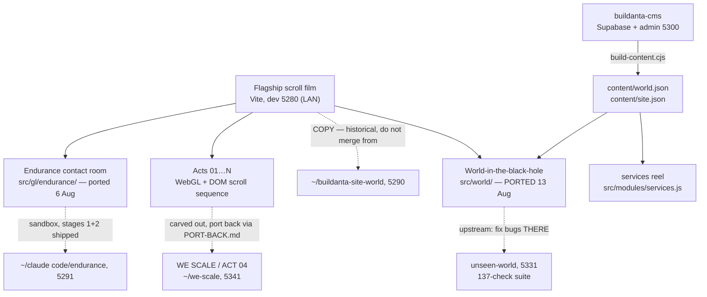

# Buildanta Solutions site (family) — living map

> Truth file (vault rule W3). `dashboard.html` is generated from this — never edit it by hand.
> Regenerate: `node ~/.claude/skills/build-standards/tools/gen-dashboard.mjs "~/claude code/buildanta-site"`

_Updated: 2026-08-14_

## Map

- **The family pattern:** heavy act work happens in carved-out repos with their own verify suites, then ports back deliberately — never edited live in the flagship.
- Content comes from **buildanta-cms**, not from files here. `content/` is generated — see *Changing the words* below.
- The world is **ported, not forked**: its source of truth is `~/claude code/unseen-world`. Fix bugs there first.
- **Traps live in `CLAUDE.md`** — design freeze (UX4), no beat retiming without asking, page-scoped ids, never hand-edit `content/`, never copy files in from the old 5290 copy.

## Changing the words

Nothing here is edited by hand. The loop is:

1. Edit in the admin — `cd ~/claude code/buildanta-cms/admin && npm run dev` → **localhost:5300**
   (Supabase must be up: `supabase start` in `buildanta-cms`. First account created becomes owner.)
2. Press **Publish** in the admin. That writes one immutable snapshot.
3. Build it into this site:
   `SUPABASE_SERVICE_KEY=$(supabase status -o json | jq -r .SERVICE_ROLE_KEY) \`
   `node tools/build-content.cjs --out "$HOME/claude code/buildanta-site" --art world/art`
   (run from `buildanta-cms`. The `--art world/art` is required — without it the media
   lands in `public/art/`, which nothing here reads.)
4. Commit `content/` and `public/world/art/`. Both are tracked on purpose.

If the CMS has never been published, the services reel falls back to the hardcoded
array in `src/modules/services.js` and the site looks exactly as it always did. The
world does not have a fallback: `content/world.json` is committed, so a fresh clone works.

## Progress

- ✅ Perf + colour audit, all 4 stages shipped 8 Aug — GPU 8.84 → 3.93 Mpx; the 287ms stall was 19 shaders compiling mid-scroll, fixed
- ✅ WE SCALE (ACT 04) carved out and rebuilt — 33/33 headless checks
- ✅ **World PORTED into this repo (13 Aug, `d5a032c`)** — 26/26 embedded checks; canvas count back to the pre-port baseline of 7
- ✅ Endurance contact module built — Contact = fly into the ship; 12 MCQs settled
- ✅ CMS BUILT and wired — 58 projects, 12 with real copy, 9 services + 5 headings; this site reads its output
- ✅ **Endurance contact module — already IN this repo** (`src/gl/endurance/`, ported 6 Aug across `c25506b`/`2df6082`/`9c4a069` with Yash's own MCQ rounds). The "waiting to be ported" note carried in this file was stale; verified 13 Aug by flying into the ship and reaching the room.
- 🔴 The contact form still composes a **mailto:** — Yash owes the real send method + the phone/WhatsApp number
- ⏳ 46 of the 58 projects still carry placeholder names and art
- ⏳ WE SCALE port-back per PORT-BACK.md
- 🔴 Pre-existing portal bug — Yash's open item, not being chased silently
- 🔴 Endurance: form-send method + phone/WhatsApp number owed by Yash

## Decisions

### D-001 — The approved design is frozen (vault UX4)
- **Date:** 2026-08-10
- **Decision:** Once Yash approves a design it is FROZEN; rebuilds/migrations are not licence to redraw it; ambiguous scope resolves toward preserving.
- **Why:** A "leveled-up" rebuild silently redrew approved UI once; that class of loss is now banned by rule.
- **Alternatives:** Trust each session's judgment — rejected, that's how it happened.
- **Decided by:** Yash
- **Source:** Vault rule UX4 (2026-08-10)

### D-002 — Projects lives AT the black hole and falls you into the world
- **Date:** 2026-08 (approx)
- **Decision:** The Projects entry sits beside Contact at the black hole; entering it drops the visitor into the explorable world.
- **Why:** One gravity-well moment carries both destinations — the site's signature move stays singular.
- **Alternatives:** Separate Projects page/nav — rejected as ordinary.
- **Decided by:** Yash
- **Source:** Seeded 2026-08-11 from the world build

### D-003 — Contact = fly INTO the Endurance ship
- **Date:** 2026-08 (approx)
- **Decision:** The contact experience is the Interstellar-style ship beside the black hole; flying in reveals the form.
- **Why:** Contact should be a scene, not a form field — consistent with the film language of the site.
- **Alternatives:** Standard contact section — rejected.
- **Decided by:** Yash (12 MCQs)
- **Source:** Seeded 2026-08-11 from the Endurance module build

### D-004 — CMS: Supabase + team logins + whole site + both previews
- **Date:** 2026-08-11
- **Decision:** The CMS covers the WHOLE site (not just the world), runs on Supabase with team logins, and supports build-time AND live preview; uploads auto-fit because card geometry comes from `image_size`, not the file.
- **Why:** The team must edit content without Claude in the loop, and previews must match both publish paths.
- **Alternatives:** World-only CMS; file-based editing — rejected in the 9-decision MCQ round.
- **Decided by:** Yash (9 MCQs)
- **Source:** CMS decision round, 11 Aug 2026

### D-005 — Acts get carved out, worked in isolation, and ported back
- **Date:** 2026-08 (approx)
- **Decision:** Heavy act rework happens in a dedicated repo (e.g. we-scale) with its own verify suite and a written PORT-BACK.md path.
- **Why:** Two agents once overwrote each other six times editing the flagship concurrently; isolation plus a deliberate port-back ended that.
- **Alternatives:** Work acts live in the flagship — rejected after the collision.
- **Decided by:** Yash + Claude (logged)
- **Source:** Seeded 2026-08-11 from the WE SCALE carve-out

### D-006 — Beat boundaries never move without asking
- **Date:** 2026-08 (approx)
- **Decision:** No retiming of any scroll act's beat boundaries without Yash's explicit yes.
- **Why:** An ACT 03 retime silently ate the WE SCALE act twice — and its own tests passed both times.
- **Alternatives:** Rely on tests to catch it — proven insufficient, twice.
- **Decided by:** Yash
- **Source:** Seeded 2026-08-11 from the ACT 03 incident

### D-007 — The services reel reads from the CMS, with the hardcoded array as fallback
- **Date:** 2026-08-13
- **Decision:** `src/modules/services.js` merges `content/site.json` over its hardcoded array per-plate; the array stays as the fallback and as the readable definition of the shape.
- **Why:** Otherwise the CMS's Site content screen controls nothing on the real site. Per-plate merge, not all-or-nothing, so a service the CMS has not been given yet keeps its copy instead of vanishing from the reel — the failure that would be noticed last and hurt most.
- **Alternatives:** Leave services hardcoded (rejected — makes the admin pointless here); replace the array entirely (rejected — a missing build would blank the reel).
- **Decided by:** Yash (MCQ, 13 Aug)
- **Source:** World port, 13 Aug 2026

### D-008 — The world's media is committed, not generated on clone
- **Date:** 2026-08-13
- **Decision:** `public/world/art/` (3.7 MB, 58 files) and `content/` are tracked in git.
- **Why:** Another session opening this repo gets a working world with no build step. Yash weighed that against repo size and chose "just works on open".
- **Alternatives:** Gitignore them and require `build-content.cjs` before first run — rejected; the cost lands on whoever opens the repo cold, which is exactly when they can least diagnose it.
- **Decided by:** Yash (MCQ, 13 Aug)
- **Source:** World port, 13 Aug 2026

### D-009 — The world is ported by hand, never by copying files
- **Date:** 2026-08-13
- **Decision:** Changes come across as applied hunks onto this tree's current files, never by `cp` from `~/claude code/buildanta-site-world`.
- **Why:** That copy has no shared git history with this repo, so git cannot three-way merge it. Three of its files are OLDER than ours — copying `main.js` wholesale re-added the crash recorder removed in `dd983a4`, and an over-long slice of its tail duplicated `boot()`, booting the whole site twice and doubling four canvases. Both were caught only by measuring against the pre-port tree.
- **Alternatives:** `cp -R` the copy over this repo — rejected, it silently reverts work.
- **Decided by:** Claude (logged; the hazard is recorded in CLAUDE.md)
- **Source:** World port, 13 Aug 2026

### D-010 — Split headings wrap by word, not by character
- **Date:** 2026-08-13
- **Decision:** `splitText.js` groups each word's character spans in a `.word` wrapper carrying `white-space: nowrap`.
- **Why:** Every character is its own `inline-block`, and a line may break between any two of them — so the contact heading rendered "GOT SOMETHI / NG TO BUILD?" on every laptop-width screen. `word-break` could not fix it: the browser was not breaking the word, it was breaking between two boxes.
- **Composition held at TWO lines** (Yash, same day): the wrapper alone pushed the contact heading to 3 lines at 1024–1440px, so `.contact__title` went from `6.6vw` to `5.7vw`. The line box is ~44.7% of the viewport and "GOT SOMETHING" needs 7.72x the font size in width; measured at eight widths from 820 to 1920, the exact fit is **5.76vw at every one of them**, so one coefficient covers the band with ~1% slack. The 104px cap is unchanged — it engages at 1825px, where the column is 816px against the 803px needed.
- **Verified:** all 11 split headings measured at five widths before and after. Contact: 2 lines with a broken word → 2 lines with none. The other ten: unchanged at every width.
- **Alternatives:** leave it at 3 lines (rejected by Yash); leave the break (rejected, it is the flagship's contact headline).
- **Decided by:** Claude found and fixed the break; Yash chose to keep the two-line composition
- **Source:** Found while verifying the Endurance port request, 13 Aug 2026

### D-011 — WE SCALE goes black (supersedes the mint look AND the carve-out's)
- **Date:** 2026-08-14
- **Decision:** WE SCALE's ground is reference-black (measured off buildanta-solutions.vercel.app: #000 corners, green-tinted near-black atmosphere), globe+hand move LEFT, title top-centre in glowing green, the six ambient money notes / birds / feed orbs are retired (hero burn note stays), ticker + HUD go dark.
- **Why:** Yash wanted the act to match his black reference; 6 MCQs settled text position, black depth, green treatment, type colour, bills, and the strip.
- **Alternatives:** White type like the reference (rejected — glowing green); keeping the bills on black (rejected — only globe+hand remain).
- **Decided by:** Yash
- **Source:** MCQs, 14 Aug 2026 · commit 34d2f1b
- **⚠️ Consequence:** the `we-scale` carve-out repo (port 5341) still wears the MINT look — its PORT-BACK.md must not be run as-is now; the flagship is ahead of it.
