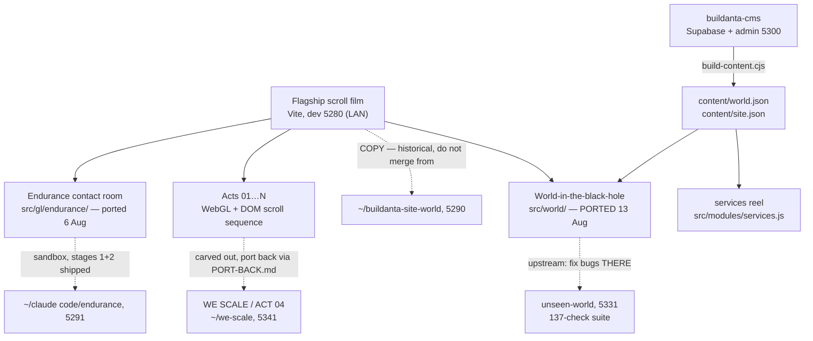

# Buildanta Solutions site (family) — living map

> Truth file (vault rule W3). `dashboard.html` is generated from this — never edit it by hand.
> Regenerate: `node ~/.claude/skills/build-standards/tools/gen-dashboard.mjs "~/claude code/buildanta-site"`

_Updated: 2026-08-14_

## Map

- **The family pattern:** heavy act work happens in carved-out repos with their own verify suites, then ports back deliberately — never edited live in the flagship.
- Content comes from **buildanta-cms**, not from files here. `content/` is generated — see *Changing the words* below.
- The world is **ported, not forked**: its source of truth is `~/claude code/unseen-world`. Fix bugs there first.
- **Traps live in `CLAUDE.md`** — design freeze (UX4), no beat retiming without asking, page-scoped ids, never hand-edit `content/`, never copy files in from the old 5290 copy.

## Changing the words

Nothing here is edited by hand. The loop is:

1. Edit in the admin — `cd ~/claude code/buildanta-cms/admin && npm run dev` → **localhost:5300**
   (Supabase must be up: `supabase start` in `buildanta-cms`. First account created becomes owner.)
2. Press **Publish** in the admin. That writes one immutable snapshot.
3. Build it into this site:
   `SUPABASE_SERVICE_KEY=$(supabase status -o json | jq -r .SERVICE_ROLE_KEY) \`
   `node tools/build-content.cjs --out "$HOME/claude code/buildanta-site" --art world/art`
   (run from `buildanta-cms`. The `--art world/art` is required — without it the media
   lands in `public/art/`, which nothing here reads.)
4. Commit `content/` and `public/world/art/`. Both are tracked on purpose.

If the CMS has never been published, the services reel falls back to the hardcoded
array in `src/modules/services.js` and the site looks exactly as it always did. The
world does not have a fallback: `content/world.json` is committed, so a fresh clone works.

## Progress

- ✅ Perf + colour audit, all 4 stages shipped 8 Aug — GPU 8.84 → 3.93 Mpx; the 287ms stall was 19 shaders compiling mid-scroll, fixed
- ✅ WE SCALE (ACT 04) carved out and rebuilt — 33/33 headless checks
- ✅ **World PORTED into this repo (13 Aug, `d5a032c`)** — 26/26 embedded checks; canvas count back to the pre-port baseline of 7
- ✅ Endurance contact module built — Contact = fly into the ship; 12 MCQs settled
- ✅ CMS BUILT and wired — 58 projects, 12 with real copy, 9 services + 5 headings; this site reads its output
- ✅ **Endurance contact module — already IN this repo** (`src/gl/endurance/`, ported 6 Aug across `c25506b`/`2df6082`/`9c4a069` with Yash's own MCQ rounds). The "waiting to be ported" note carried in this file was stale; verified 13 Aug by flying into the ship and reaching the room.
- 🔴 The contact form still composes a **mailto:** — Yash owes the real send method + the phone/WhatsApp number
- ⏳ 46 of the 58 projects still carry placeholder names and art
- ⏳ WE SCALE port-back per PORT-BACK.md
- 🔴 Pre-existing portal bug — Yash's open item, not being chased silently
- 🔴 Endurance: form-send method + phone/WhatsApp number owed by Yash

## Decisions

### D-001 — The approved design is frozen (vault UX4)
- **Date:** 2026-08-10
- **Decision:** Once Yash approves a design it is FROZEN; rebuilds/migrations are not licence to redraw it; ambiguous scope resolves toward preserving.
- **Why:** A "leveled-up" rebuild silently redrew approved UI once; that class of loss is now banned by rule.
- **Alternatives:** Trust each session's judgment — rejected, that's how it happened.
- **Decided by:** Yash
- **Source:** Vault rule UX4 (2026-08-10)

### D-002 — Projects lives AT the black hole and falls you into the world
- **Date:** 2026-08 (approx)
- **Decision:** The Projects entry sits beside Contact at the black hole; entering it drops the visitor into the explorable world.
- **Why:** One gravity-well moment carries both destinations — the site's signature move stays singular.
- **Alternatives:** Separate Projects page/nav — rejected as ordinary.
- **Decided by:** Yash
- **Source:** Seeded 2026-08-11 from the world build

### D-003 — Contact = fly INTO the Endurance ship
- **Date:** 2026-08 (approx)
- **Decision:** The contact experience is the Interstellar-style ship beside the black hole; flying in reveals the form.
- **Why:** Contact should be a scene, not a form field — consistent with the film language of the site.
- **Alternatives:** Standard contact section — rejected.
- **Decided by:** Yash (12 MCQs)
- **Source:** Seeded 2026-08-11 from the Endurance module build

### D-004 — CMS: Supabase + team logins + whole site + both previews
- **Date:** 2026-08-11
- **Decision:** The CMS covers the WHOLE site (not just the world), runs on Supabase with team logins, and supports build-time AND live preview; uploads auto-fit because card geometry comes from `image_size`, not the file.
- **Why:** The team must edit content without Claude in the loop, and previews must match both publish paths.
- **Alternatives:** World-only CMS; file-based editing — rejected in the 9-decision MCQ round.
- **Decided by:** Yash (9 MCQs)
- **Source:** CMS decision round, 11 Aug 2026

### D-005 — Acts get carved out, worked in isolation, and ported back
- **Date:** 2026-08 (approx)
- **Decision:** Heavy act rework happens in a dedicated repo (e.g. we-scale) with its own verify suite and a written PORT-BACK.md path.
- **Why:** Two agents once overwrote each other six times editing the flagship concurrently; isolation plus a deliberate port-back ended that.
- **Alternatives:** Work acts live in the flagship — rejected after the collision.
- **Decided by:** Yash + Claude (logged)
- **Source:** Seeded 2026-08-11 from the WE SCALE carve-out

### D-006 — Beat boundaries never move without asking
- **Date:** 2026-08 (approx)
- **Decision:** No retiming of any scroll act's beat boundaries without Yash's explicit yes.
- **Why:** An ACT 03 retime silently ate the WE SCALE act twice — and its own tests passed both times.
- **Alternatives:** Rely on tests to catch it — proven insufficient, twice.
- **Decided by:** Yash
- **Source:** Seeded 2026-08-11 from the ACT 03 incident

### D-007 — The services reel reads from the CMS, with the hardcoded array as fallback
- **Date:** 2026-08-13
- **Decision:** `src/modules/services.js` merges `content/site.json` over its hardcoded array per-plate; the array stays as the fallback and as the readable definition of the shape.
- **Why:** Otherwise the CMS's Site content screen controls nothing on the real site. Per-plate merge, not all-or-nothing, so a service the CMS has not been given yet keeps its copy instead of vanishing from the reel — the failure that would be noticed last and hurt most.
- **Alternatives:** Leave services hardcoded (rejected — makes the admin pointless here); replace the array entirely (rejected — a missing build would blank the reel).
- **Decided by:** Yash (MCQ, 13 Aug)
- **Source:** World port, 13 Aug 2026

### D-008 — The world's media is committed, not generated on clone
- **Date:** 2026-08-13
- **Decision:** `public/world/art/` (3.7 MB, 58 files) and `content/` are tracked in git.
- **Why:** Another session opening this repo gets a working world with no build step. Yash weighed that against repo size and chose "just works on open".
- **Alternatives:** Gitignore them and require `build-content.cjs` before first run — rejected; the cost lands on whoever opens the repo cold, which is exactly when they can least diagnose it.
- **Decided by:** Yash (MCQ, 13 Aug)
- **Source:** World port, 13 Aug 2026

### D-009 — The world is ported by hand, never by copying files
- **Date:** 2026-08-13
- **Decision:** Changes come across as applied hunks onto this tree's current files, never by `cp` from `~/claude code/buildanta-site-world`.
- **Why:** That copy has no shared git history with this repo, so git cannot three-way merge it. Three of its files are OLDER than ours — copying `main.js` wholesale re-added the crash recorder removed in `dd983a4`, and an over-long slice of its tail duplicated `boot()`, booting the whole site twice and doubling four canvases. Both were caught only by measuring against the pre-port tree.
- **Alternatives:** `cp -R` the copy over this repo — rejected, it silently reverts work.
- **Decided by:** Claude (logged; the hazard is recorded in CLAUDE.md)
- **Source:** World port, 13 Aug 2026

### D-010 — Split headings wrap by word, not by character
- **Date:** 2026-08-13
- **Decision:** `splitText.js` groups each word's character spans in a `.word` wrapper carrying `white-space: nowrap`.
- **Why:** Every character is its own `inline-block`, and a line may break between any two of them — so the contact heading rendered "GOT SOMETHI / NG TO BUILD?" on every laptop-width screen. `word-break` could not fix it: the browser was not breaking the word, it was breaking between two boxes.
- **Composition held at TWO lines** (Yash, same day): the wrapper alone pushed the contact heading to 3 lines at 1024–1440px, so `.contact__title` went from `6.6vw` to `5.7vw`. The line box is ~44.7% of the viewport and "GOT SOMETHING" needs 7.72x the font size in width; measured at eight widths from 820 to 1920, the exact fit is **5.76vw at every one of them**, so one coefficient covers the band with ~1% slack. The 104px cap is unchanged — it engages at 1825px, where the column is 816px against the 803px needed.
- **Verified:** all 11 split headings measured at five widths before and after. Contact: 2 lines with a broken word → 2 lines with none. The other ten: unchanged at every width.
- **Alternatives:** leave it at 3 lines (rejected by Yash); leave the break (rejected, it is the flagship's contact headline).
- **Decided by:** Claude found and fixed the break; Yash chose to keep the two-line composition
- **Source:** Found while verifying the Endurance port request, 13 Aug 2026

### D-011 — WE SCALE goes black (supersedes the mint look AND the carve-out's)
- **Date:** 2026-08-14
- **Decision:** WE SCALE's ground is reference-black (measured off buildanta-solutions.vercel.app: #000 corners, green-tinted near-black atmosphere), globe+hand move LEFT, title top-centre in glowing green, the six ambient money notes / birds / feed orbs are retired (hero burn note stays), ticker + HUD go dark.
- **Why:** Yash wanted the act to match his black reference; 6 MCQs settled text position, black depth, green treatment, type colour, bills, and the strip.
- **Alternatives:** White type like the reference (rejected — glowing green); keeping the bills on black (rejected — only globe+hand remain).
- **Decided by:** Yash
- **Source:** MCQs, 14 Aug 2026 · commit 34d2f1b
- **⚠️ Consequence:** the `we-scale` carve-out repo (port 5341) still wears the MINT look — its PORT-BACK.md must not be run as-is now; the flagship is ahead of it.

### D-012 — The thinker statue joins the black WE SCALE
- **Date:** 2026-08-14
- **Decision:** consult-shot-profile.webp (dormant since the mint world hid the consult film) mounts full-bleed on the right half, facing the globe; faithful bronze grade; title stays top-centre; full statue on phones too; no caption line; fades with the act's own reveal.
- **Why:** Yash pasted the statue from an older vercel deployment of this same site asking why it was removed — the asset never left the repo, only the film that showed it. 8 MCQs settled placement, size, title, grade, entrance, phones, copy, and shot.
- **Alternatives:** Desktop-only statue (my advice, rejected — full on phones); green-graded or mono (rejected — faithful bronze); caption line (rejected).
- **Decided by:** Yash
- **Source:** 8 MCQs in batches of two, 14 Aug 2026 · deployed same day

### D-013 — The old WE CONSULT film returns inside the black act
- **Date:** 2026-08-14
- **Decision:** The timeline holds at consultLocal .848 while ~3 screens of raw scroll play the revived film: desk + laptop-globe under ghost CONSULT → "Stop wasting growth hours." with live streaks → "BOOK A GROWTH CALL ↗" closing card (not a link). No stats, no steps. Fully reversible; full film on phones; silent.
- **Why:** Yash asked for the old deployment's consult part added after the act without replacing anything; 15 MCQs + his two screenshots fixed the cut and the text verbatim.
- **Alternatives:** After the burn (rejected — sacred chain stays last); crossfade (rejected for through-the-darkness); stats row and steps ladder (dropped).
- **Decided by:** Yash
- **Source:** 15 MCQs in batches of 4, 14 Aug 2026 · deployed same day
- **⚠️ Trap for later:** the ORIGINAL film writer was never deleted — it computes zeros and writes them onto `.consult-zero` every frame. The epilogue's writer must stay AFTER it and on the SAME element or it is silently shadowed. `--film-earth-turn` takes degrees.

### D-014 — The desk page leaves the film
- **Date:** 2026-08-14 18:31
- **Decision:** The desk/laptop-globe page (establish shot, ghost CONSULT, laptop portal) is removed from the epilogue film. Two beats remain — "Stop wasting growth hours." and the BOOK A GROWTH CALL card — over two screens (filmStretch 3.0→2.0, same dwell per beat).
- **Why:** Yash sent a screenshot of the page and said "remove this page and integrate the rest."
- **Decided by:** Yash
- **Note:** the page's DOM stays dormant; restoring it = re-adding its film-live rules + s1/dolly variable writes (see d6335b1 for what they were).

### D-015 — Post-film handover is notes-only
- **Date:** 2026-08-15
- **Decision:** After the BOOK A GROWTH CALL card, the hand, globe and plant do not return — only the flying dollars over the unchanged ground, into the burn. Reverse below the film restores the full world.
- **Why:** Yash: "after book a growth call remove the hands and plant thing and dont remove the flying dollar and background must be the same also."
- **Decided by:** Yash
- **Mechanics:** ConsultHand.setWorldCut(on) at filmLocal ≥ .90 (swap always under opaque film blackness, both directions); flag participates in the per-frame visibility expression or it would last one frame.

### D-016 — The ad-strip note
- **Date:** 2026-08-15
- **Decision:** Post-film the hero note arrives pinned as a diagonal fullscreen strip (rotation.z 0.21, scale 0.95 — whole bill visible as a band, ends cropped), no float; supporting notes stay dark; burn→galaxy unchanged on top of the tilt.
- **Why:** Yash's reference screenshot: "tilted… like an advertisement strip shifted diagonally… dont float the dollar… remain the same transition."
- **Decided by:** Yash
- **⚠️ Discovered en route:** port 5290 serves the stale buildanta-site-world copy — verify-journey ran green against the WRONG BUILD for two days. Suite now defaults to 5303 and fingerprints the build (setWorldCut) before trusting the page. Vault V8.

### D-017 — The burn loses its debris
- **Date:** 2026-08-15
- **Decision:** The focusBurnFragments system (five bill-textured shards that ignite, break away and drift) is retired behind its single visibility gate. The note chars and embers in place; fire, embers, scorch and the galaxy handover untouched.
- **Why:** Yash circled every shard on his mid-burn screenshot: "remove this cutting notes part and the note in only be burn dont ruin this transion."
- **Decided by:** Yash
- **Restore:** re-instate the original gate expression preserved in the comment at the site of the change.

### D-018 — The strip travels and answers the pointer
- **Date:** 2026-08-15
- **Decision:** The ad-strip note slides along its own diagonal across the beat (±0.5 world units, ~75% always on screen), settling as the burn ignites. Hover: lean toward cursor + 0.06 lift + 1.8% scale, eased, fading to zero at burn start. No material effects. Phones: travel only, no hover (no pointermove).
- **Why:** Yash: "move diagonally but not disappear fully… put some hover effects… not overmake up the effects."
- **Decided by:** Yash

### D-019 — Clean black film frame
- **Date:** 2026-08-15
- **Decision:** The lens-bridge's green furniture (three ring borders, one dashed/turning; the conic aperture wheel with green glow) is display:none under film-live. The frame keeps only neutral elements: dark vignette, the shot's baked beams, the copy's white rules.
- **Why:** Yash's arrowed screenshot: "remove this green shades from the frame this should be clean screen as the theme."
- **Decided by:** Yash
- **Note:** rawForP cannot address inside the film HOLD (p is pinned at FILM_P) — verify film beats by page-% jump on a fresh page.

### D-020 — Sound removed
- **Date:** 2026-08-15
- **Decision:** createSound returns an inert full-API stub (no AudioContext ever constructed); .intro__sound hidden. Real implementation retained unexported (createSoundRetired) for cheap restoration.
- **Why:** Yash: "first remove the sound in this."
- **Decided by:** Yash

### D-021 — The fall travels on production; the ring gets pixels
- **Date:** 2026-08-15
- **Decision:** (1) Projects fall reads the beat through a module-scope bridge (liveIntro) instead of the dev-gated window.__buildanta — the LIVE site was hard-cutting into the world because getBeat() was null in every build. (2) The finale beat has a 1.5× resolution FLOOR on desktop (was min(dpr,cap), which renders 1× on dpr-1 monitors and aliases the photon ring); phones keep the 1024 cap.
- **Why:** Yash's two reports from production: "it just snaps inside" and the hole's visible quality.
- **Verified:** production-parity (static dist) with the real wall→hold→ENTER→ride→Projects gesture; in-page rAF log shows the 5.4s voyage; beat canvas 2160×1350 at dpr-1.
- **⚠️ Traps:** anything read from window.__buildanta is dev-only — prod paths must never depend on it. Headless rAF fired 3×/8.4s — sample inside the page on its own rAF or measure nothing. A stray 300×150 canvas also lives in .intro__blackhole (harmless, unexplained — check if ever hunting leaks).

### D-022 — The shadow is a true void
- **Date:** 2026-08-15
- **Decision:** Three fixes so the event horizon renders dead black: (1) dither moved below the gamma encode (in linear space ±0.5/255 becomes 15/255 on black); (2) the photon ring gated to escaped rays only (captured rays share minR≈1.5 and were glowing); (3) scene alpha carries a HOLDOUT MATTE (0 inside the horizon) and the composite suppresses bloom by it, feathered 1px.
- **Why:** Yash: "it should be black, man" — on the finale and through the Endurance window.
- **Measured:** interior median 5.0/255 with 52% inter-frame flicker → **0.0, max 0, 0% flicker**. Deep space 0.0. Disk/ring/lensing unchanged; Endurance suites 11/11 and 13/13.
- **⚠️ Trap:** the dither trap is generic — ANY ±1/255 nudge must live in display space, never linear. And sample the interior from a luminance profile, not a guessed box: my first two readings measured the rim's bloom skirt.

### D-023 — The market camera is a 3D model
- **Date:** 2026-08-19
- **Decision:** PNG + six overlay spans retired; procedural GLB (build_camera.py, 6-iteration matcher loop, IoU 0.739 accepted) rendered by marketCamera.js inside the same .market-pusher box. Drop-in contract: render frame locked to the model's mm=px coordinate system, so at yaw 0 the canvas is pixel-equivalent to the PNG — all existing push transforms unchanged, 43.5%/31% pivot still the lens. Entry x .425–.560 (profile fade-in, travel+turn, reels spin-up as a factor on cameraSpin). approach at .684 untouched.
- **Open:** plate transport curve (reel_a→apex→reel_b); anchors already published as --market-reel-* projections.
- **⚠️ Traps:** bpy transform_apply acts on ALL selected objects — helpers must deselect first (the body silently doubled its depth and swallowed the lens; silhouette matchers cannot see interior occlusion — the build now audits part depth vs the lens plane). mm-scale point lights decay to black — use directionals. Port 5290 = stale copy (V8), shoot-market retargeted.

### D-024 — The camera waits for the title
- **Date:** 2026-08-19
- **Decision:** Yash rejected the D-023 entry window (.425–.560): it overlapped the act title. The big "We market" exits via a WIPE ending ~p .555 — NOT at copyOpacity's fade (.4975), which only governs the small copy; the first retime keyed on it and failed. Entry now: fade-in .555–.585, yaw done .635, lands .647, spin-up .590–.635. Handoff contract at .684 untouched, re-verified front-on. Plates ride alone .495–.555 by his explicit instruction ("start the camera after the ending of the We Market section transition").
- **⚠️ Trap:** the act's copy fade and the title's wipe are two different exits ~.06p apart — retiming against the wrong one leaves the title under the entering camera. Measure the clear point from frames, never from a formula.

### D-025 — Optical zoom, drive-in entrance, real metal
- **Date:** 2026-08-19
- **Decision:** Yash: pixelated push, machine appearing too late, "make it look more real." One root cause: the canvas lived inside .market-pusher under CSS transforms — the FINAL pusher transform block overrode the earlier block carrying the entry vars (the machine never travelled, it faded in place), and the push was scale(13) stretching a raster. Rebuilt: canvas covers the act, intro.js composes the transform chain into a frame rect, marketCamera.js maps the model frame onto it with setViewOffset — native-res at every scale. Entry: ease-out drive-in from off-screen left .545, nose on screen .550, lands .62 (title gone .546 — never co-visible). Materials: PMREM env (sigma .04), creased normals 40°, seeded procedural grain/brushed maps tuned for the 13× moment, clearcoat lens. Phone dpr cap 1→2 (the old cap re-created the bug on dpr-3 panels). Verified by a 6-skeptic adversarial workflow + all three suites.
- **Open:** --market-reel-* anchors publish only from ~.684 (harmless — consumer is the future plate transport); takeover ring has 17/30px parallax vs the 3D barrel at .730 (invisible under its 0.2-alpha rim, accepted); intro__gl still draws past its act (spun off as a task chip).
- **⚠️ Traps:** a CSS var is only real if the LAST cascade block for that property consumes it — the entry vars sat in an overridden block and every single-p frame check passed while the animation never ran. Skeptics can misfire against a wrong spec: the ".684 not centred" finding measured lens x=.473, which IS the approved PNG-era placement (old code's own comment: 683/1440) — check the frozen design before "fixing" toward a number you invented. PMREM sigma above ~.04 clips at 256px (warns, slow bake).

### D-026 — Arrive, load, run; and the rings agree
- **Date:** 2026-08-19
- **Decision:** (Yash 22:22, two of three asks — the model refine waits for his exact reference image.) The feed reel now DROPS IN from above: machine drives in without it, reel descends .622, seats .660 with a 10mm clunk, spin-up .662–.682 — one spinUp for both spools keeps the one-driver law; the machine starts when it is loaded. Ring alignment: the takeover/iris overlays were pinned at viewport centre while the barrel's VISUAL circle sits off it — under perspective an off-axis circle's apparent centre shifts from its axis point, so project('lens') cannot fix it either. marketCamera projects 8 flange-rim points (rim measured from geometry at load) and both overlays pin to the averaged centre (--lens-cx/cy, fallback 50%).
- **Open:** takeover RADIUS still follows the old hand-tuned law (only position was fixed) — if Yash still sees size disagreement, calibrate takeR against projectLensCircle().r. Model refine pending his reference image.
- **⚠️ Trap:** aligning a 2D overlay to a 3D circle needs the projected RIM, not the projected centre-node — perspective parallax on an off-axis circle moves its apparent centre ~17/30px at 13×.

### D-027 — The FILM unspools from the reel (D-026's drop-in reverted)
- **Date:** 2026-08-19
- **Decision:** Yash (22:58) corrected the 22:22 reading: not the camera's reel arriving — the STRIP arriving FROM it; the camera's reels stay mounted and spinning (spinUp restored .565). The band's gate point starts at the live-projected feed reel (tracks the machine mid-drive) and descends to its track on filmIn's own curve (.553–.585 — the strip now appears WITH the machine; it used to fade in before the machine existed). Plate travel starts after the band lands (filmRaw local .44–.85, same .684 end, denser detents). Ring-alignment work from D-026 stands.
- **⚠️ Trap:** the strip has TWO stale transform chains in main.css — the original (rotate −2.5° + rotateX 3°) and the 7 Aug "reel runs LEVEL" chain that killed both. Restating the transform at file end, I copied the ORIGINAL and the sprockets ran downhill again 11 days later. D-025's lesson cuts both ways: to extend a chain, extend the LAST block's chain — never the first one grep returns.

### D-028 — The model matches Yash's reference; the rings truly align
- **Date:** 2026-08-20 (00:20)
- **Decision:** Detail pass on build_camera.py against Yash's reference image: SAME anchors/frame/pivot (realism = hardware vocabulary, not proportions — resizing to the reference's proportions would have re-derived the whole handoff contract at midnight). Added: recessed glass (child mesh l_glass → surround gets bright brushed metal, element gets dark clearcoat), ridge/retaining rings, bolted bezel frame, knurled dials, flank studs, tilt axle + end knobs, telescopic tripod (double collars, spike + ball-tip feet), reel hub caps. 23,320 tris; anchors 0.00mm; IoU 0.735 ≈ the accepted 0.739 baseline (envelope preserved).
- **Rings, root-caused at last:** D-026's --lens-cx/cy fix NEVER APPLIED — vars sat on .market-experience but the takeover/iris are not its descendants (skeptic chord-fit: overlay at exactly the 50% fallback; my earlier "looks aligned" was an eyeball pass over a 17/30px offset). Moved to root (#intro), --lens-r's scope. Second gap under it: the handler is SCROLL-driven, so a GLB that finishes loading while the page sits still leaves every ready-gated write stale (jump navigations always hit this) — mountMarketCamera gained onReady → intro re-applies lastRaw once. Verified in-page: overlay centre == projectLensCircle centre == (695,408) at .730.
- **⚠️ Traps:** setting a CSS var proves nothing about who can SEE it — check the consumer is a descendant of the element you set it on (the same page had --lens-r on root as a working example one line away). A scroll-driven handler + an async asset = every "if (ready)" write silently skipped on jump navigation; verify with a JUMP, not a scroll-through, and give async mounts an onReady that re-applies current state.

### D-029 — Machined metal under studio light (Yash's full shading spec)
- **Date:** 2026-08-20 (08:20)
- **Decision:** Executed Yash's 07:41 spec end-to-end. Geometry: recessed bolted panel with screw WELLS, shallow element (apex 18mm proud — the ball look is dead), turning grooves, both-face reel lips + recessed web + hub bore, horn viewfinder, 24-rib dials, 18mm crank stock, and BEVEL EVERYTHING (2mm/2seg/40°) with export_apply=True — **the old export NEVER carried the body bevel; a modifier alone never leaves Blender**. Material: base #303040/metal .78/roughness 0.30–.55 mapped, wear slots → #4A4A62 (Blender material slots → glTF primitives); element #0A0A12 metal 0 with a 0.18→0.45 view-normal roughness ramp. Luminance: exposure .95, violet key 2.4 (PCFSoft shadows), amber fill (decay 0), lavender rim, ambient .10 — no white light. Acceptance measured: midtones 29–51 RGB, key face ≤(96,95,126), only bevels/speculars over ceiling.
- **⚠️ Traps:** rotation applied AFTER box() spins the part about the WORLD origin — box() bakes location into the mesh (head knobs flew 300mm; give primitives rotation at creation, join() bakes matrix_world). The 40° bevel limit chamfers every coarse-torus facet (minor<10 = facets >36°) and TRIPLES tris. glTF export_apply=False (default) silently drops all modifiers. Reading pixels off a WebGL canvas needs preserveDrawingBuffer — sample the screenshot instead.
- **Amended 08:17 (D-029b):** the .95-exposure grade crushed to silhouette on Yash's screen — every-detail-legible outranks the midtone ceiling. Exposure 1.05, ambient .22 + violet/warm Hemisphere .55, fill 1.7 frontal, key 2.6, rim 2.0, env .85, base 3E3E52/wear 5C5C74. Palette rule intact (no white light). Measured at his viewport: machine mean lum 85; only the glass element and reel windows stay near-black.

### D-030 — The model was cached for a YEAR, and the surface was rebuilt
- **Date:** 2026-08-20 (09:30)
- **🔴 Root cause of a full day of "it still looks plain":** Cloudflare Pages serves `/assets/*` with `cache-control: immutable, max-age=31536000`, and the GLB shipped under a FIXED filename — `immutable` means the browser does not even revalidate. Yash held the ORIGINAL plain-box model for a day while the (content-hashed) JS updated around it: he was seeing the first model lit by the newest rig, and every "still plain" report was correct. **Fix: the GLB moved out of `public/` and is imported through Vite (`?url`) so it is fingerprinted like any other asset. Never move it back.**
- **Decision:** Four-specialist analysis against the reference, then measured iteration. Micro-detail moved from canvas maps into OBJECT-SPACE shader noise — the maps were delivering 0.26% of their authored amplitude (27.6 texels per screen pixel; UV density spans 86× within one mesh); signed per-mm curvature for cavity darkening and chamfer polish; per-part grain (the reference varies 20:1 between a blasted reel web and a turned leg tube); the environment replaced by the act's own violet-sky/amber-ground gradient (RoomEnvironment's emissive PANELS were the hard square speculars on the dome); tripod feet shipped with NO material (default white); 4-ring lens stack at 8mm pitch; per-part bevel widths.
- **Acceptance** (785×1511 elevation vs the graded reference): median 50 vs 56, p75 67 vs 70, p95 129 vs 148, p99 171 vs 208, blue-bias 15 vs 3. Darks deliberately stop short (p05 41 vs 11) — Yash's standing "no detail hidden" rule outranks matching a studio shot's shadows.
- **Tooling:** `/acceptance.html` (dev-only) renders the machine at the reference's exact frame using the site's own materials and lights; every number above came from it.
- **⚠️ Traps, all silent, all found by bisection:** the runtime crease angle welds 2-segment chamfers into their flat face above ~20°, inflating small faces into cushions — every segment count must sit on the correct side of it (64-seg cylinders 5.6°, chamfers 22°). `pmrem.fromScene`'s cube camera **defaults to far=100**, so a 500-unit sky sphere bakes pure black — the tell is envMapIntensity 12 rendering identically to 3. An LDR canvas sky carries a fraction of RoomEnvironment's energy (its panels sit far above 1.0) and needs an HDR multiplier on the material colour. A bevel must stay small relative to the face it sits on.

### D-031 — Geometry rebuilt on re-measured constants (IoU .735 → .866)
- **Date:** 2026-08-20 (09:45)
- **Decision:** The geometry specialist measured the reference pixel by pixel and found most of the "MEASURED — do not invent" constants were wrong. Corrected: body 12% too tall; ONE front square → the reference's TWO levels (396×287 recessed panel + nested 260×251 raised plate, **eight** screws); tapered three-step top plate; lens rebuilt on the measured radial profile (flange r117, groove r106, step r96, retaining ring r71.5, bore r66, glass r60); reels R138 with windows r35@83 and a rim band that stands PROUD (the old torus lip sat *below* the web and read as a dent), hub with seven BLIND pockets; viewfinder was 125mm too high (a fin between the reels) → a horizontal horn on the flank; side dials were half size; crank goes right-then-down; three-tier pedestal, stalked tilt knobs, three-disc pivot boss, two-disc crown (was 44% too wide); two-stage legs with twin clamps and ferruled feet; **the entire spreader clamp assembly did not exist** — a fake column stood in for it.
- **🔴 THE BEVEL RECIPE was the "untextured CG" look:** a 2-segment bevel splits a 90° edge into facets 30° apart, so any crease threshold above that smooths all three into a soft roll — every panel, ring and window was a rounded blob. **1 segment = a single 45° chamfer whose edges stay sharp at any sane threshold**, and it halved triangles (138k → 55k).
- **On record, deliberately not applied:** the reference's reel centre measures y ≈ +308.5 (two independent estimators) against the contractual anchor +319.5. The anchor stays — the reel SPINS about that node, so moving the geometry off it would wobble the wheel. Silhouette loses to the animation contract, on purpose.

### D-032 — envMapIntensity was dead code; and the graded plate is the target
- **Date:** 2026-08-20 (10:35)
- **🔴 Live bug, found by the lighting specialist:** in three r180 a `MeshStandardMaterial` whose **`envMap` is null** has its `envMapIntensity` uniform overwritten every frame by `scene.environmentIntensity` (default 1.0). Every value we ever set was inert — that is why 12 and 3 rendered identically during the D-030 bisect, which I wrongly blamed on a dead environment. Fix: assign `o.material.envMap = scene.environment` explicitly (both the metal and the glass).
- **Reference correction:** the act-legal target is `public/market-cinema-camera-graded.png`, not the neutral `art-source` plate — chasing the latter's neutrality is a hue error. Against the graded plate: median 54 vs 53, p95 135 vs 149, p99 170 vs 205, **blue-bias 16 vs 16**.
- **Tried, measured, reverted:** the colour specialist's full grade (strip environment, NeutralToneMapping, smoother metal, key at 58°) moved percentiles toward target but rendered flat and monochrome purple. **Numbers guide; the frame decides** — several histogram improvements made the machine look worse, and the revert is deliberate, not an oversight.
- **Open:** p05 stays light (46 vs 22) by choice — "no detail hidden" outranks a studio plate's shadow floor. The unapplied colour/lighting deltas are in the task output if the grade is ever revisited.

### D-033 — The lens is an aperture, not a marble
- **Date:** 2026-08-20 (11:20)
- **Decision:** Yash: "the lens does not look real… with purplish shade inside." It was a dark sphere in an empty bore — and it is the destination of the whole push. Now: nine blades, each a disc minus a circular bite (r78 centred 69mm out, 40° pitch, 12° phase), stacked 0.5mm apart; the pupil is not modelled, it falls out as ARC_R − ARC_D = 9mm; a dark tunnel behind it gives the centre depth; the front element is a shallow spherical cap (apex 6mm proud), not a ball. Blades are shaded from their own arcs, violet at the rim falling to a warm core — the one surface where the act's violet key and amber fill meet.
- **⚠️ Four wrong models before the right one** (each fails visibly, so keep them straight): a strict z-order lets the top plate own everything outside its own bite (spiral on one side only); angular-wedge ownership flattens the arcs into a radial star; nearest-leading-edge draws every arc across the face and yields a lattice rosette; **the correct rule resolves the cycle LOCALLY — start at the plate whose sector you stand in, walk backwards, take the first that covers you.**
- **⚠️ Two traps:** the bore was a SOLID plug, so an iris built inside it was buried and only the plug's face showed. And the exporter maps Blender (x,y,z) → (x, z, −y), so a plane that is XZ in the build script is **XY** in the GLB — measuring radius/angle in .xz ran them across the blade THICKNESS and produced a flat disc I nearly blamed on the material.

### D-034 — Four defects the lens specialists measured in the shipped iris
- **Date:** 2026-08-20 (11:45)
- **🔴 l_glass exported as a 380mm SPHERE enclosing the machine.** `cut()` is a DIFFERENCE where the "shallow cap" needed an INTERSECT, so the trim only drilled a core out of a giant ball. It hazed the whole camera — and because l_glass is a child of the lens node, marketCamera.js's rimR scan read **190 instead of 117**, so `projectLensCircle()` reported a lens circle 1.6× too large and silently broke **D-026's takeover-iris alignment**. An oblate spheroid IS the cap: no ball, nothing to trim. Verified after: overlay centre (694,406) vs lens circle (694,405), r back to 429.
- **Also fixed:** `iris_tunnel` was appended to `lens_parts`, and **glTF names a merged mesh after the join's FIRST part** — so no mesh matching /tunnel/i survived and the runtime rule matched nothing (it was a solid rod besides, whose flat face is the black disc it was meant to prevent); now a stepped bore with baffle ledges, its own object, PARENTED. `BLADE_STEP` 0.5 was **smaller than** `BLADE_T` 0.9, so plates interpenetrated and fused into a slab. Bite cutter 48 → 96 segments. The tunnel material had no envMap, so its intensity was overwritten by the scene default (D-032's trap again) — and **metalness 1 is deliberate: for a metal F0 IS the colour**, so one near-black value kills environment sheen and key specular together; at metalness 0 the "hole" measured as bright as the blades.
- **Specced but reverted:** the trailing trim (cut blade k with blade k+4's bite so every geometric edge lands on a shader arc). As a DIFFERENCE it eats the plate from both sides and the nine crescents stop tiling — a star-shaped hole opens onto the throat. Tried, shot, reverted.
- **⚠️ Standing traps:** `transform_apply(scale=True)` defaults location AND rotation to True, baking world position into the mesh — any lens child whose location is baked reports it as its bbox and hijacks rimR. The build audit now asserts **radius** as well as depth for lens children, because radius is what went wrong and depth never saw it. The five iris constants are duplicated as literals in the runtime shader; change one copy alone and the lit arcs decouple from the real edges.

### D-035 — One shutter, it opens by retracting, aligned by construction
- **Date:** 2026-08-20 (12:40)
- **Decision:** Yash: "I want the shutter of the camera lens to get opened on zoom-out, not that purplish blue circle… align the shutter opening with that green circle… and as that green circle gets bigger the green mesh also appears." Three things were fighting: the model's 3D iris, the **old CSS blade overlay from the photograph era** (built because a scaled PNG could not stay sharp at 13×), and a reveal circle not centred on the lens. The CSS takeover and its wedge iris are now **retired** (elements remain, permanently at opacity 0 — proven dead: forcing display:none changes 0.0000% of pixels).
- **🔴 My first fix made it worse.** Opening by scaling the blade assembly (s up to 7.4) pushed the plates past the barrel and over the body until they covered **94% of the viewport** — a fullscreen violet pinwheel with no camera left on screen at p=.726, i.e. the rejected artefact reproduced larger. **A physical iris opens by RETRACTING:** the plates keep size and position and the shader DISCARDS everything inside a growing, nine-sided, rotating pupil. Past full open the blade field is gone and the bore is empty for the page beneath.
- **Timing:** the shutter must finish opening BEFORE the blackout rises (.726–.738). The first cut opened at .730 and the whole mechanism played invisibly in the dark; now .710–.732, with 91% of the opening complete while the blackout is still at 7%.
- **Alignment by construction:** the push pivot IS the lens, so steering the pivot to the viewport centre puts the aperture where the green circle lives (clip-circle at 50% 50%). Exact frame fractions (341.5/785, 467/1511) — the rounded 0.31 still left 5px, because at 13× a 0.1% frame error is real pixels. Verified: `project('lens')` and `project('iris_blades')` both (0.5000, 0.5000).
- **⚠️ Measurement trap:** a dark-pixel centroid reads the aperture ~20px off-centre at wide openings because the pupil merges with the barrel's own shadowed ring. The node projection is the honest probe; the pixel scan is trustworthy only while the hole is small.
- **Also:** four suites (verify-portal, verify-sync, visual-baseline, verify-journey) were still aimed at port **5290**, which serves a stale copy — their assertions had not run in a long time. Retargeted to 5303. verify-portal now runs and fails on a PRE-EXISTING issue (scroll-back leaves the black-hole beat up), confirmed pre-existing by stashing all of src/ and reproducing; spun out as its own task.

### D-036 — The reveal blooms where the shutter opened
- **Date:** 2026-08-20 (13:20)
- **Decision:** Second skeptic round passed the mechanism (strictly monotonic opening; a real spiral — the nonagon rotates 38.7° WHILE growing; the old CSS overlay proven dead by removal test, 0 pixels changed) but the central ask still failed: opening and green circle ~46px apart. **Cause is not the centring:** the lens NODE is at model z 0 while the blades sit 232mm in FRONT, and under perspective a point that much nearer the eye projects elsewhere. `marketCamera.projectPupil()` now reports the aperture's real screen point; intro latches it at the handover and the reveal's clip circle AND its feather both aim at it. Measured: both at (901.6, 439.2) = exactly where projectPupil says the shutter opened.
- **⚠️ TEST-METHOD TRAP (cost a whole debugging round):** jumping straight to p=.756 skips the frames where the latch is taken, so the reveal falls back to 50% and every probe reports a misalignment a real scroll never has. **Verification must STEP through .700–.734.** I twice "fixed" a CSS custom-property scope that was never the problem — a manual control (setting the var by hand and watching the circle move) proved inheritance had worked all along. When a value looks unset, prove the WRITE ran before re-plumbing the READ.
- **Open (from the skeptics, not addressed):** the aperture never fills the frame while still lit — it saturates at 0.563 of the lens radius at .728 and the blackout has it by .734; fixing that means moving the blackout beat boundary, which is frozen without Yash's say-so. Blades still read violet at a glance (his instruction), flagged only as re-complaint risk.

### D-037 — The bloom is a sibling; and the throat fades
- **Date:** 2026-08-20 (13:50)
- **Shutter PASSED** its third audit outright: strictly monotonic (pupil 21.5 → 349.5px), k=9 dominant at every p with the phase advancing one direction (~24°), exactly one iris on screen (the PNG-era DOM is gone entirely), and the aperture reaches 99% of open while the frame is still at 88% of peak brightness.
- **🔴 The alignment failed again, and the reason matters:** the element that paints the green disc a viewer reads as "the circle" is `.consult-zero__light-frame`, a **SIBLING** of `.consult-zero` hard-coded to 50% 50%. Anchoring the clip-path moved the clip and its feather but could never move that. **Third round lost to the same class of error — aiming at the element I EXPECT to paint something instead of the one that measurably does.** Its box is `inset:-12%` (bigger than the viewport and offset from it), so viewport px are meaningless inside it; intro measures its rect once at the latch and publishes aperture coordinates in ITS space for the gradient, the transform-origin and the ::after disc. Verified: bloom at viewport (903,439) vs clip circle (901.6,439.2).
- **Throat pop fixed:** `visible = irisOpen < 0.30` removed it in a single frame at p=.718 in full light (a black ring jumped luminance 11 → 49 in one 0.001 step). Now an opacity ramp over .22–.34: measured 15 → 21 → 41 → 55 across four steps.
- **Reported, not changed:** the mesh fills in mostly over the last third of the reveal. It is NOT decoupled — the world is painted and clipped from .744 — but the grid is sparse at its vanishing point, which is exactly where the circle opens. Making it arrive earlier means moving the consult act's start (.768), a frozen beat boundary.

### D-038 — The filmstrip is a curved 3D ribbon
- **Date:** 2026-08-20 (14:40)
- **Decision:** (Ribbon brief.) The DOM strip's defect was structural — tilted flat cards on a straight sprocket band cannot read as film. Now ONE continuous curved surface in the camera's own scene: Catmull-Rom through the brief's five points, 160 arc-length segments, 260mm wide, rolled +18°→0→−18° (the twist is what reads as serpentine), parented to the RIG so the film rides the machine and stays threaded through its reels. **The rail is static** (the reference's real lesson): built once, never animates; only content slides via a uniform mapping the act's existing DETENTED drive (filmTravel — raw `pos` parked the GAP at the apex). Sprockets are shader discards in the surface. Nine plates in one 3×3 atlas, one draw call. Captions stay DOM (crisp/selectable/AT-readable), anchored via projectModelPoint. Clicks raycast to an index and bridge to the SAME hidden DOM plate's handler — sheet, Escape, backdrop, focus, Lenis lock untouched (verified: apex click opened CONTENT, focus on close, Escape closed). DOM strip opacity-0 but in the tree (a11y fallback; never display:none). Reels split per brief via closed-form INTEGRALS of the fill-state rates (a raw rate would spin wheels backwards when it fell); both remain functions of pos — one-driver law holds. Reduced motion: plate 4 parked, no transport.
- **Acceptance (skeptic-measured):** rail static at rest — sprocket apertures 0.00px drift across plate positions; holes trace the arc (line rms 47.5px vs cubic 2.95px over 1925px); one surface, no seam >4px; apex within 4px of the machine axis; ends dim to ×0.66. The p=.60 "rail moved" reading is the machine still settling — the ribbon rides the rig by design.
- **Fixed after audit:** ghost hit-areas — the hidden DOM plates kept pointer-events:auto and sit ABOVE the canvas, so invisible rectangles ate clicks; keyboard focus never needed it (anchors stay Tab/AT-reachable at pointer-events:none). Caption now swaps on the DETENTED drive (it led the picture on raw pos).
- **Parked:** phone framing puts the act in the top third of a tall screen (pre-existing layout); reduced-motion reels scroll-rotate (scroll-indexed, no autonomous motion).
- **⚠️ Traps:** the ribbon must use the DETENTED drive or the inter-plate gap parks at the apex. `frustumCulled = false` on the ribbon — the rect-driven view offset misjudges its bounds. The ribbon is a ShaderMaterial so the load-time material traverse skips it (guards on isMeshStandardMaterial) — keep it that way.

### D-039 — Camera first, then the reel arrives from behind it
- **Date:** 2026-08-21 (12:00)
- **Decision:** Yash's sequence — "first only camera ... then it moves to the centre ... when it reaches the centre the reel comes from the back of the camera to the front on parallax ... then the reel flows." The film used to fade in at .553 while the machine was still driving in, so neither entrance had its own beat. Now: **.545–.620** camera alone; **.622–.662** the reel travels forward out of the machine's depth (ribbon GROUP z −1150 → 0, plus lift and lateral drift — under perspective that depth travel IS the parallax); **.660–.710** transport. Spools spin only once film exists (spin-up .565 → .658). Verified by frames: at .642 the film passes BEHIND the tripod legs, by .665 IN FRONT of them.
- **⚠️ The group moves, never the geometry** — the rail stays built-once, which is the rule the ribbon is designed around.
- **Flow direction — ASKED, not assumed.** "Flow left to right" contradicted the path another session had built to his 22:37 brief (feed off-frame RIGHT behind the machine, exit left). Offered mirror-the-path / reverse-the-film / leave-as-is; **he chose leave it right→left**, reading his phrase as describing the arrival sweep rather than plate travel. No change made.

### D-040 — The wavy arrival, and two rounds of measuring it honestly
- **Date:** 2026-08-21 (13:30)
- **Decision:** The reel arrives on the frame Yash screenshotted — matched by sampling `project('lens')` across the entry (his lens x .404 → p .5836–.5841; a seven-viewport sweep puts his frame AT the onset on 16:10, inside one scroll pixel). It travels forward out of the machine's depth with a travelling ripple in the ribbon's VERTEX shader, amplitude reaching exactly zero at settle so the rail stays pixel-identical at rest.
- **🔴 FREQUENCY IS PER VISIBLE ARC, NOT PER ARC.** Only ~23% of this path is ever on screen, so 30 radians of phase (4.8 cycles over the whole strip) put barely **1.1 cycles in frame** — raising 15 → 30 could not fix the "reads as one bend" complaint, and my comment claiming it had was wrong. ~3 crests inside 23% needs ~13 cycles over the arc = **82 radians**, with segment count raised so the wave itself isn't faceted (~8 samples/cycle minimum).
- **🔴 The loud half of the ripple played BEHIND the machine.** A monotone falloff spent 44% of the amplitude before the film came into view, so the viewer only ever saw the quiet tail. Amplitude now HOLDS near full until the film is out front, then dies.
- **Also fixed:** `filmOut` was applied twice, squaring the envelope (the authored .714–.726 fade was never the fade that ran); the caption outlived the strip it labels (legible at .708, half behind the machine).
- **⚠️ Traps:** a BACKTICK inside a shader template literal closes the JS string and breaks the build — second time (see the black-hole night). Verification must STEP through, never jump, or latched values read as unset. `project('lens')` is pinned to (0.5,0.5) during the push and is NOT a description of the visible aperture — use `projectPupil()`.
- **Open, reported not changed:** Escape restores focus to a plate anchor inside the opacity-0 accessible fallback (correct semantically, invisible to a keyboard user); `#cursor` sits parked at (0,0) until a visitor's first pointer move.

### D-041 — The designer's camera/reel, wholesale, and the three latches under its suite
- **Date:** 2026-08-25
- **Decision:** Replaced the market act's camera/reel entirely with the front-end designer's zip (src/gl/marketCamera.js, src/modules/intro.js, src/styles/main.css — full tree diff proved everything else byte-identical) + adopted CONTEXT.md. Yash's 7 MCQs: intro.js wholesale incl. the .744→.738 sphere retime (moved consistently on both sides) and the pacing split; back loop stays OFF (ribbonBack.visible=false, one line to re-enable); suites + one 3-agent skeptic round; deploy immediately; projector 404 parked as a chip; CONTEXT.md adopted; failures fixed FORWARD. Deployed 51c0c58, live sha 2c43199e…18e verified twice.
- **Fix-forwards (3, all documented inline):** (1) the swap's vel filter only ran on scroll events, freezing filmVel at its last SIGNED value at rest — the canvas held a direction-keyed smeared frame; the ticker now replays the last raw while the act is live (also restores the designer's own "twice per frame" cadence and lets uTime breathe the band's arc at rest). (2) The filter is dt-based (dt*15 ≡ 0.25@60Hz) AND snaps to exact 0 under 0.02 — 🔴 the ribbon frag BRANCHES at smearPlates≤1e-5 (exact sample vs 9-tap blur walk), and an asymptotic decay never crosses it, so the band parked on the blurred branch forever, branch chosen by approach history. Proven by pinning filmVel equal both ways → canvases bit-identical. (3) uTime is pinnable (__bbPinTime); verify-reverse pins it so fwd/rev shots share the arc phase.
- **Suites after:** verify-reverse back to the PRE-swap baseline (known .780/.820 only — a separate pre-existing latch, out of this task's scope); journey + market green; portal known-red unchanged.
- **Skeptic round (wf_1f752256-978, 3 agents):** transport/caption/click/reduced-motion contract 6/6 PASS (9/9 plates park, IoT at gate p=.684 offset 0.0px, overshoot 3.0–3.1% as spec'd). 🔴 MAJOR, shipped as delivered: the entry FLY-IN the designer's own comments describe (off-frame top-right, cubic-out, land .318) never renders — ribbonGroup.position is hard-set (0,0,0); the band fades in leg-by-leg with plates already seated. Designer-delivered behaviour, not a port regression; Yash decided 25 Aug (MCQ): LEAVE AS SHIPPED — the fade entry stays; not sent back, not rebuilt. Notes: on 390px the IoT caption is not visible at .684 (desktop shows it); an orange nub of the scroll HUD persists top-left through the blackout beats; headless perf numbers were rig-dominated (needs a real-browser pass).
- **⚠️ Rig law extended:** a canvas-hidden partition test cannot tell "canvas differs" from "a layer SAMPLING the canvas differs" — only a synchronous render + toDataURL readback settles it; and setting a uniform from outside is a NO-OP when the render loop re-asserts it from state (pin through setState).

### D-042 — THE MEET: AI and human hands replace the funded world (WE SCALE beat)
- **Date:** 2026-08-31
- **Decision (Yash, 6 MCQs):** Rebuild the zero.university two-hands stage for WE SCALE with OUR OWN assets (finish must match the reference bar — not bland); it REPLACES the hand+globe funded-world beat (Franklin burn untouched, after it); the middle-finger moment plays as a QUICK BEAT with the target named by our copy; the AI hand is a PARTICLE hand; drive is PURE SCROLL; the payoff at contact is a SPARK revealing the WE SCALE title. The zero.university mirror (~/claude code/zeromirror, local ref) was dissected by a 3-agent workflow first — mechanics studied, nothing copied; its story is also INVERTED (their touch never completes and betrays; ours completes and lands the title).
- **Built:** src/gl/consultMeet.js — 9200-particle AI hand sampled from an analytic 16-capsule skeleton in TWO poses (flip/reach) with per-particle (limb,u,v,w) parameterisation so the morph is coherent, not a crossfade; shell-biased sampling + edge-glow rim; human hand = photo sprite (PLACEHOLDER: consult-hand-v2.png rotated — final photoreal reach prompt in docs/meet-hand-prompts.md, needs GOOGLE_AI_API_KEY or any image model); contact spark burst + expanding ring + a ripple that rides the hand from the fingertip (the reference runs its ripple in screen space); ambient motes; DOM copy + title driven by --meet-l1/--meet-title vars on .consult-zero (set where they are READ — the D-032/D-034 scope law).
- **Funded world RETIRED, NOT DELETED:** one constant (MEET_REPLACES_FUNDED_WORLD in ConsultHand.js) forces fundedWorldFade to 0 — globe, palm, plant, ecology, birds, fume and the six supporting notes all multiply it. Flip it back to restore.
- **🔴 verify-reverse is FULLY GREEN for the first time ever** — all 11 positions identical. The historical .780 flag died WITH the funded world (its latched state was the culprit); .820 was our motes drifting on the wall clock (consult render clock now pinnable via __bbPinTime, same contract as the market canvas); .660 resurfaced under machine load as the designer-swap vel race and is closed for good by a WALL-CLOCK deadband (250ms of scroll stillness snaps filmVel to exact 0 — tick-count deadbands lose races on loaded machines).
- **v2 (same day, Yash: "should be proper hand — revert on the particle things"):** the particle hand is OUT. The AI hand is now a REAL 3D mesh — two poses (reach + flip) built headless in Blender 5.2 from capsule skeletons via the Skin modifier (scratchpad/build-hands.py; six sculpt rounds — the flip only reads once the curled fingers leave the plane TOWARD the camera; 2D fist capsules blend to taffy), shaded by a procedural spearmint matcap (the reference's technique, our palette, no borrowed file). Skeptic majors all closed: 🔴 the serif opening copy (.consult-zero__opening-copy / --zero-hand-copy — NOT the __intro element; found by text-walk, elementFromPoint is blind to pointer-events:none) burned until .78 and pre-spoiled the reveal — it now exits by .28 and the payoff title speaks the same Instrument Serif voice; contact FX re-centred on the true fingertip meet (gap stops at .30, tips no longer interpenetrate); the human sprite graded lime→spearmint; a meet-axis beam fills the dead centre during the approach. Suites after v2: journey/market green, reverse 11/11 identical.
- **Open:** photoreal hand asset pending a Gemini key (or any provider) — geometry/choreography final, texture swap only; deploy awaiting Yash.

### D-043 — The Veo handshake becomes the MEET: video → code, no video
- **Date:** 2026-08-31
- **Decision (Yash, 12 MCQs across two rounds + a research phase he ordered):** his 120-frame 4K Veo clip (green hand + human hand meeting in a HANDSHAKE over a red light-curtain) replaces the built 3D hands in WE SCALE. Hands are matted off the curtain and composited STANDALONE over the act's black void (curtain shader deferred); pure scroll drive; crossfade between adjacent frames; both handshake pumps included, ending on the held clasp; graded into the act (de-spill + spearmint nudge); spark + the serif WE SCALE title fire at the CLASP (consultLocal ≈ .64); the finger beat is RETIRED (his call — DOM kept); phones get a small set; weight was delegated to research with one hard rule: it must not read as an embedded video.
- **Research (3-agent workflow wf_1fb21696-f7b):** only 96 of the 120 frames are unique (24 are 24→30fps pulldown duplicates — scrubbing all 120 would hitch); beat map f10 green enters / f20 human / grip f90 / TWO designed pumps f99-118 / near-still settle; the green hand keys with zero false positives, the bg is ALIVE (dims 2.6×) so matting loses interactive lighting a future curtain shader can restore; technique matrix ranked matted-frames-as-GPU-textures + procedural bg first for both-way scrub with no video feel (zero.university itself ships no flipbooks — static atlases + shader motion); WebCodecs all-intra second.
- **Pipeline (scratchpad/matte2.py, 9 iterations — the lessons):** loose colour keys + TOPOLOGY beats tight keys (fill_holes for shadow bites, closing first so edge-open holes seal, red-brightness veto so curtain seen through finger gaps stays a hole); component cleanup must run BEFORE any dilation-rescue or bridges resurrect the moving curtain streaks; boundary rescue pixels get sunk alpha or they rim the hands maroon; the Veo watermark rides ON the forearm in late frames — inpaint (median) beats masking; entering fingertips die to area floors tuned for junk (0.0008 not 0.006).
- **Engine (consultMeet v3):** 96 WebP-alpha frames per ladder (desktop 1152w ≈ 3.3MB, phone 432w ≈ 1.1MB), Vite-fingerprinted via import.meta.glob (D-030 law); blobs fetched up front, decoded through an always-resident skeleton set (every 8th) + LRU ring (≤28 textures ≈ 84MB VRAM desktop, ~12MB phone); scrub = texture PAIR by index + fractional crossfade — zero decode on the scroll path, both directions; missing neighbour degrades to nearest-loaded crisp; 1×1 dummy keeps the M9 precompile and warm loop safe. Spark/core/ring re-anchored to the measured clasp point (0.16, 0.27); motes kept; 3D hand meshes retired (git 51c0c58..HEAD holds them).
- **Skeptic round (wf_183b7be9, 2 agents) + response:** ENGINE PASSED — scrub cost speed-independent (mean ~49ms vs 37ms idle floor on the software-GL rig), reversal twins 0.013%%-identical (the diff was the cursor reticle), heap +38MB over 8 full passes, cold deep-link never shows a wrong/blank frame. MATTE FAILED at 2x zoom (3 majors) → pipeline v10-v12: a TEMPORAL BACKGROUND MODEL (median of 96 frames; chroma is dimming-invariant) vetoes anything background-like — killing the moving curtain streaks and the cast shadow-fingers the per-pixel keys could never separate — but it must be PROTECTED by the strict classifiers or it slashes warm skin (v10 lesson); global de-spill un-drenched the settle frame's under-fingers; a dark-and-not-background-like closing pass heals palm creases; the crossfade fraction is smoothstepped so parked stops rest crisp. Residual at 2x: faint crease marks on the human palm mid-beat — the honest ceiling of colourimetric matting; a segmentation-model pass is the recorded upgrade path.
- **Suites:** journey/market green; verify-reverse 11/11 identical WITH the flipbook — the frame pair is a pure function of consultLocal. D-042's open item (photoreal hand pending a Gemini key) CLOSES — the footage IS the photoreal hand. Deploy awaiting Yash.

### D-044 — REAL 3D: the handshake built from scratch (video → model → code)
- **Date:** 2026-08-31 (evening)
- **Decision (Yash, 6 MCQs):** the flipbook was rejected ("totally bad") — the beat is now genuine 3D: rigged hand models scrubbed by scroll, idling with the reference's exact finger micro-sway when the cursor rests, ending in the handshake. Footage ripped out immediately on his order; Veo clip kept as the motion blueprint; the reference's material recipe with our own assets; baked drift + pointer parallax; spark + title at the clasp.
- **Research (wf_c7de817f, 3 agents):** 🔑 MakeHuman-via-MPFB inside headless Blender generates CC0 humans whose rigify route yields EXACTLY the reference's 24-joint DEF- arm architecture — proven on this Mac before building. Choreography extracted from all 120 Veo frames into a keyframe table (grip f87-90, ONE full pump + half — authored as two per the brief). The reference's idle sway decompiled 1:1 (7e-4 rad × {1,.6,.35}, 0.5Hz×(1+i×.05), phase i×1.3+seg×0.4, X-axis, ease 3/s). Its green matcap DECODED and refit (~5/255): the cyan is a floor-bounce band, not a rim; their hand GLB ships NO normal map — pure matcap on smooth normals.
- **Build (scratchpad/arms-build.py + choreo-build.py, 6 choreography iterations):** two MPFB humans → rigify → right forearm+hand isolated by DEF-weight cut → IK-choreographed approach (bodies DRIFT IN with the reach — the clip's travel exceeds one arm's length; stretch off or unreachable targets noodle the arm at full extension) → clasp posed via offset grid probes → two pumps keyed as one rigid unit (Child-Of set-inverse is a trap with transformed armatures; direct dual-wrist keys are deterministic) → baked to DEF bones → GLB 1.7MB.
- **Look:** green = MeshMatcapMaterial + our fitted matcap; human = generated skin MATCAP (the Cycles bake kept leaving the forearm's far side black — bake route parked in choreo-build.py as the photoreal upgrade). Both unlit, landing 1:1 under the consult renderer contract.
- **Engine (consultMeet v4):** paused clipActions, action.time = f(consultLocal), mixer.update(0) re-stamps bones every frame — which is what makes the post-mixer sway layer safe; sway weight eases out while |Δprogress|>1e-5 (alive at rest, gone while scrubbing; deterministic under __bbPinTime); subject-side drift + pointer parallax so the act's shared camera never moves.
- **Suites:** journey green, verify-reverse 11/11 identical. Open: clasp interlock is good-not-perfect at closeup (grid-probed, spark covers it) — refinement path is pose iteration in choreo-build.py; skeptic round pending; deploy awaiting Yash.

### D-045 — The handshake solved geometrically (agent swarm + judge gates)
- **Date:** 2026-09-01
- **Trigger:** Yash rejected the live D-044 result outright ("what is this bullshit") and ordered: real hands, perfect rigging, install ruvnet/ruflo, divide the work across agents, re-verify until the handshake is right.
- **ruflo v3.38.20** installed from the named repo into ~/claude code/ruflo-harness (7 hook types, agent library, swarm CLI, skill registered).
- **Swarm (wf_bb9e7ffb, 24 agents, 3 phases with adversarial judge gates):** model/pose/integration specialists looping against 2 judges each. The MODEL phase delivered — real MPFB skin texture, subdivision, knuckle/tendon detail, corrective wrist deformation, arm-stub vertex fade. The POSE phase never passed: 8 judge rounds all scored 3-4, every one naming the same root cause (palms crossing at ~90deg, fingers draping instead of curling, interlaced fingertips). Run ended on a model-limit error in integrate r2, not a build failure.
- **🔴 Why numeric pose iteration kept failing, and the fix:** the agents aimed each hand with a point-direction + roll guess and curled fingers with  ONLY — a master rotates the whole chain rigidly, so a finger can drape but can NEVER wrap. Solved instead by MEASUREMENT: probe each hand rest pose for its true axes (F = wrist→middle tip, ACROSS = pinky→index, N = F×ACROSS = the DORSAL normal — not the palm normal, a sign error that inverts every clasp), then build the desired orthonormal frame and solve R = M_des · M_rest⁻¹. Handshake geometry that falls out: both fingers along ±(shake axis), both thumbs up, palms therefore antiparallel; wrist separation ≈ 2× wrist-to-palm-centre (0.104 m — a hand LENGTH apart fist-bumps); hand-stack thickness ±0.020 m or the far fingers pierce the near dorsum; ALL THREE segments curled (.01/.02/.03); and a 35° roll of the whole clasp about the shake axis, because with thumbs exactly up the palms press along the VIEW axis and the near hand eclipses the far one. Each forearm placed collinear with its own hand kills the wrist kink.
- **Also:** the severed arm ends are faded in JS, not Blender — the exporter kept a stale second colour layer, so COLOR_0 was never mine; the loader now derives the fade from geometry (long axis + flat-cap detection: the cut end is a razor-thin vertex slab, the hand end spreads into fingers).
- **Suites:** journey + verify-reverse green (11/11 identical). Scripts: scratchpad/probe-frame.py, clasp-solve.py, stub-fade.py; source of truth handshake-anim3.blend.

### D-054 — Project handed off; this Mac is being formatted
- **Date:** 2026-09-03
- **Trigger:** Yash is formatting this Mac and handing the project to an intern. Choices via MCQ: full repo + pipeline + source assets; keep git history; INCLUDE node_modules and dist (self-contained zip); intern's OS unknown (guide written OS-neutral); deploys stay on Yash's Cloudflare; zip to ~/Downloads plus a private GitHub push as the safety copy.
- **What moved into the repo for survival:** the whole Blender hand pipeline (previously in the session scratchpad, which dies with the format) now lives at `pipeline/hands/` with all absolute paths rewritten to script-relative — validated by running gap.py from the new location (same numbers as the live build). Original source assets preserved under `pipeline/source-assets/`: zeromirror.zip (the rigged hands Yash licensed), the CC0 Hands_Rigged.zip, the old fistbump blend, and the paper-tear reference video.
- **HANDOFF.md** written for the intern: run/verify/deploy, the map, the pipeline chain and its measured knobs (gap law: 2×OVERLAP+0.003), the seven traps (beat boundaries frozen, unlit lightmap, UV-seam merge, pure-function-of-scroll rule…), and the open items (dollar-wheel + WE-SCALE-top-right still undecoded).
- **Safety copy:** private GitHub repo under `1710yashraj-builder`.
- **⚠️ Out of scope but at risk:** everything else on this Mac. Flagged to Yash separately — other project folders in `~/claude code` are NOT in this zip.

### D-053 — Paper tear REMOVED (Yash reversed the call)
- **Date:** 2026-09-03
- **Trigger:** "Remove that paper unwrapping animation" — one turn after it shipped.
- **Removed cleanly, not disabled:** the import, the material/mesh construction and the per-frame drive are gone from consultMeet.js, and the CSS veil + edge-blur are back to plain `var(--meet-bg)` (no `--meet-paper` multiplier). Confirmed `meet-paper-tear.webp` is **out of the built bundle**, so the 189 KB does not ship.
- **Kept for restore:** the atlas itself stays at `src/assets/meet-paper-tear.webp`, and D-052 documents the exact recipe (source clip is a pack of four; first tear, frames 7-57, `transpose=1`, green key + morphological close + despill, re-timed sampling, levels lift). Restoring is a re-add of one import and one block.
- **Verified:** suites green after removal; the beat is back to fists-meet-then-hold with the meadow untouched.

### D-052 — Paper-tear transition fires on the fist bump
- **Date:** 2026-09-03
- **Trigger:** Yash's reference clip: a green-screen crumpled-paper tear. Wanted it to play when the fists touch. Plus a further +20% scroll on the beat (consultStretch 2.1 -> 2.52).
- **Source:** his mp4 is a PACK OF FOUR tears (coverage sweeps 0->100->0 four times across the 10s). Used the first, frames 7-57, `transpose=1` to landscape so it matches a 16:9 stage instead of being cropped from portrait.
- **Built as a SCRUBBED SPRITE ATLAS, not a video element** — a `<video>` seeked by scroll janks and, worse, would break verify-reverse. 28 frames in a 4x7 grid at 720x405 (2880x2835, inside the 4096 texture limit), 189 KB webp. Frame index is a pure function of consultLocal, so forward and reverse match exactly.
- **Keying:** alpha from green dominance `min(g-r, g-b)` feathered over 22 levels, then a morphological CLOSE (MaxFilter 7 -> MinFilter 7) to fill the compression speckle the key punches into the paper, then hard despill `g = min(g, (r+b)/2)`.
- **🔴 Two things that looked like bugs but were the SOURCE:** (1) the clip idles on a featureless grey white-out for 11 of 28 frames — re-timed the sampling to spend the budget on the wipe-on and the rip-open and only 3 frames on the cover; (2) the paper grades dull grey, so a levels lift `(x-108)*1.72+150` pulls it to real white while keeping the fold shadows. Confirmed via a uniforms probe that the plumbing was already correct (frame 14.5, opacity 1, texture 2880x2835) BEFORE touching the atlas — the pixels were the problem, not the wiring.
- **CSS handoff:** the veil and edge-blur are DOM layers ON TOP of the canvas and were washing the white paper to grey. consultMeet now writes `--meet-paper` (sin-shaped over the tear window) and both CSS layers multiply by `(1 - var(--meet-paper))`, measured dropping to 0.006 at full cover.
- **Window:** consultLocal 0.64 -> 0.82, i.e. it starts as the fists meet and finishes before the beat fades.
- **Still open:** Yash's "double/dollar wheel" and the "WE SCALE top right" asks are still undecoded — asked twice, no reference yet.

### D-051 — Fists actually touch, and the beat gets +50% scroll
- **Date:** 2026-09-03
- **Trigger:** Yash's screenshot: the fists stop short of each other. Plus "increase the scroll time of that particular part by 50%".
- **🔴 The contact term had the WRONG SIGN and nobody caught it because it was never measured.** `OVERLAP` in build_new.py is applied as `G_POS = ... + DIR*(-g_front - OVERLAP)` / `H_POS = ... + DIR*(-h_back + OVERLAP)`, which pushes each hand AWAY from the meeting point — so the "overlap" knob was a separation knob. At 0.02 it left a real 0.043-unit gap; raising it to 0.046 widened the gap to 0.093, which is what exposed the inversion.
- **Fixed by measurement, not estimation:** a KD-tree min-distance probe between the two evaluated (subdivided) meshes at f75/f77. Gap is linear in the term (slope ~2, one displacement per hand), so `OVERLAP = -0.004` lands it. Verified: min gap 0.0006 units at f75 and **332 human vertices within 0.01 of the green at f77**, i.e. a real contact patch across the knuckles, not a point kiss.
- **Why the original estimate could never work:** it derived contact from each mesh's extreme projection along DIR, measured BEFORE subdivision (Catmull-Clark shrinks the cage) and taken from whichever single vertex happened to be frontmost — which sits on a different finger for each hand. Extent-along-an-axis is not the same as closest-approach.
- **Scroll:** `consultStretch` 1.4 → 2.1 in intro.js. This is the act's own slice of the timeline, so the beat takes 50% more scrolling while every p-boundary — and therefore every other act's pacing — is untouched. (CLAUDE.md forbids moving beat boundaries unasked; this was asked, and boundaries did not move.)
- **Verified:** journey green; reverse-scroll identical at all 11 stops after the length change; deployed and byte-verified.

### D-050 — Yash's own hand textures + reference lighting + elbow-out framing
- **Date:** 2026-09-03
- **Trigger:** Yash: match the reference's hand lighting exactly, use the textures already inside his zip, keep the fist bump, and zoom so only elbow→fingertips shows (upper arm hidden by the edge blur).
- **Textures recovered from the zip** (they are not loose files — both were packed): green hand uses `assets/textures/matcap-hand.webp` (their own hand matcap: warm-yellow key upper-left, saturated mid-green body, cool teal shadow bottom). Human hand uses tile (0,0) of `assets/atlases/human_hands.ktx2` — a 4096² Basis-supercompressed KTX2 holding **16 baked lighting variants** of the arm; tile (0,0) is the neutral warm one (the rest are red-rim stage variants).
- **🔑 How the KTX2 was extracted with no CLI decoder on this Mac:** served the .ktx2 plus three's basis transcoder from `public/`, loaded it in headless Chrome with `KTX2Loader`, drew it to a WebGLRenderTarget with `repeat 0.25 / offset (0, 0.75)` to isolate the tile, `readRenderTargetPixels` → canvas → PNG. Temp files removed after; nothing basis-related ships.
- **Material split now mirrors theirs:** green = `MeshMatcapMaterial` with their matcap; human = **`MeshBasicMaterial` (unlit)** because its texture is a BAKED LIGHTMAP — multiplying it by a matcap double-shades it. COLOR_0 vertex colours were flattened to white so they cannot tint either authored texture. `skinTexture.flipY = false` for the glTF UV convention.
- **Framing:** SCALE 9.44 → 15.5, scaled about the CONTACT POINT (model origin) rather than the bbox centre so the bump stays centred while the arms grow past the frame; CENTER_LIFT therefore becomes the plain target (0, 0.4, 0.2). Travel distances rescaled by the inverse zoom (×0.6) or the hands swing outside the tighter frame during the reach.
- **Still open (not requested yet):** the reference's Greek columns and pond are separate assets in the zip; `garden-godrays.ktx2` is decoded and available if Yash wants the ray pass deepened.
- **Verified:** suites green; deployed; live sha + edge asset byte-matched.

### D-049 — Hand MODELS replaced with Yash's rigged assets (the real fix)
- **Date:** 2026-09-03 (early hours)
- **Trigger:** Yash, bluntly, that the hands still didn't look real. He supplied `zeromirror.zip` and confirmed he holds the rights. Root cause of every previous round: the CC0 BlendSwap hand was 1,102 verts of crude geometry — no amount of posing, shading or biomechanics fixed a model that had no knuckles to show.
- **What shipped:** `fancy_hand_2.glb` (green) + `human_hand_1.glb` (human) from `mirror/assets/models/`. Properly sculpted full arms, 24-bone Rigify rigs, ~2.9k verts each after seam-merge (4,276 raw). Replaces `meet-fistbump.glb`.
- **Transfer was clean:** both rigs curl on local X exactly like the old rig, so the D-048 pose tables (asymmetric radial→ulnar fist, reach cascade, thumb tables) and the whole succession/overshoot system moved across UNCHANGED. Only the per-rig curl SIGN differs (green −1, human +1) — measured at build time, never assumed.
- **Build pipeline** (`scratchpad/zm/`): `build_new.py` imports → merges glTF UV seams (2563 boundary edges → 21; unmerged seams crack open under subdivision) → measures each rig's curl axis and its hand-local finger/thumb anatomy axes → places each arm by solving `arm.matrix_world = H_desired @ hand_bone.matrix.inverted()` → keys travel + finger cascade. `finalize.py` paints the green/skin gradient as COLOR_0 vertex colours (no bake needed — the mesh carries real geometric detail now) and exports Draco'd GLB at 2.4 MB.
- **Site changes:** SCALE 6.2 → 9.44 and CENTER_LIFT re-solved from the measured contact-frame span (1.20 × 0.80 model units); travel distances halved because these arms are ~2× the old forearm-only length. Mesh node is still named `GreenHand`, so the loader's `includes("Green")` matcap branch is untouched.
- **🔑 Bones are now `DEF-f_index.01.L` style**, which finally matches the sway regex at consultMeet.js:208 — the idle finger micro-sway that has been silently dead since D-044 can now actually bind.
- **Verified:** isolated full-size renders before any site integration (the lesson from the previous round — judging hands from a blurred frame corner is what let a broken pose ship); suites green; deployed.

### D-048 — Hand motion rebuilt from measured biomechanics (Yash: "make them move like a real hand")
- **Date:** 2026-09-02 (night)
- **Trigger:** Yash: the finger movement "isn't settling", go read how real hands move and build to it. Three research agents swept hand-surgery/ergonomics literature and animation-craft sources; findings applied as numbers, not vibes.
- **Diagnosed first:** all 20 finger bones on BOTH hands were keyed on the identical 4 frames (1/56/68/100) — every digit moving in perfect lockstep, which is precisely the robotic read. Confirmed by dumping the fcurves before touching anything.
- **Rules now encoded in `fistbump_site.py`** (each with its source): fist is asymmetric radial→ulnar, max MCP flexion index 62°/middle 77°/ring 82°/little 87° (J Hand Ther) — verified in the rebuilt curves as a settled −54/−67/−71/−75° fist; PIP dominates with MCP:PIP:DIP ≈ 0.57:1.00:0.84 (PubMed 12445611); DIP slaved to PIP at 0.70 (PeerJ PMC9541616); relaxed hand is already curled and cascades index→pinky (JJE 44:436 Table 3) so the reach pose gives every digit a different curl; splay collapses ±35°→±5° with flexion (StatPearls NBK538428) so the reach spreads wide and the fist has none; 3+1 finger grouping with 2–6° Y-roll so digits overlap instead of staying coplanar (AnimSchool).
- **Timing (Biomimetics 8(2):244, 2023):** thumb starts first and settles last; fingers arrive radial→ulnar at +1 frame per digit; inside each digit PIP leads, DIP +1, MCP finishes last +2; every joint overshoots ~12% two frames past its key and settles back over 3 (one bounce); plus a 4% impact bite at contact releasing over 4 frames.
- **🔴 Sources disagreed and measurement won:** AnimSchool teaches "pinky closes first, index last"; the glove-measured study finds the opposite (thumb first, little finger arrives last). Went with the measurement and noted the craft convention as stylization.
- **Verified:** fcurve dump shows per-digit arrival spread over ~6 frames with visible per-joint overshoot; suites green; deployed.

### D-047 — Handshake replaced by the FIST BUMP (Yash's direct order, fork session)
- **Date:** 2026-09-02 (afternoon)
- **Trigger:** Yash iterated a stylized fist-bump animation (CC0 BlendSwap hands, blendswap.com/blend/22269) across a fork chat until the fists read right from every angle, then ordered: "replace current handshake animation with this fist bump" + deploy.
- **What shipped:** `src/assets/meet-fistbump.glb` (231KB, 100f @24fps, single baked 'Scene' animation, knuckle contact keyed at f75) replaces `meet-handshake.glb` (3.9MB) as the consult-act subject. consultMeet.js changes: import path; SCALE 33.5→6.2 and CENTER_LIFT re-solved because this is a WIDE travelling shot (contact assembly 1.75×1.23 model units measured at f75), not the old closeup clasp; scrub entry remap 0.06→0.07 so f75 contact lands exactly on the spark scroll point; CP re-measured to the true touch point. Contact keyed with a deliberate −0.03 knuckle overlap — at +0.012 clearance the site's perspective camera saw an edge-on slit between the knuckle walls.
- **Kept:** all act beat boundaries, spark timing (cl 0.625), WE SCALE title sync, beat fade — zero changes outside consultMeet.js constants. The old handshake GLB and its 16-commit history stay in the repo (unbundled, no runtime cost).
- **Verified:** playwright beat shots at cl 0.15/0.45/0.625/0.655/0.75/0.90 (tools/shoot-fistbump.cjs, kept); verify-journey green; verify-reverse 11/11 identical (the 0.78/0.82 time-noise flags from the designer-swap era are gone). Two dev bridges added (meetRoot/meetActions) matching the marketCam3d precedent.
- **🔴 GLB-in-three traps hit:** (1) per-object glTF animations only play ONE action in three.js scrub rigs — export SCENE mode with `export_anim_scene_split_object=False`; (2) skinned-bbox probing beats screenshot guessing — the "invisible hands" were 35 world units off-frame at the inherited scale; (3) sway bones dead (names don't match the DEF-regex) — silent, acceptable, revive by renaming bones if idle sway is ever wanted back.

### D-046 — Forearms only, and the judge loop that rebuilt the clasp (r7–r12)
- **Date:** 2026-09-01 (night)
- **Trigger:** Yash supplied 5 reference photos (green + human FOREARMS only, no elbow, one straight line through the grip) and locked 6 MCQs: forearms run off-frame, hands slide straight in, keep the detail but soften the green, closeup renders to him first, and "keep running the loop until 10x10 from the judges."
- **Pipeline (scratchpad):** forearm-cut.py (elbow cut at 0.235m + x2.35 axial stretch + 'Shade' COLOR_0 bake: fades, valleys, warmth, nails) → forearm-pose.py (geometric clasp + thumb pixel-target solver + forearm auto-straightener) → export-slim.py (KeepDetail-protected decimation + Draco, 3.7MB) → in-situ playwright frames at 5303 → adversarial judge pair (pose + finish, fable agents, pass ≥9).
- **Judge trajectory:** 5/4.5 → 5.5/5.5 → 5/5 → 6/5.5 → 6/6 → (r12 pending). Each round's numeric fixes applied verbatim; regressions honestly reverted (r9's web-mate slide blanketed the human hand — rolled back same night).
- **🔑 What actually moved the clasp from fist to handshake:** (1) curls redistributed proximal→distal (a fist is MCP-heavy; a wrap extends at the MCP and hooks the distals); (2) 12–20° WRIST FLEXION at the clasp only — the ref's hand drops steeper than its forearm line, putting the knuckle row top-center; (3) web-to-web wrist offsets, but only to 0.058/0.065 — closer buries the human hand; (4) keyed thumb bone scale (1.0 approach → 0.85 clasp) applied BEFORE the solver sweep — solving full-size then scaling buries the tip in the shell; (5) matcap surgery is a legit judged surface: floor lift, emerald mid pull with peak exemption, painted sheet lobes, and a saturation floor (chrome = R,B creeping toward G).
- **🔴 Judge oscillation is real:** the specular target bounced (tiny pings→rubber→chrome→matte) across rounds with each fresh pair re-measuring differently; treat single-round finish verdicts as direction, not gospel, and keep the numeric receipts.
- **Site:** consultMeet.js gained a radial emerald wash plane behind the grip (additive, beat-faded). Suites green every round (verify-reverse 11/11). NOT deployed — renders to Yash for sign-off per his MCQ.

### D-092 — Hands audio never armed (bug fix)
- `zeroStageAudio.js` arms only when all 3 channels (ambient, hand-entry, whoosh) unlock from a trusted gesture. Its per-frame `tick()` paused the ambient element while the ENTER click's silent priming `play()` was still pending, rejecting it → ambient stayed locked → stage never armed. Previously a later click re-armed it; since D-079 visitors click ENTER once and then only wheel-scroll, so the hands were silent. `tick()` now skips that pause while `channels[0].pending`. Verified: armed right after ENTER; at the meadow ambient playing and fading up, hand-entry cue fired.

### D-091 — The bill burn gets the reference's own crackle
- **Date:** 2026-09-24. `public/assets/money-burn.wav` = zeromirror's `assets/audio/fx_money-burn.mp3` (1.4 s loop, WAV for a seamless seam). Played exactly as the reference's bill stage does (read from its bundle): one looping voice per note, level 0.05 × 4·o·(1−o) of that note's `uBurnProgress`, started at o > .001, stopped at .95; random start offset per voice. `mirrBillBurn.burnLevels()` → `intro.billBurnLevels()` (only while p ∈ [.945, 1)) → `src/modules/moneyBurnSound.js`. Scroll-driven, so reverse re-lights it; Sound button mutes it. Verified: 10 notes report progress through the beat, no page errors.

### D-090 — Reel sound softened (onset kept sharp)
- `reel-tick.wav` re-rendered from `art-source/audio/reelscrollaudio-original.mp3` (5.538–6.5 s, then the decoded 27 ms of lead silence trimmed — onset now ≈1 ms): `atrim 0.027, highpass=70, lowpass=5500, equalizer 3.2 kHz -7 dB, highshelf 7 kHz -8 dB, +3 dB, alimiter 0.8 (1 ms attack)`. No compressor / echo / fade — they would blunt the onset the sync depends on.

### D-089 — Reel sound fast-forwards with scroll speed
- **Date:** 2026-09-24. `reelTickSound.js`: playbackRate follows |Lenis velocity| live — ≤ 25 px/frame = 1×, rising linearly to 2× at 110 px/frame (tape-style, pitch rises; zero added latency). Constants `CALM_V` / `FAST_V` / `MAX_RATE`.

### D-088 — Reel landing sound
- **Date:** 2026-09-24 (working tree). `public/assets/reel-tick.wav` = 'reelscrollaudio' 00:05.538–00:06.5 (38 ms of leading silence trimmed, cut on the measured onset; WAV to avoid MP3 priming), 30 %, fired the moment a plate ARRIVES in the reel gate (~92 % of the snap — a hair early for output latency — frac ≥ .50 forward / < .36 reverse); no fades anywhere, a new hit hard-cuts the last (SEO … IoT), forward and reverse; a new landing restarts it (30 ms release). `intro.reelLanded` = the detent's parked plate (frac < .34 → idx, ≥ .66 → idx+1, else null) inside p .61–.69, undefined outside so re-entry starts fresh. Measured sequence forward: SEO@.610, AEO@.638, ADS@.646, SOCIAL@.650, CONTENT@.656, WEBSITE@.660, SOFTWARE@.664, CRM@.670, IoT@.678; reverse mirrors it. `src/modules/reelTickSound.js`; Sound button mutes it.

### D-086 / D-087 — -75 BZ score; Skip intro + Sound throughout
- **D-086 (24 Sep):** `public/assets/reel-score.mp3` = 'Mystery' 1:24.5–2:00 (35.5 s), looped in -75 BZ (the camera reel) at 40 % via a second `createIntroScore({ src, volume })`, same 3 s in / 4 s out loop fades, 2 s leave; Sound button mutes both, EQ reads the louder.
- **D-087 (24 Sep):** `.intro__footL` (Skip intro + Sound) moves at boot into `.intro__controls` on #intro (z 45, above camera / bill / portal / black-hole layers), pinned to its original spot, with a same-size slot left in the foot so the hint and counter don't shift. `data-ink`: the act's theme ink while the intro chrome is up, `dark` over the pale meadow (`lightBackdrop`), `light` elsewhere. Skip is a no-op from -25 BZ on. Checked at act 1, camera, meadow, bill, wall, 0 BZ.

### D-085 — We code globe sound, scroll-driven; the score ducks under it
- **Date:** 2026-09-24 (working tree). `public/assets/wecode-globe.mp3` (client-supplied, cut to 00:00–00:30) loops from the We code reveal (p .240) to the We market handover (p .425); level = scroll position, 4 % → 50 % linearly, holds when scrolling stops, falls on scroll-back; loop fades 2 s / 2 s; leaving fades 1.2 s. The -100 BZ score ducks to 20 % (1.5 s) while it plays and returns after. `src/modules/weCodeSound.js`; `introScore.setDuck()`; Sound button mutes it. No page errors scrolling through.

### D-084 — Particle sound softened ("so it doesn't hurt the ears")
- `public/assets/hero-particles.mp3` re-rendered from `art-source/audio/hero-particles-original.mp3`: pass 2 (client: "smoother"): `highpass=80, lowpass=4500 ×2, equalizer 3 kHz -8 dB, highshelf 6 kHz -9 dB, acompressor -26 dB 4:1 (30/400 ms), aecho 0.8:0.6:40:0.25 (a touch of room to round transients), volume +7 dB, alimiter 0.6` — mean ≈ first pass, peaks lower. Attack of the in-page fade slowed 0.1 → 0.3 s time constant.

### D-082 — Hero particle texture sound (+ D-081 Sound button = score mute, EQ reads the score)
- **Date:** 2026-09-23 (working tree). `public/assets/hero-particles.mp3` (client-supplied, 30 s) layered over the -100 BZ score, only while the cursor moves AND the hero particle orb is on screen (fades with it over p .200 → .245). `src/modules/heroParticleSound.js`: base `BASE_VOLUME` 0.08 (client will tune), cursor speed adds at most +50 % (`MAX_BOOST`), fade in ~0.1 s / out ~0.25 s, pauses 1.5 s after silence so the next stir resumes in place; unlocked at the loader ENTER; the bottom-left Sound button mutes it too. Verified: idle paused, moving gain ≈ .08, stopped → paused at its position.

### D-080 — The cursor pack replaces the crosshair reticle, site-wide
- **Date:** 2026-09-23 (working tree). Client supplied a cursor-pack image (black glyph / white outline) and asked for it everywhere, the old cursor removed.
- **Done:** `#cursor` / `#cursor-ring`, `initCursor()` and every `cursor: none` (incl. the inline `html,body,body *` rule in index.html's head and the entry gate's) removed. Redrawn pack SVGs in `public/assets/cursors/` (arrow, hand, grab, grabbing, text); `:root --cur-*` vars in main.css, and every `cursor:` keyword in site CSS/JS maps to them. `src/world/` untouched: the world keeps its own ported pixel drag hands (fix upstream if they should change).
- **Checked:** computed cursors arrow on page, hand on controls, no reticle, no page errors.

### D-079 — The -100 BZ score, and the loader's ENTER
- **Date:** 2026-09-23 (working tree, not committed)
- **Request:** "Mystery" (free / no-copyright, client-supplied) 00:00–01:23 looping inside -100 BZ only; each loop dips out at its end and rises in at its start; starts after the loader. MCQ: an ENTER link in the loader's own mono type under the counter, shown ONLY at a real 100 % (the old timeout reveal was removed at the client's request) — it is the browser gesture sound needs; leaving -100 BZ fades out over 2 s; returning restarts at 00:00; loop fades out 4 s / in 3 s.
- **Implementation:** `public/assets/intro-score.mp3` (trimmed to 83 s, 160 kbps, 2.7 MB); `src/modules/introScore.js` (Web Audio, each pass scheduled on the audio clock with its own gain envelope; suspends with the tab); `preloader.js` waits for ENTER (`onEnter` → `introScore.unlock()`), auto-clicks it under `navigator.webdriver` so every verify/shoot tool still walks straight in; `main.js` ticker `setActive(sectionIndexAt(raw) === 0)`.
- **Verified (5303):** ENTER appears at 100 %, hover underline draws, click → AudioContext running, jump to -75 BZ clean, no page errors.

### D-078 — BZ section navbar: five locked sections, the reference's scroll ruler, Leave the Ship
- **Date:** 2026-09-23 (working tree, not committed)
- **Request:** sections the visitor cannot scroll back out of; going back only via a top navbar that looks and moves like the Zero reference's ruler (zeromirror.zip). Decisions by MCQ: -100 BZ = raw 0; -75 BZ = p .543 (We market title cleared, camera entering); -50 BZ = p .738 (the lens' black before the circle); -25 BZ = the TAP & HOLD wall; 0 BZ = the ENTER ride's end. Navbar jumps any direction under the reference's WHITE overlay (spinner + green "B" monogram). DM Mono. Reference phone variant (bars + unsigned counter + menu). Ruler hidden inside world/ship. Dark ink over the pale meadow. `#progress` removed. Skip intro → -25 BZ. TAP & HOLD also shown during the bill burn (hold still only at the wall). ENTER must stay a circle. "← Leave the Ship" twin of "← Leave the world"; ship wheel-up / drag-down exit removed (button + Esc only).
- **Implementation:** `scrollRuler.js` + `scroll-ruler.css` (reference port, `bz-` classes, no ids); `sectionNav.js` (back-lock: Lenis `virtualScroll` clamps wheel ON the floor, keys stepped by hand, touchmove blocked at the floor, scroll backstop; sticky floor lowered only by a jump; each section floored at 80 ruler units so -25 / 0 BZ labels don't collide — the ruler is driven piecewise, scroll never rescaled); `intro.js` (`SECTIONS`, `sectionRaws`, `goToSection`, `resetDoor` re-arms the door on a jump back, `enterWithoutDoor` for 0 BZ, `ensurePortalHold`, `lightBackdrop`; the portal's wheel-up / Esc scroll-back dismissal and its cooldown removed); `music.leave()`; `finaleRoom.js` `.finale-ship-exit` + `html.finale-flight`; `tools/scope-world-css.cjs` now scopes the world's `a/button:focus-visible` rule — its leaked `border-radius: 2px` was what squared ENTER (D-077 "seen, not mine" item 1).
- **No beat boundary moved** — sections only read `rawForP` / the wall / the ride end.
- **Verification (5303, swiftshader):** `tools/verify-section-nav.cjs` — r3 full run 18/19 + r5 `--only 2,14` PASS after fixing the keyboard lock (PageUp/Home jumped past the floor) and the phone timeline overlapping the wordmark (moved to the right-hand slot, like the reference). No page/console errors. `npm run build` PASS. Known env-only warning: under swiftshader the Gargantua is slow enough that the overlay may not paint before a jump from 0 BZ (its fade is timer-based).

### D-077 — TAP & HOLD rides the hole: the portal wall tells the visitor what to do
- **Date:** 2026-09-10 (working tree, not committed by the agent)
- **Request (Yash, with a screenshot of the wall circling the hole's black centre):** "I want a tap-and-hold button in that black area. Wherever the circle moves, the button also moves with it, so the user will know what he should do after entering that part of the website."
- **Implementation:** a show-only `div.bh-hold` (`TAP & HOLD`, DM Mono 600 11px letter-spaced, gold hairline, 112 px desktop / 100 px ≤ 640 px — the `.bh-portal` look) built by `src/modules/portalHoldButton.js`, mounted in `.intro__portalwrap` at `engagePortal()` and destroyed at `teardownPortalModule()` / `ridePortal()`. Every frame it reads the sealed module's public `window.__bhp.state()` and places its centre at `( x/dpr , (size − y)/dpr )` — the module's own centre, the same expression and 84 px edge clamp the module uses to place ENTER — so it follows the pointer and the idle drift alike and the door later opens exactly where the button was. Phases: shown in idle / winding / collapsing / blast, hidden in armed / entering (the module's real ENTER takes over), back when the hole re-grows. The SVG ring is bound to the module's collapse `c` (`pathLength=1`, dashoffset `1 − c`; the backing darkens with `c` up to ENTER's own .55); released early it empties as `c` returns. It is `pointer-events: none` and `aria-hidden`: the press still reaches the module's own pointerdown, and `src/effects/blackhole-portal/index.js` is untouched. No clocks — every visual is a function of the module's state, sampled per frame; reduced motion drops the pulse and fades and keeps the ring as direct state. The 4 s idle whisper is removed (`hintTimer` / `hideHint` / `.hint` in `intro.js`, `HOLD` in `index.html`, `.bh-hint` in `main.css`) — this supersedes the 6 Aug "silent whisper after idle" MCQ.
- **Verification (5303, Windows, system Chrome + swiftshader):** `SITE_URL=http://127.0.0.1:5303/ node tools/verify-portal.cjs` (the suite now requires Playwright from the `%APPDATA%` CLI fallback, launches the system Chrome with `--use-angle=swiftshader` and sets `PW_TEST_SCREENSHOT_NO_FONTS_READY=1` like the other tools — the armed-state screenshot hangs on this machine without it): 1 wall engaged, module live ✓ · 1b `TAP & HOLD` visible at the wall, `pe: none`, `aria-hidden`, ring present ✓ · 1c rides the hole — pointer at (200,160) → hole (205.5,162.4) = button (205.5,162.4); at (1080,560) → hole (1061.9,551.8) = button (1061.9,551.8); max centre error **0.00 px** over 941 px of travel ✓ · 1d holding: phase collapsing, c 0.196, ring 0.196 ✓ · 1e released at c 0.74 → idle, ring empty, button still shown ✓ · 2 armed: door opens where the hold button was (**0.02 px**), hold button hidden, ENTER focused ✓ · 3 ENTER settles on the living hole, blue site hidden, holds ✓ (`y 26498, beatOpacity 1, siteIn 0.000`) · **4a RED, pre-existing:** "Gargantua still up after scroll-back" (`beat 1, door false, hold false, module false`) — the ORIGINAL suite against the ORIGINAL code (git stash) fails identically, and the 5290 → 5303 retarget entry above already records it as pre-existing and spun out; probe: after the scroll-back `scrollY` and `intro.progress` do move (26498 → 23004, progress .9267) but the beat canvas keeps `opacity: 1`. Steps 4b/5 never run because 4a throws. Earlier runs gave identical numbers (1c 0.00 px over 939/945 px; 2 at 0.00–0.02 px). `npm run build` PASS (vite, 3.77 s; the usual >500 kB chunk warning only). `node tools/shoot-portal-hold.cjs --tag r2` CLEAN — 7 captures (desktop rest / follow-ul / follow-lr / hold-mid / armed, phone rest / hold-mid), per-frame hole-vs-button error 0.00 px on every frame, hold-mid at c 0.500 with ring 0.5. r1 → r2 fixed what the frames showed: the empty ring's round cap painted a dot at 12 o'clock (fill hidden at c = 0) and the label lost contrast on the bright collapse core (dark text halo + the c-proportional backing; the .55 cap in `.bh-hold.is-hold` is the knob if Yash wants more).
- **Seen, not mine (pre-existing, outside this step):** (1) in the armed frame the module's ENTER draws as a rounded SQUARE with a double hairline: after a real mouse hold it matches `:focus-visible` and its computed `border-radius` is `2px`, from `src/world/style.scoped.css` `a:focus-visible, button:focus-visible { border-radius: 2px }` — UNscoped (the `.world-host` prefix reached the `a` rule above it but not this grouped selector), loaded globally by `src/world/world-app.js`, specificity (0,1,1) beating `.bh-portal`'s 50%. `src/world/` is never-touch; fix upstream in unseen-world / `tools/scope-world-css.cjs`. (2) `src/styles/responsive-optimized.css` pins `.bh-portal` to `left: 50vw; top: 50vh !important` under `(hover: none) and (pointer: coarse)` (rotation safety), so on phones the ENTER door opens at the viewport centre while TAP & HOLD rides the hole as asked — the two can sit apart when the door opens. Left as is (frozen design), flagged for Yash. (3) on phones the `.bh-credit` line wraps to two lines at 390 px.
- **Preserved:** hold timing and phases, the ENTER door, the ride, the Esc/return paths, reduced motion (module still arms immediately on hold). Sealed module, `content/`, `src/world/`, `src/vendor/`, `consultMeet.js` untouched.

### D-076 — The bill arrives the way the reference's bill stage does: our two fists frozen in the portrait medallion, Franklin through them, pull-back, tilt, burn kept — APPROVED 10 Sep 15:38, copy lockup removed
- **Date:** 2026-09-10 (built, judged, refined, approved and finalised the same day; nothing committed yet — everything below is in the working tree)
- **Request (Yash), in the order it arrived:** "Look at the animation frame by frame from zeromirror/mirror/. I want exactly the same animation on my fist bump" — at the point where the site crossfaded the flat note over the fists (D-072/D-073). Four decisions taken when asked: (1) inside the bill's round portal at the start, OUR two fists at the approved contact hold, frozen, fading out as Franklin appears (where the reference shows its single hand); (2) where the reference shows "University sells", our WE SCALE lines in the reference's style (serif word + calligraphic script word, pale mint); (3) this REPLACES the arrival crossfade — the burn/retreat and the black-hole handoff after it stay; (4) match the reference's OWN scroll pacing. Later notes, same day: after impl-r1, "instead of that super green colored hand, I want my both fist bump hands to be there in super green color" / "both hands as super green as REF 1 hand in circle" — the reference hand measured at `#a0977a` lit / `#797a6b` shadow became the target for BOTH fists; then, at 15:38, after seeing `shots-bill-transition/impl-r5`: "remove that We Scale text, everything is now done" — the reveal is approved exactly as captured with that one change; and "terminate the judges, just document it" — judge round 2 was stopped and this entry is the record.
- **Source — what was studied and how (the mirror bundle, nothing copied):** the reference is the vendored mirror's bill stage, read from its bundle `main.pretty.js` (not from screenshots) and captured frame by frame (F1 close-up → F5 script) with the repo's Playwright tools for side-by-side sheets. What it does: a hard cut into the bill path at t = 0 — camera (0,0,.19) fov 30 (40 under 768 px), the hero note filling the frame; a `CircleGeometry(0.06,64)` over Franklin (uv v squeezed 1.2×, scale .88×1.05, offset (−.022,0,.01), rotation copied from the note) showing a 640-px still of the previous stage's hand over leather, `opacity = 1 − hv(t, 0, .056)`; camera lerps to (0,0,2) and rolls 0→90° over t 0→.35; notes drift/wobble by per-note seeds; embers `min(hv(t,0,.05), 1−hv(t,.2,.35))`; a screen-space radial dual-Kawase lens blur plus a `radialPull` black vignette (TL .03 TC 0 TR .03 / BL 1 BC .35 BR 1, Gaussian clear hole σ .25) and saturation 1.08; the "University sells" sprite at t .05 → .30. Stage cost: t 0→.4 = 0.4 × 325 mirror-vh / 35 wheel gain = 3.714 native vh. Everything was REIMPLEMENTED host-side from that reading (shaders ported by hand, laws re-derived as `f(b)`); the only assets in play are the ones the vendored bill scene already shipped (the note atlas, whose leather patch the medallion reuses). Not shipped, licence unverified: the mirror's script OTFs and its chalkboard texture.
- **Implementation — modules:** `src/modules/mirrBillBurn.js` (rewritten: phases `arrival` / `portal` / `settle` / `burn`, camera and fov law, hero seed), `src/modules/billPortal.js` (new: the medallion — still composite, tone grade, feather), `src/gl/lensBlurPass.js` (new: the reference lens — Kawase blur + radialPull vignette + saturation 1.08, premultiplied-sRGB safe), `src/gl/billEmbers.js` (new: the mirror's ember shader ported verbatim), `src/gl/zeroMirrorStage.js` + `src/gl/zeroSourceHand.js` + `src/gl/ConsultHand.js` (ADDITIVE `bakePortalStill` API; `render()`/`applyState()` untouched), `src/modules/intro.js` (bill segment 1.65 → 3.58 vh; `billTransition` state; sky-plate var), `index.html` / `src/styles/main.css` (the sky plate; the copy lockup added in r1–r2 and removed at approval, see below), `tools/shoot-bill-transition.cjs` + `tools/shoot-bill-portal.cjs` + `tools/portal-tone.cjs` (capture and measurement), `tools/verify-scroll-bill-transition.cjs` (the contract). `src/vendor/**`, `content/`, `src/world/`, `consultMeet.js` untouched.
- **Implementation — phases and thresholds, as a function of `b = burnLocal`:** `t = clamp01((b − .03)/.97) × .4` feeds the vendored `setProgress`/`applyCamera` UNCHANGED from t = 0 — the reference's F1 close-up IS the path's start, and the old end-of-recede pose sat on the same path at t .067, so everything from F5 on is what already shipped, re-framed by the reference's lens. `arrival` [0,.03): the canvas dissolves in over the live fists with the note already at its t = 0 pose and the portal showing the baked fists 1:1 over the live ones (~.115 vh; our stand-in for the mirror's leather-on-leather cut). `portal` [.03,.166): concealed swap of the stage for the stars under the opaque paper in `[.030,.036]`; the circle fades F2 b .066 → .73, F3 .105 → .45, F4 .141 → .18, gone at `PORTAL_END`. `settle` [.166,.285): pull-back continues, hero ripple; `camera.fov` eases from the reference lens (30 desktop / 40 phone) to the approved `BURN_FOV 50` with `smoothstep(PORTAL_END, SETTLE_END, b)` so F1–F5 keep their lens (34 at the F5 stop b .20) and the burn resumes at exactly the approved framing. `burn` [.285,1): vendored, unchanged (`BURN_START_P`); canvas fade `.9→1`; wall/portal handoff at b = 1 as before. Seeds frozen (`mulberry32(0xb111b0a7)`; hero `rotSeed ∈ [.8,.94)` → top edge farther, right side nearer at F4). F5 measured: roll 14.4°, z .48.
- **Implementation — scroll budget (decision 4):** the `[.945, 1]` row is `0.242 base + 3.58 extra = 3.822 vh` (was 1.892; reduced-motion 1.032 → 2.032). t 0→.4 occupies 3.707 vh — 0.2 % off the reference; F1→circle gone = 411 wheel-px at 790 px, the mirror's own number. **No beat boundary moved**: `.945` and everything before it are exactly where they were; `verify-reference-scroll-pacing.cjs` re-pins only that row (and the reduced total 3.3 → 4.3). Phones keep vh-based rows (the mirror's .7× phone segments and 80 px/finger touch gain are flagged, not copied).
- **Implementation — the fists baked as a still (decision 1):** `zeroMirrorStage.bakePortalStill()` renders the hands' root only — no garden, coins or petals — at bridge 1.0 with a neutral pointer, through a clone of the live camera with aspect 1 and `fov′ = 2·atan(f·tan(fov/2))`, `f = 1.088` desktop / `.801` phone (the fraction of the viewport height the circle's 0.1056×0.105 texture patch spans at t = 0). Linear + premultiplied bytes → `DataTexture` (LinearSRGBColorSpace, flipY false), composited in `billPortal.js` over the atlas's leather patch (raw rows 252..764, columns 1474..1986 — zero new assets) with a 6 % top/bottom alpha feather (side feather 1.2 % — u is never clamped) so ClampToEdge never streaks a forearm through the ellipse. Baked once on the first tick past p .70 when both the bill scene and the fist rig are ready (one readback stall, never inside the beat), re-baked 250 ms after a resize; until then the portal draws leather only and the beat still completes. Size = `round(f × innerHeight × min(dpr, 2))`.
- **Implementation — tone grade (Yash's super-green note):** the reference hand is a monochrome pale-green still — measured on `f-07053.png`: lit `#a39e84`, shadow `#747565`; the brief's targets `#a0977a` / `#797a6b`. The bake and the live fists are untouched; the grade lives only in `billPortal.js` `createPortalMaterial`: un-premultiply, luma, `mix(uToneShadow, uToneLit, smoothstep(.10, .50, luma))` in linear space, re-premultiply, composite over the leather (`uToneMix` 1; 0 restores the raw still). `PORTAL_TONE_LIT #a2a382` / `PORTAL_TONE_SHADOW #807f75` sit 6–10 per channel above the targets because the edge blur and the leather under the anti-aliased rims pull the MEASURED means down by that much. Both fists dissolve into the note's palette at F2–F4 as the reference hand does.
- **Implementation — lens blur, camera pull-back, backdrop:** `lensBlurPass.js` copies (not shares) the three Kawase/composite shaders already ported in `zeroMirrorStage.js`, adds the radialPull vignette (`pg()` port, 256×144) and saturation 1.08, and writes premultiplied sRGB straight into the alpha canvas (un-premultiply → grade → encode → re-premultiply) so note edges carry no dark fringe over the stars; region-mean luminance within ~5 % of the mirror's F1–F5 wherever the content matches. The pull-back is the vendored path from t = 0 (camera (0,0,.19) → (0,0,2), roll 0→90° over t 0→.35). Backdrop: the black-hole module still mounts at b ≥ .03 under opaque paper (the swap needs it), but the star wrap and the Gargantua lens sit behind a **sky plate** — `.intro__portalwrap.bg::after`, `#1c221c`, `opacity = 1 − --bill-sky`, `--bill-sky = smoothstep(heroBurn / .1)` with `heroBurn = iv(t/.35, .30, 1.50)` (the vendored `BILL_SPECS[0]` / `BURN_PHASE` numbers) — 0 through F5 and the settle, 1 by b .386: the sky is revealed through burned openings as Yash asked on 6 Aug, not between whole notes from b ~.08. No transition on the plate, so reverse restores it at the same position and the live black-hole rAF loop is covered until the burn.
- **Implementation — embers:** the vendored `PointsMaterial` embers (`withEmbers` now false) are replaced host-side by the mirror's ember shader, ported into `src/gl/billEmbers.js` from `main.pretty.js` l.37502-37547: 150 points in a 0.8×0.6×0.9 box, soft radial alpha, per-seed orange `(1,.3,.05)…(1,.5,.08)`, additive, depthWrite off, depth fade, per-seed drift on the scroll-derived clock, opacity `min(hv(t,0,.05), 1−hv(t,.2,.35))`. Seeds come from the frozen stream AFTER the ten note seeds, so the hero tilt is unchanged. Two documented host deviations: size 7..15 px (mirror 5..12 — its dots come through the blur ~24 px wide, ours at 5..12 came through ~10 px and dim) and `EMBER_GAIN 1.25`.
- **Implementation — the copy (decision 2), built then REMOVED:** r1–r2 shipped `.intro__bill-copy` — `WE` in Instrument Serif + `scale.` in WindSong (Google Fonts; the reference's Bethany Elingston OTFs are not shipped), `#DBFFE4` with a soft halo, lockup `clamp(432px, 25vmin, 921px)` at left 10vmin / bottom 12vmin, script word `.42w` weight 500 with a `.012em` stroke overlapping the serif as "ll" rises through "ty", a masked wipe driven by `--bill-copy = outExpo(hv(t,.05,.075)) × (1 − smoothstep(hv(t,.30,.31)))` written per frame on `#intro`; the sub-lines "AI executes. Humans direct. / Together, you scale." were dropped from the lockup in r2 because they already play in the approved contact title (`.consult-meet__title`, D-042 v2). **At 15:38 approval Yash removed the lockup entirely.** Gone: the `.intro__bill-copy` block in `index.html` (a one-line comment marks the spot: "bill copy removed 10 Sep 2026 at the client's request; D-076"), `&family=WindSong:wght@400;500` from the Google Fonts link (nothing else used it), every `#intro .intro__bill-copy*` rule plus the phone/landscape/reduced-motion overrides and the phone `.intro__portalwrap.bg .bh-credit { opacity: calc(1 − var(--bill-copy)) }` yield in `main.css` (it read the now-dead var; without it the credit resolves to 1 exactly as before at copy 0), the copyIn/copyOut/billCopy math, the per-frame `--bill-copy` write and the `copy:` key of the `billTransition` getter in `intro.js` (`billT` stays — the sky plate's hero-burn law reads it). No threshold around the copy moved: zeroStageOpacity [.030,.036], heroBurn/`--bill-sky`, `BURN_START_P`, the 3.58 vh segment and every beat boundary are as they were (confirmed by the suite: pacing 3.822 vh / 2.032 reduced, F5 roll 14.4 / z .48, fov 30/40 → 50 at .285, plate 1 until the burn). Restore path if ever wanted: the git history of D-076 (`git log -S intro__bill-copy`).
- **Determinism:** every value is `f(b)`; the still is content-fixed; seeds frozen; `animationTime` scroll-derived; no class latches. Reverse shows the fists fading back in inside the circle and the meadow re-dissolving (the reference never plays backwards; inherent). Known deviations at the cut: the live frame carries the pointer camera rig while the still is neutral (a soft double image if the pointer is far off-centre during the 80-px dissolve), and the live fists are not lens-blurred while the still under the canvas gets the radial blur at its edges.
- **Verification — judge round 1 (impl-r1, three Ruflo judges):** fidelity **5**, typography **6**, integration **7** (of 10). Main findings, all addressed in the refinement pass: the medallion hands still read as skin and matcap rather than the reference's monochrome green still (fidelity; Yash's super-green note landed the same day and set the numeric targets); the vendored square embers did not read like the mirror's soft orange dots and the stars showed between the notes from b ~.08 where the reference has its dark board (fidelity); the script word was too small, too light and blurred as a whole element, and did not rise through the serif the way "ll" rises through "ty" (typography); the three sub-lines duplicated the approved contact title within 0.7 vh, and the whole beat at fov 30/40 made the approved D-072/D-073 burn's notes ~1.7× larger on screen (integration).
- **Verification — refinement pass (r2 → impl-r5):** tone grade on both fists measured through `tools/portal-tone.cjs` over the scene's projected ellipse (desktop b .0259 lit `#9b9e7c` / shadow `#717563`; phone lit `#999a79` / shadow `#717561`; G ≥ R on every mean); the ported ember shader; the sky plate; the script word re-set (`.42w`, 500, hairline stroke, mask-only wipe) and the sub-lines dropped; fov back to the approved 50 for the burn. Suite extended to the r2 contract (tone bands with floors so an empty circle fails loudly, the 150-point ember set, fov 30/40 at F1/F5 and 50 at .285/.5, the plate law against the scene's own `burnProgress`, a forward/reverse capture pair compared pixel for pixel). Frames: `shots-bill-transition/impl-r5/` (12 desktop + 4 phone stops with a `manifest.json` of measured tone and ember counts) and `shots-bill-portal/impl-r5/sheet.png` (mirror F1–F5 over ours; orange-dot predicate F5 71 / F4 0 vs the mirror's 96 / 0). Pre-existing environment facts tolerated, not hidden: Chrome duplicates a stalled/failed atlas fetch (also on pre-D-076 code); the reduced-motion entry gate auto-completes about a second after it shows; the vendored atlas upload logs "texSubImage2D: bad image data" / "Texture is immutable" as before.
- **Verification — judge round 2:** started on impl-r5 and TERMINATED by Yash after his visual approval ("terminate the judges, just document it"); no round-2 scores exist and none are claimed.
- **Verification — the copy removal (this step, on 5303):** `npm run build` PASS. `SITE_URL/BUILDANTA_TEST_URL=http://127.0.0.1:5303/ node tools/verify-scroll-bill-transition.cjs` → exit 0, **6/6 cases PASS, 0 FAIL**: desktop (pacing 3.822 vh, arrival 0.115 vh; F1 medallion fists lit `#9a9b7a` / shadow `#707462` vs reference `#a0977a` / `#797a6b`; forward/reverse settle captures 0.000 % pixels differ), phone (3.822 vh; lit `#999a79` / shadow `#717461`; 0.000 %), reduced (2.032 vh; 0.000 %), missing atlas, delayed atlas, stage-not-ready. Each main case logs: graded fists in the portal, opaque cover through the concealed swap, F2–F5 portal fade, reference lens through F5 then fov 50, sky plate until the burn, **no copy lockup** (`noCopy()`: 0 `.intro__bill-copy*` elements, `--bill-copy` neither inline nor computed on `#intro`, no `copy` key in `intro.billTransition`, no "WE scale." text node anywhere — run at F5, b .151/.18/.212/.782, the burn stop and the reverse settle stop), frozen idle, exact reverse (pixels too), wheel control, portal / entry gate. The suite is per-case pass/fail with `assert.strict`, not a counted-assertion runner, so "6 of 6 cases" is the honest count. `tools/shoot-bill-transition.cjs`'s manifest field `copy` became `copyTrace` (0 everywhere). Visual proof, `shots-bill-transition/no-copy` vs `impl-r5` (`tools/png.cjs` decode, region means + changed-pixel %): scene state (progress, portal opacity, fov, roll, plate, sky, seed) bit-identical at all 16 stops; desktop-0.0259 identical (0.000 % pixels > 2); desktop-0.1036 identical to 0.018 % (> 10); from b .1555 on the only difference is the bottom-left slot where the lockup and its halo were (centre delta ≤ 0.37/255; other corners 0.00). Two tiny non-copy diffs, reported honestly: desktop-0.0518 differs on exactly one 1-px scanline at the bottom edge (0.10 %), and phone-0.105 shows a ≤ 4/255 shift over the blurred-plate area outside the hero note — compositing rounding with identical scene state, not a design change. Ember sample counts differ by a few pixels where the copy's halo used to overlap embers (144 → 147 at desktop .2073). Side effect to know: on phones the pre-existing `.bh-credit` line no longer dims from b ~.15 — it is back to its frozen, pre-D-076 behaviour, and is therefore visibly different from impl-r5's phone-0.285. Suite output dir: `shots-zero-stage/scroll-bill/` (settle/settle-reverse captures replace the old copy/copy-reverse names). **Not run this step:** `verify:zero-stage*` (design/title baselines), `verify-journey.cjs`, `verify-reverse.cjs` — the removal touches none of what they pin, but they were not re-run and are not claimed.
- **Open, defaults shipped (no longer judged — Yash's call):** phone pacing same vh as desktop (vs the mirror's .7×); medallion at the mirror's size (forearms cropped; on phones the medallion overflows the 390-px width); the 80-px dissolve at the cut (vs a hard cut); the flat sky plate (vs the mirror's chalkboard texture, licence unverified); the ember size/gain deviations. Closed by the approval: the lockup and its typography, the contact-title question, the `.bh-credit` yield, the burn lens.
- **Preserved:** every beat boundary, `src/vendor/**` verbatim, `content/`, `src/world/`, `consultMeet.js`, the zero stage's render path (`render()`/`applyState()` untouched — the bake is additive), the approved contact title, the black-hole handoff, the reduced-motion entry gate, the D-072/D-073 burn at its approved fov 50.

### D-075 — Real fists: straight thumbs on the index nail, per-hand fist donor, 45° roll, push-in
- **Date:** 2026-09-09
- **Request (four asks, in order):** the thumbs sit on top of the index-finger nail so each fist reads as a real fist; the fist-bump ending "a bit zoomed in"; after round 1, "fix upper part of the thumb and make it straight and align it to lower part of the thumb"; after a photo reference and a screenshot with rotation arrows, six 45° candidates were rendered (`shots-zero-ending/rotation-candidates/sheet.png`, ignored dir) and the client chose "roll 45°, thumbs toward camera", then reviewed the live page and approved it as-is ("everything landed perfectly"), stopping further refinement.
- **Thumb pose (pipeline):** `pipeline/hands/thumb_solve.py` (new) solves `DEF-thumb.01/.02/.03.L` numerically per rig with a face-intersection census. `build_new.py` keys the result as ABSOLUTE per-rig euler triples `TH_FIST_G` / `TH_FIST_H` through `_set3()`; the thumb still leads in `cascade()`, overshoots only its flexion by 5% and settles by f73 so the production donor sample (f75.25) and the legacy contact scrub (f75.07) both see the finished pose. Shipped: G = ((0.5553, 0.7689, 0.6891), (0.9552, 0.1168, 0.1500), (0.2618, 0, 0)), H = ((−0.4086, −0.7039, 0.5550), (−0.9599, −0.1498, 0.0972), (−0.2618, 0, 0)); CMC 58°/60°, MCP 55°/55°, IP 15°/15° (the "straight" ask), .02/.03 bend 14.6°; pad → index 3.0 mm green / 2.6 mm human at f75 with subsurf, zero interpenetration, zero self-folds; fist gap 9.9 mm f75 / 7.5 mm f77, identical to the pre-thumb baseline (closest pair still index knuckle ↔ index knuckle, the f77 dip is the pre-existing impact bite); f50–f82 sweep never passes through (min 1.3 mm). Finger tables, reach pose and cascade timing unchanged. Backups: `backups/meet-fistbump-2026-09-09-pre-thumb.glb`, `backups/newhands_site-2026-09-09-pre-thumb.blend`.
- **Per-hand donor (production):** `human_hand_1.glb` carries its DEF bones 25–65 mm off its own skin (upstream asset; marker renders proved it), so copying the green rig's rotations onto it pivoted the human thumb into a claw. `zeroMirrorStage.js` now takes the single donor frame (clip progress 0.75) from each hand's OWN rig in `meet-fistbump.glb` (green ← Hand_Green, human ← Hand_Human), carrying position, rotation and scale through a measured rest-frame turn (green identity, human half-turn Z; frame error < 0.005°, rest mismatch 0.000 mm over 16 closing bones). Production reproduces the Blender pose: thumb.03 ↔ index.03 2.74 mm green / 2.37 mm human at stage 1.0 versus 2.9 / 2.7 mm in the .blend. Known residual, documented and NOT changed: the non-closing arm ancestors keep the source clip's non-uniform stretch scale, which squashes the green fist ~10% and stretches the human ~12% along the forearm.
- **Roll:** `FIST_FRAME_ROLL_DEG = 45` (spin and tip 0) rotates each hand's desired contact frame about its own finger axis so the thumb side faces the camera; the sign is resolved per hand from the camera basis so "positive = toward the viewer" holds on both. Contact point, the 35° diagonal, the knuckle-patch wrist solve and the settle are unchanged. `?fistRoll=`, `?fistSpin=`, `?fistTip=` (degrees) form a preview-only override read once at module load; production reads only the constants.
- **Push-in:** `ENDING_ZOOM = 0.10` tightens the vertical FOV 30 → 27 on desktop and 40 → 36 on phone (subjects ~12% larger), weighted by smooth(bridge .12 → .80) so it rides the wrists' approach and holds through contact and the WE SCALE title; `applyCameraFov()` is now the only writer of `camera.fov`, including `resize()` and the reduced-motion static frame. `state.endingZoom` exposes the weight.
- **Verification (honest):** three-lens judge rounds (client, anatomy, geometry) ran after every build. In the rolled view the last round scored 6 / 5.5 / 6 and asked for the thumb to run ACROSS the index and middle middle-phalanges toward the other fist rather than along them, with tighter fingertips; the client reviewed the live page at that point and approved it, so the refinement solve was stopped before it rebuilt anything (the shipped GLB is the round-2 build; `thumb_solve.py` carries later solver work that is not baked). The Playwright suites (`verify:zero-stage`, `:design`, `:title`, journey, reverse) were NOT run for this state; the saved-baseline suites will need a refresh for the intended pixel changes before they can pass. `npm run build` passed. Tool added: `tools/shoot-zero-ending.cjs --tag <name>` (SITE_URL, default port 5303) captures the ending at 0.95–1.0 on desktop, 2× contact crops and phone, with bone diagnostics in `manifest.json`.
- **Preserved:** beat boundaries, `consultMeet.js` (legacy preview) and its framing, landscape, petals, title, coins, audio, `content/`.

### D-074 — Copy reference scroll pacing except WE SCALE
- **Date:** 2026-09-06
- **Request:** copy only scroll timing from `C:/Users/sarth/Desktop/Buildanta site/buildanta-site`, leaving the current, different WE SCALE section's timing untouched.
- **Transferred:** reference distance multiplier `1.28334375`, We Code multiplier `6.11520611520612` on `.240→.425`, and market transport extra `4.5932` on `.628→.684`. Apply reference pacing to the pre-WE SCALE intro and the subsequent black-hole scroll span. Lenis smoothing, world/finale timing and other scroll controls already match; no changes there.
- **Protected:** `.738` is the current iris/source-hand reveal, so split the existing `.684→.768` handover budget proportionally there. Only its camera-side prefix gets the reference multiplier. From `.738` through the Zero stage hold, fist bump and dollar transition, all current viewport-height costs remain unchanged (including D-073). No visual cue, asset, section, copy, audio or animation implementation is copied from the reference.
- **Verification:** `tools/verify-reference-scroll-pacing.cjs` evaluates actual source scroll maps against the reference and pre-edit protected baseline, including reduced-motion and inverse mapping.

### D-073 — Remove the dollar transition's long stationary scroll
- **Date:** 2026-09-06
- **Request:** reduce the extra scrolling needed to advance the bill after it appears.
- **Fix:** shorten arrival to normalized `.00→.04`, the opaque hold to `.04→.075`, and begin the supplied burn/retreat at `.075` (camera blend complete by `.23`). Move the concealed background swap to `.045→.07`, still entirely under intact opaque paper. Reduce the transition's extra scroll from 2.6 to 1.65 viewport heights (reduced motion: 1.2 to 0.9); hand beat boundaries remain unchanged.
- **Preserved:** fullscreen coverage, supplied assets, frozen idle frames, reverse scrolling and black-hole handoff. Supersedes D-072's pacing only.

### D-072 — Scroll-controlled fullscreen bill transition
- **Date:** 2026-09-06
- **Request:** the dollar is a scroll-controlled transition from the fist bump to the black-hole section, not a continuously playing video. It must first cover the whole viewport.
- **Control:** removed timed playback, automatic scrolling, replay state and bill-specific wheel/touch/keyboard interception. The ending now has its own evenly mapped scroll span. `intro.rawForBillTransition()` and `intro.billTransition` expose its position and render state. Every note pose, burn mask, ripple and flicker samples progress-derived time; stopping and reversing scroll is deterministic.
- **Occlusion:** normalized `.00→.08` brings in one intact fullscreen hero note. An aspect/FOV-fitted camera with 20% overscan covers desktop and phone corners through `.20`. Behind that opaque paper, hands/title/scenery change to the black-hole backdrop over `.10→.18`. From `.20` the note begins the supplied burn/retreat, with the other notes joining and the original camera motion resuming by `.38`. The burning openings reveal the next scene; its interaction becomes available at the transition end.
- **Preservation:** the supplied atlas, shaders and note specs remain unedited in the vendor folder. Existing hand animation, logos, text, audio, next-section interaction and loading-failure handling are preserved. D-070/D-071's 11-second autoplay is superseded.
- **Verification:** `tools/verify-scroll-bill-transition.cjs` checks fullscreen cover, stationary/forward/reverse scroll, concealed background swap, and next-section handoff across desktop/mobile/reduced-motion viewports.

### D-071 — Replace Franklin with the supplied mirrbillburn animation
- **Date:** 2026-09-05
- **Request:** replace the active dollar burn with `C:/Users/sarth/Desktop/Buildanta site/mirrbillburn`.
- **Source:** vendor that folder's `billBurn.js`, two GLSL shaders and KTX2 note atlas verbatim. Its README identifies the effect as a reconstruction from the mirror bundle, not original website source. Existing Basis transcoder files hash-match the supplied ones and are reused.
- **Integration:** `src/modules/mirrBillBurn.js` replaces the prior lazy renderer. Its ten notes, staggered burn, embers and camera dolly/90-degree roll keep the supplied settings. Normalize the visible source interval `0→.40` across the existing 11-second ending; omit the standalone test page's already-culled `.40→1` empty tail. Only section-entry/exit opacity is added.
- **Preservation:** WE SCALE/fist-bump timing, smooth transition, next-section gate, reverse cancellation, reduced-motion manual path and audio are unchanged. The former Burning Franklin files remain inactive and recoverable; its renderer is no longer imported by the active ending.
- **Checks:** `tools/verify-mirrbillburn.cjs` covers the replacement on desktop/mobile; `tools/verify-mirrbillburn-edges.cjs` covers loading failure, delayed loading and reduced motion.

### D-070 — Supplied Burning Franklin after the complete WE SCALE ending
- **Date:** 2026-09-05
- **Request:** use `C:/Users/sarth/Desktop/Buildanta site/burningfranklin` immediately after WE SCALE, smoothly followed by the next section. This supersedes D-069's removal.
- **Source:** all four renderer modules and five textures are copied verbatim into `src/vendor/burning-franklin`; SHA-256 verified against the supplied directory. The wrapper `src/modules/burningFranklin.js` drives its exact `.84→1` source window, with the standalone's 11-second duration, world cut, paper slide, flames, char and embers. The site's legacy renderer remains disabled in source mode.
- **Sequence:** the existing hand animation completes at timeline `.945` before automatic playback starts. Hands/title/background crossfade during the supplied note's own arrival; there is no black pre-roll gap or player UI. The starfield is the transition backdrop; the interactive portal appears only after the paper burns away. Forward input cannot skip playback, reverse cancels and restores ordinary scrolling, and reduced motion uses manual progress.
- **Lifecycle:** lazy-load before hand entry, wait for the five textures, preserve the finished hand scene while loading, fail open to the next section, hide the dedicated burn canvas elsewhere, and dispose listeners/resources with the intro.
- **Reduced-motion handoff:** the existing entry gate now waits until source timeline `.9999`, rather than interrupting the manual burn at `.958`; legacy preview timing is unchanged.
- **Verification:** `node tools/verify-supplied-burning-franklin.cjs` checks desktop/mobile sequence, exact source progress, full completion, forward guard and reverse/replay. Earlier no-burn and contact-triggered Franklin scripts describe superseded behavior.

### D-069 — Remove the burning dollar too
- **Date:** 2026-09-05
- **Request:** remove the remaining burning Franklin animation, superseding D-067/D-068 playback.
- **Change:** source mode never falls through to the legacy note/burn renderer. Removed contact autoplay and all its input interception; the hands complete normally under scrolling. The former burn scroll span is collapsed, and the finished hand scene fades directly into the existing portal starfield. Legacy furniture stays hidden throughout the handoff, including reverse scrolling.
- **Preservation:** hands, WE SCALE, scenery, audio and legacy-preview code/assets remain. No source assets were deleted.
- **Check:** `node tools/verify-no-burning-dollar.cjs` replaces the superseded Franklin playback checks for the current default experience.

### D-068 — Remove the intact dollar opening
- **Date:** 2026-09-05
- **Request:** remove the old unburned dollar-bill portion shown in the user's screenshot.
- **Change:** source-mode note progress now begins at `.945` (already ignited), not `.849`. The remaining burn plays for 4.7 seconds after contact; the old six-second intact strip/slide no longer exists in the active timeline. The forward/inverse mapping is shared by autoplay and ordinary scroll, so direct/reloaded positions and reverse cannot restore that opening. The burn's paper texture remains necessary for the burning effect; legacy backup mode is unchanged.
- **Verification:** desktop/phone contact, burn-only playback, completion, input blocking, reverse cancellation/replay, and the former intact timeline stops pass. Production build passes. D-067's 11-second full sequence is superseded by this burn-only timing.

### D-067 — Contact-triggered Burning Franklin playback
- **Date:** 2026-09-05
- **Request:** start Burning Franklin immediately after the green/human fists touch, following the user's autoplay discussion.
- **Trigger:** first rendered physical contact (source `.99`, bridge `.80`, timeline `.9136`), forward travel only. A fast scroll presents that exact contact pose before starting; warm-up and reverse do not trigger it.
- **Playback:** the existing ticker automatically drives the supplied bill sequence from consultLocal `.849→.998` over 11 seconds, starting at its visible arrival without black pre-roll. Hands/title fade in 180ms, then the original bill slide, burn, embers and starfield render in the same canvas. No new hand/bill renderer, iframe or playback UI.
- **Lifecycle:** synchronizes real scroll through `rawForP`, blocks forward input from skipping playback (including Lenis), cancels on reverse wheel/touch, navigation cancellation or tab hiding, and rearms only after returning before contact. Reduced motion retains manual/static behavior. The existing portal cannot interrupt playback; its normal gate resumes after the burn. All listeners are removed on destruction.
- **Verification:** `node tools/verify-franklin-contact.cjs`; screenshots in `shots-zero-stage/franklin-contact/`.

### D-066 — Supplied Burning Franklin integration
- **Date:** 2026-09-05
- **Source:** `C:/Users/sarth/Desktop/Buildanta site/burningfranklin`.
- **Finding:** the supplied readable module and active site's burn shader/mask/ember/pose/timing routines are identical. No different burn effect exists in that source; the standalone adds an 11-second autoplay driver and local texture imports.
- **Change:** use its byte-verified `bill-franklin.jpg` through a local Vite import instead of the remote Unsplash request. Preserve scroll control, the existing burn implementation, source hands and starfield handoff; do not import standalone playback UI or duplicate renderers. Provenance: `src/assets/burning-franklin/SOURCES.md`.

### D-065 — Archive and remove the two growth epilogue scenes
- **Date:** 2026-09-05
- **Request:** remove the entire “Stop wasting growth hours.” and “BOOK A GROWTH CALL ↗ / and we’ll send the plan.” portions, keeping a restorable backup in the project's parent directory.
- **Backup:** `C:\Users\sarth\Desktop\buildanta-site-handoff\removed-growth-sections-2026-09-05` (a sibling of this project). Pre-removal `index.html`, `src/modules/intro.js`, `src/styles/main.css`, `package.json`, all four think/CTA portrait/wide WebP assets, the user's identifying screenshots and restoration notes are retained there. Source/asset copies were hash-verified before live removal. See `docs/removed-growth-sections.md`; merge the archived portions when restoring, rather than overwriting later full-file changes.
- **Live removal:** removed the two scene DOM groups, their lens overlay and `film-live` activation rules, the epilogue variable writer, two-vh scroll hold and film side-channel. The four exclusive WebP files no longer ship from `public/assets`; the shared profile/statue assets and unrelated dormant scenes remain intact.
- **Continuity:** retained the former `.957952` boundary as `NOTE_DEPARTURE_P` for the following note/burn timing. The completed source fist bump fades directly over `p=.945→.957952`; title and edge blur follow that same fade. `setWorldCut` now derives from timeline position, preserving the notes-only ending and reverse scrolling without the deleted film hold. Camera, circle, hand choreography, background, logos and typography are unchanged.
- **Verification:** production build and 40 focused desktop/phone/reduced-motion checks pass (`npm run verify:removed-growth-sections`). No removed DOM/copy or image requests, no scroll hold at the old boundary, and the note/burn renders correctly. Reverse captures are pixel-exact. Shorter scroll length changes browser pixel rounding slightly; diagnostics at the prior exact source-progress values confirm unchanged pixels, camera and all 48 hand bones. Reports/screenshots: `shots-zero-stage/removed-growth-sections/`.

### D-064 — Subtle softness across the landscape background
- **Date:** 2026-09-05
- **Request:** make the whole background a little blurry/cozy, retaining the established typography and edge treatment.
- **Implementation:** the source background shader applies a normalized nine-tap weighted filter to the already-composited sky/cloud/land image before drawing either hand, coins or petals. The radius is 3 CSS pixels on desktop and 2.25 on phones, independent of DPR, with clamped sample coordinates and no new render targets. The existing 30px masked perimeter blur remains unchanged. No CSS filter is applied to the complete hand canvas or the text.
- **Scope/lifecycle:** sampling starts only as the existing landscape reveal appears; the cyan hand/coin entry and the original-garden fallback bypass the new filter. Colors, layer registration, parallax, camera and hand animation, text and timing remain unchanged. Reduced motion uses the same static softened landscape. `state.landscape.blurRadiusCssPx` records/controls the radius for diagnostics; zero restores the original sharp background.
- **Verification:** `npm run verify:zero-stage:background-softness` passed 18/18 checks on desktop and phone with zero runtime errors. Captures and radius-zero diagnostics are under `shots-zero-stage/background-softness/`: landscape detail is softened, opaque finger sharpness is preserved, camera/48 bones and typography are unchanged, and early entry plus return scrolling are pixel-exact. Desktop/mobile visual review and the production build also passed.

### D-063 — Reference We Scale typography and cozy edge blur
- **Date:** 2026-09-05
- **Reference:** user-supplied `codex-clipboard-8165348a-0471-4e78-ad30-b8b64d80c605.png`. This supersedes the single-color heading experiments in D-062: off-white `WE` (`#f2fff7`), italic mint `SCALE.` (`#54f0a5`, sampled from the reference), the original soft mint glow, and centered pale-green supporting lines with `.14em` tracking. Instrument Serif, the right-side desktop anchor and above-hand phone layout remain; headline sizing is 6.4vw/capped 6.2rem on desktop and 14vw/capped 3.5rem on portrait phones.
- **Cozy frame:** the existing `.consult-meet__edgeblur` now filters the one source canvas using its original 30px backdrop blur and radial mask. Its transparent center leaves the contact sharp while sides/corners soften. `--zero-edge-blur` follows source `.5→.7` and fades with `zeroStageOpacity`; it is absent during early hand/coin entry and the epilogue, reversible on scroll and static with reduced motion. No extra canvas, scenery, opaque veil or generated image was added.
- **Unchanged:** hand/camera/coin animation, circle opening, landscape layers, audio, title copy and title reveal timing. The old target, full-screen light veil and HUD remain suppressed. Legacy preview still uses its original styling and blur controls.
- **Verification:** `npm run verify:zero-stage:design` checks the current typography, clipped-edge softness versus the same frame without the blur, sharp center pixels, unchanged hand/camera state, responsive bounds, reverse/exit and reduced-motion behavior. Captures and report are under `shots-zero-stage/design/`.
- **Result:** 27/27 checks passed with zero runtime errors. Desktop and phone contact-center pixels remain identical with/without edge blur; early-entry and reverse frames also match exactly. Typography/colors/fit, hand and camera bones, masked edge filtering, scene exit and the reduced-motion still all pass. Production build passed with the existing large-chunk warning.

### D-062 — We Scale copy returns beside the source fist bump
- **Date:** 2026-09-05
- **Request:** restore the existing We Scale UI/text after the hands enter the landscape, beside the fist bump.
- **Content:** reuse the existing `.consult-meet__title` in `index.html`: “WE SCALE.”, “AI executes. Humans direct.” and “Together, you scale.” No duplicate title, new CTA, toolbar, metrics, or source-site UI is added.
- **Layout:** preserve Instrument Serif and italic SCALE. The source-mode title sits to the right of the desktop hands and above them on portrait phones. The heading now uses `--zero-title-green: #1ea356`, sampled from the user's supplied “code” image (superseding the previous hand-green sample), with a tight dark shadow for cloud contrast. The supporting copy retains dark forest ink; mobile retains its tight white letter halo, without a panel or scene veil. The old target, full-screen veil, edge blur, opening copy and HUD remain hidden. Legacy preview styles and timing remain unchanged.
- **Timing:** opacity is sampled from source progress `.72→.82`, then holds through the diagonal contact and fades with `zeroStageOpacity` into the existing epilogue. Reverse scroll restores the same value. Reduced motion displays static text with its static hand scene, without a scale or travel animation. No camera, hand, coin, landscape, audio, or timeline durations were modified.
- **Verification:** `tools/verify-zero-stage-title.cjs` captures desktop/mobile entry, landscape arrival, contact, reverse and scene exit; checks the existing copy and viewport bounds, suppressed legacy overlays, original camera/hand bones and reduced-motion state. Artifacts are under `shots-zero-stage/title/`.
- **Result:** 22/22 checks passed (desktop 9, phone 9, reduced motion 4), with zero runtime/resource errors. The title is hidden at source `.30/.70` and during circle entry, visible at `.82/.99`, and absent during the epilogue. Camera, hand roots and 48 bones exactly match the prior landscape build; 12 reverse frames are pixel-identical. Production build passed with the existing large-chunk warning.

### D-061 — User-supplied layered landscape behind the source hands
- **Date:** 2026-09-05
- **Scope:** replace the ZeroMirror garden background only, using the user's `blue sky.png`, `clouds.png`, and `land.png`. The supplied full composition is a visual reference, not another scene or overlay. Exact copies and provenance are in `src/assets/zero-stage/landscape/`; the original garden atlas and the legacy preview remain available.
- **Composition:** the existing full-screen background material composites the three textures within one 16:9 artboard. Cloud and land registration are separate, retaining the 4:3 land aspect and a ~60% horizon. One cover crop adapts the complete composition to desktop/phone. The supplied sky's opaque interior fills the background without its irregular alpha-cut edge; a soft shader alpha choke suppresses low-opacity keyed fringes in the other cutouts. No image assets were edited or generated.
- **Motion:** the source cyan/white entry through progress `.5` is unchanged. The existing `.5→.7` garden reveal brings in the new landscape while retiring the old garden's milky frost, light rays, edge blur and grain grading. Small pointer parallax remains; reduced motion still samples a fixed frame. Hands, camera, all eight logo coins, petals, audio code, circle aperture, and the diagonal fist-bump choreography are untouched. No new decorative elements were added.
- **Ownership/fallback:** only the default source background shader changes; no legacy hands or additional canvas are mounted. All three textures must decode before switching away from the old garden fallback. Every new texture is disposed with the source stage, including interrupted loads.
- **Verification:** `npm run verify:zero-stage:landscape` compares desktop 1535×790 at DPR1.25 and phone 390×844 at DPR2 against the saved pre-change frames at source `.30/.60/.80/.99` and the early circle. It checks exact camera/hand/48-bone state, unchanged entry pixels and logos, decoded textures, coverage, reverse scrolling and pointer extremes. Reports/screenshots are in `shots-zero-stage/landscape/`. This is a background/visual suite; it does not retest or change the separately documented audio-unlock issue.
- **Result:** final landscape suite passed 16/16 with zero runtime/resource errors. Camera, both hand roots and all 48 bones were numerically unchanged; reverse frames and pointer-center reset were pixel-identical. Independent desktop/mobile screenshot review found no remaining background seams or exposed borders. Production build passed (156 modules; existing large-chunk warning).

### D-060 — Eight editable branded coin faces
- **Date:** 2026-09-05
- **Order:** Claude Code, Gemini, ChatGPT/OpenAI, Cursor, Facebook, Instagram, Higgsfield, Grok. Grok is the eighth slot explicitly selected by the user.
- **Assets:** self-contained local SVGs under `src/assets/zero-stage/coin-logos/`; provenance in `SOURCES.md`. Claude Code uses the orange mark from its official documentation, not a fabricated pixel mascot. Higgsfield uses its official header symbol. The original KTX2 atlas remains untouched for petals/source assets.
- **Rendering:** `src/gl/coinLogos.js` controls order and size. Each SVG is rendered once to a 512×512 white coin-face CanvasTexture, with mipmaps and anisotropic filtering. Both caps share the same face. All eight cylinder shapes, rim colors, depth flags, pop schedules, spacing and seeded spins remain unchanged. No remote asset requests are needed at runtime.
- **Verification:** `npm run verify:zero-stage:logos` passes 16/16 desktop/phone checks; projected orbit geometry matches the previous implementation exactly (0px), and forward/reverse new-logo frames are pixel-identical. Build passes. Report and texture contact sheets: `shots-zero-stage/logos/`. The portal test's later-scene reference now points to these approved logo captures.

### D-059 — Diagonal fist-bump composition
- **Date:** 2026-09-05
- **Request:** match the attached fist-bump placement: green arm from upper-left, human arm from lower-right, meeting slightly above the center.
- **Implementation:** rotate the source fist contact frame 35 degrees clockwise in camera space, including its perpendicular thumb axis. Both wrist targets are recalculated from the actual posed knuckle patches. Raise the meeting point; keep the source camera, garden, mesh sizes, finger curl and original choreography through `.95` unchanged.
- **Verification:** `npm run verify:zero-stage -- --visual-only` passes 14/14 pose/visual/accessibility checks; contact measures about 35 degrees on desktop and phone and reverse ending captures are identical. The existing first-click audio issue is explicitly excluded from that test scope, not reported as fixed. Portal regression also passes 13/13, with unchanged circle-center and earlier hand/coin pixels.

### D-058 — Restore the original opening as a clear window into ZeroMirror
- **Date:** 2026-09-05
- **Request:** after the camera animation, bring back the original green circle opening with a transparent center. This changes D-057's entry transition, not its source scene or fist-bump ending.
- **Implementation:** the original lens-aligned `78vmax` circle grows over logical `.738→.788`. Source opacity is ready before the hole starts opening, so the center shows the live source canvas immediately. The original outer green glow returns; the rim has no fill or inner haze. No second scene or legacy hand is mounted.
- **Continuity:** source progress, hand choreography, coin depth/spacing fixes, sound and parallax stay unchanged. Reduced motion reveals the static garden directly, without the expanding iris. The legacy preview remains available.
- **Regression:** `npm run verify:zero-stage:portal` passes 13/13 checks: early/mid/full opening, center transparency, reverse scroll, full viewport coverage and reduced motion. The center pixels match an unobstructed source render exactly; the subsequent hand/coin frame also matches the pre-change reference on desktop and phone. Report: `shots-zero-stage/portal/report.json`.
- **Ending recheck:** the source-ending verifier now checks actual viewport coverage instead of requiring `clip-path: none`. Geometry, contact, reverse, reduced motion and legacy checks pass. The complete suite is 13/14 on two runs: the phone ambient-audio unlock check still reports false after its one-second wait, while entry/whoosh unlock passes. No audio code changed in this transition repair.

### D-057 — ZeroMirror is the whole scene; the old animation is a backup
- **Date:** 2026-09-05
- **Supersedes D-056's merge:** the user explicitly requested the complete ZeroMirror scene in place of the old animation, changing only its ending to a two-hand fist bump. No old meadow underlay, destination camera move or mesh ownership switch runs in the default path. Its initially full-bleed entry is superseded by D-058's requested circular reveal.
- **Preservation:** `?consultAnimation=legacy` selects the original `consultMeet.js` animation, model and meadow. File snapshots and restore notes are under `backups/consult-animation-2026-09-05/`. Default mode never mounts ConsultMeet; the shared hand renderer returns directly after drawing ZeroMirror. The unrelated epilogue and closing note/burn remain.
- **Scroll:** entry supplies `0→.08`; the 4.15-screen hold supplies `.08→.95`; logical `.788→.945` supplies `.95→1`, closing both source hands and bringing their knuckles together. The source garden then holds until the epilogue's black frame. `rawForZeroStage()` addresses the same source progress throughout.
- **Ending:** source meshes, mirrored human rig, camera, garden, petals, lens and materials remain. The old GLB is only an anatomical fist-pose donor: each source hand borrows the closing pose of ITS OWN rig in it (green <- `Hand_Green`, human <- `Hand_Human`), carried into the production bone frame by a half-turn measured from the rest poses (`solveDonorFrame`), and it borrows the full closing-bone transform (position, rotation, scale), not the rotation alone — the reach clip's last key stretches the source skeleton, and `human_hand_1`'s bones sit 25-65 mm off its skin, so the earlier green-onto-human rotation transplant hooked the human thumb into a claw (9 Sep 2026). All four fingers close; source wrist transforms rotate toward the source camera's horizontal axis and match actual index/middle knuckle surface patches in XYZ, followed by a small settle back into held contact. No middle-finger or hold-button sequence runs.
- **DPR repair:** `WebGLRenderTarget` dimensions are physical pixels. `setRenderTarget()` already selects its physical viewport; calling `setViewport(target.width, target.height)` applied the renderer's pixel ratio twice. Removed those calls from all offscreen passes. This was the cause of the inset rectangle, shifted blur and duplicate-looking hand on scaled Windows displays.
- **Accessibility/audio:** reduced motion shows a static source-garden frame with no parallax or audio; normal mode retains subtle source pointer parallax and the original audio, silently armed by the first trusted visitor gesture.
- **Material parity repair:** the original source bundle's `HandsModel` and human material factory both explicitly enable `depthTest` and `depthWrite`. Restored those exact flags for the whole choreography, removing the incorrect no-depth port behavior that exposed overlapping finger triangles. Source and ending now have intact surfaces.
- **Verification at D-057:** the old merge reports belong to D-056 and do not establish correctness of this new ending. The source-only baseline passed 14/14 checks (desktop 1535×790 at DPR1.25, phone 390×844 at DPR2, skinned contact, reverse, sound unlock, reduced motion, legacy preview); source scaling tests passed 21/21 checks at DPR1/1.25/1.5/2. No runtime/resource errors. Maximum normalized DPR image difference was 1.097%; independently inspected contact/curl captures were clean. `npm run verify:zero-stage` targets the source-only verifier; `npm run verify:zero-stage:dpr -- --source-only` runs scaling checks. Reports are in `shots-zero-stage/source-ending/report.json` and `shots-zero-stage/dpr-regression/report-source-only.json`; D-058 records the latest recheck. Production build and `git diff --check` passed.

### D-056 — Full ZeroMirror Stage 1 precedes the existing fist-bump (superseded by D-057)
- **Date:** 2026-09-04
- **Decision:** replace the temporary loader-hand/product-constellation sketch from D-055 with the complete local ZeroMirror Stage 1. Keep the existing Buildanta fist-bump as the payoff. The imported scene contains only the rigged green hand, exact eight third-party logo coins, 450 petals, garden/god-rays, and reference human hand; all ZeroMirror copy, hold UI, navigation, and replacement Buildanta copy are excluded.
- **Assets:** `src/assets/zero-stage/` carries the source `fancy_hand_2.glb`, `human_hand_1.glb`, `camera_1.glb`, hand matcap, three KTX2 atlases, and original ambient/entry/whoosh audio. Basis transcoder files live under `public/zero-stage/basis/`. The stage also samples the already-shipped `meet-fistbump.glb` for one readable curl key and the exact seam pose.
- **Renderer contract:** `zeroMirrorStage.js` owns an isolated scene/camera but reuses `ConsultHand`'s renderer and canvas; no additional WebGL context exists. It samples both source hand clips and the animated camera from pure scroll progress, builds the exact eight atlas-mapped cylinders, and deterministically derives petals, logo spin, and garden frames from progress. Pointer movement adds the bounded source-style camera parallax.
- **Scroll contract:** the aperture supplies source progress `0→.08`; a named `zeroStage` hold at timeline p `.788` contributes 4.15 viewport-heights. Its first 80% maps `.08→.95` (the complete 18.566667-second reference choreography) and its final 20% maps `.95→1` (the hand adapter). `rawForZeroStage()` is the inverse used by visual tests. Every visual value is a function of scroll, so reversing restores the same frame.
- **Pose bridge (corrected 5 September):** at stage `.95` the source clip holds its final reference pose. Across `.95→1`, shared finger/wrist bones curl and rotate while the camera and rig travel to the existing bump's first approach pose. Travel starts at `.10` of the adapter and finishes by `.90`; the complete nonuniform destination scale is preserved. The endpoint uses the live camera's 32-degree vertical FOV on all viewports, and both renderers neutralize pointer displacement at the join. The original bump continues on its unchanged `.10→.825` clock.
- **Exclusive hand ownership:** the source human clears by adapter `.55`, the destination human eases in over `.58→.80`, and the green hand switches to the existing bump mesh at `.92` after its pose lands. ConsultMeet gates each hand independently. The actual live meadow renders into the same offscreen target underneath the source garden, whose opacity and grading resolve before the endpoint. There is no full-scene dissolve between two opaque hand pairs. The outer layer retires atomically when the `.788` hold ends; by then the existing bump hands and background already own the view.
- **Layer/audio/mobile rules:** `.zero-stage-live` makes the hand stage a transparent aperture and suppresses legacy WE SCALE furniture only while the imported scene owns the canvas. A trusted first click/tap/keyboard gesture silently unlocks all original audio; ambience loops while active, and entry/whoosh are forward-only threshold cues. The source camera keeps its exact 30-degree desktop and 40-degree phone FOV; a temporary portrait-only curl bias returns to zero before the exact endpoint.
- **Verification:** `tools/verify-zero-stage.cjs` captures the eleven source checkpoints and adapter frames, validates readiness at 1200×590, 390×844, and post-rotation 844×390, exercises gesture/audio failure retry and reduced motion, and compares forward/reverse frames. `tools/verify-zero-stage-merge.cjs` additionally checks 102 frames through the adapter and exit at 1535×790: actual hand ownership, visible silhouettes, rectangular overlays, endpoint continuity, and reverse determinism. Reports and captures live in ignored `shots-zero-stage/`; `--analyze-existing` rechecks saved pixels without relaunching a browser.
